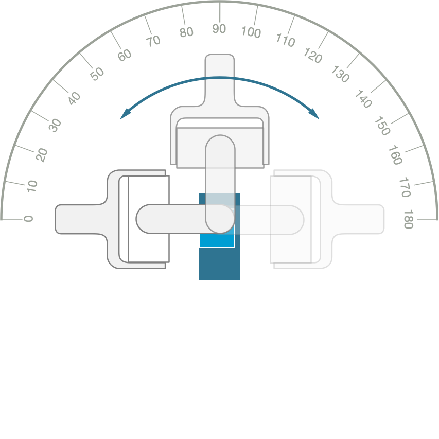
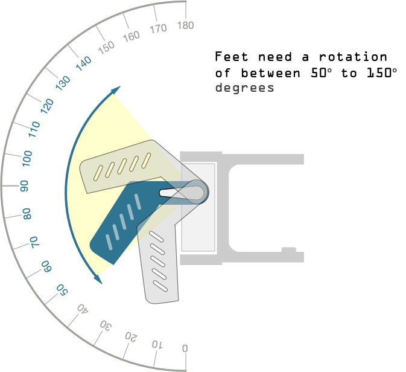

## 11 Check the servo rotation

You can check the precise angle of these later using the `test.py` program. The foot should be able to rotate between 50 & 150 degrees.

{:class="img-fluid w-25"}
{:class="img-fluid  w-25"}

{:class="img-fluid  w-25"}

---
