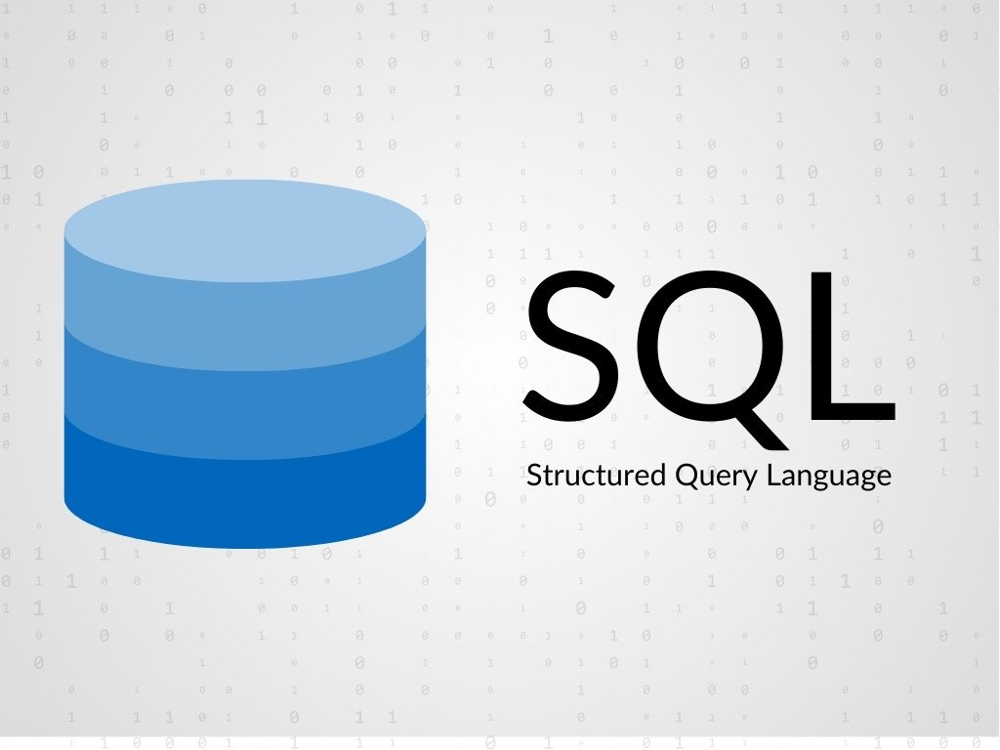

{:class="cover"}

This course provides a foundational understanding of SQL, database management, and relational database theory. Here’s what each lesson covers:

Lesson | Title                                      | Description
-------|--------------------------------------------|----------------------------------------------------
1      | Introduction to SQL and Relational Databases | Overview of SQL and relational database concepts
2      | Setting Up Your SQL Environment              | Guide to setting up and connecting to a database
3      | Basic SQL Commands and Syntax                | Learning SELECT, INSERT, UPDATE, DELETE commands
4      | Working with Tables and Data Types           | Creating tables and defining data types
5      | Data Insertion, Modification, and Deletion   | Understanding CRUD operations
6      | Querying Data with SELECT                    | Retrieving and filtering data with SELECT
7      | Advanced Filtering and Conditional Logic     | Using AND, OR, CASE statements
8      | Working with Joins                           | Combining data from multiple tables with joins
9      | Grouping and Aggregating Data                | Aggregate functions, GROUP BY, HAVING
10     | Introduction to Database Normalization       | Understanding database normalization concepts
11     | Boyce-Codd Normal Form (BCNF)                | Exploring BCNF for database schema optimization
12     | Subqueries and Nested Queries                | Using subqueries in SQL
13     | Views and Indexes                            | Creating views and optimizing with indexes
14     | SQL Functions and Expressions                | Applying various SQL functions in queries
15     | Wrap-up and Final Project                    | Review and a project to apply your skills
{:class="table table-striped"}

By the end of this course, you'll be equipped with essential SQL skills and knowledge in relational databases.

---
