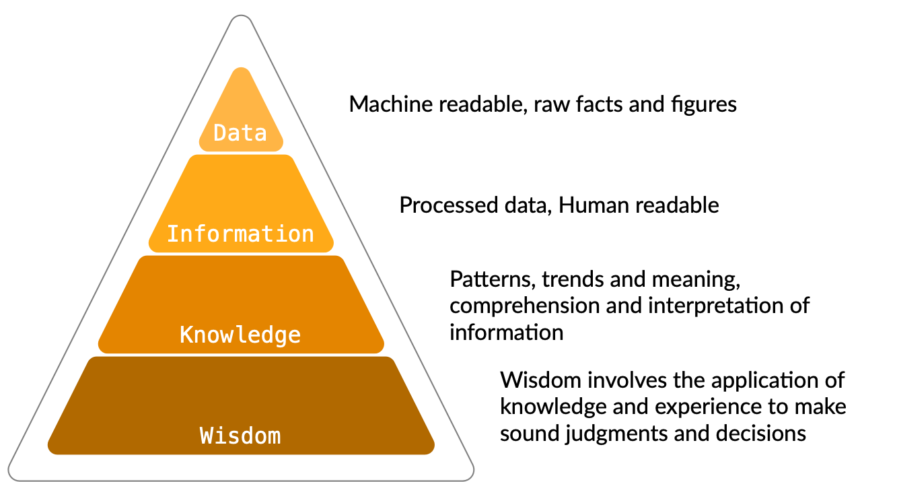

{:class="cover"}

## Overview of Databases

Databases are essential tools for storing, managing, and retrieving data. They play a crucial role in various industries and applications, ranging from small-scale projects to large enterprise systems. In this module, we will explore the fundamentals of databases and their importance.

---

## But what is *Data?*

<table width="100%" cellspacing="15" cellpadding="15">
<tr>
<td width="25%">

</td>
<td>

Data refers to pieces of information that we can collect, store, and use to learn about things or make decisions. It can be numbers, words, images, or any other form of information that we can work with. For example, when you fill out a form with your name, age, and favorite color, that information becomes data. Data helps us understand and describe things in a structured way.

Think of data as building blocks of knowledge. We collect data to learn more about a specific topic or to solve problems. For instance, scientists collect data about the weather to study patterns and make predictions. Businesses collect data about their customers to understand their preferences and provide better products or services.

</td>
</tr>
</table>

Data can be stored in databases or represented in tables, graphs, or charts to make it easier to analyze and interpret. It plays a crucial role in fields like science, technology, medicine, and many others. By analyzing data, we can uncover patterns, trends, and insights that help us make informed decisions and solve problems.

---

## Data, Information, Knowledge, Wisdom

You can think of data as a hierachy of meaning.

`Data`, Starting with raw data we might capture values from a sensor, such as a temperature sensor and store this in our database.

`Information` is data that has been processed and has a known meaning associated with it. The raw data `21` could mean anything until we assign it meaning, such as `21 degrees celcius`. This is now information that can be used and understood.

`Knowledge` is the information with added context; we might look at the temperature information and understand that this is hot or cold given a context such as room temperature (its getting warm), or oven temperature - its cold.

`Wisdom` is the application of knowledge and experience to make sound judgements and decisions; the oven will take 10 minutes to warm up from 21 degrees, I better put that on in 20 minutes time ready for cooking a meal.

{:class="img-fluid w-75"}

---

## What is a Database?

> ### A Definition
>
> "*A database is an organised collection of data.*"
{:class="bg-blue"}

A database is like a giant, well-organized digital filing cabinet for information. Imagine you have lots of pieces of information that you need to store and find quickly later - that's what a database is for. It keeps all your data safe and organized, making sure everything stays consistent, doesn't get messed up, and can grow bigger when needed. It's like a superhero for your data, keeping everything under control and easy to manage.

{:class="img-fluid w-100"}

---

> ## Why do we use Databases
>
> Databases provide many advantages:
>
> - **Data Organization**: Databases are like organized filing systems for information. They sort data into categories, so it's easier to find and use it effectively.
>
> - **Data Integrity**: Databases have rules in place to keep information accurate and reliable. This means the data stays consistent and doesn't have any mistakes or errors.
>
> - **Data Security**: Databases have special features that keep important information safe. They control who can access the data and protect it from people who shouldn't see it.
>
> - **Data Scalability**: Databases can handle lots of information, even as it keeps growing. They can grow and adapt with a website or organization as it gets bigger.
>
> - **Data Consistency**: Databases let multiple people work with the information at the same time. They make sure everyone sees the most up-to-date and correct version of the data, so there are no conflicts or confusion.

---

## Introduction to Relational Databases

Relational databases are the most common type of databases used today. They organize data into tables with rows and columns, establishing relationships between tables. Understanding relational databases is crucial for working with databases effectively.

{:class="img-fluid w-50"}

---

## Relational Database Management Systems (RDBMS)

Relational Database Management Systems (RDBMS) are software systems that manage and manipulate relational databases. They provide the tools and interfaces to interact with the underlying database and execute queries to retrieve, modify, and manipulate data.

Popular RDBMS examples include:

- MySQL
- PostgreSQL
- Oracle Database
- SQLite
- Microsoft SQL Server

---

## Introduction to SQLite

{:class="img-fluid w-25"}

`SQLite` is a lightweight and self-contained relational database engine. It is widely used due to its simplicity, portability, and zero-configuration setup. In this section, we will explore the features and use cases of SQLite.

---

## Overview of SQLite

SQLite is a software library that provides a relational database management system. Unlike traditional client-server databases, SQLite operates directly on disk files, making it serverless and ideal for embedded systems, mobile applications, and small-scale projects.

---

## Advantages of Using SQLite

SQLite offers several advantages:

- **Easy to Use**: SQLite is simple to set up and operate, requiring minimal configuration.
- **Self-Contained**: SQLite databases are standalone files, making them portable and easy to manage.
- **Zero-Configuration**: There is no need for separate installations or running database servers. SQLite libraries are included with many programming languages, including Python.
- **Cross-Platform Compatibility**: SQLite is compatible with various operating systems and programming languages.
- **Efficient Performance**: SQLite is highly optimized, providing fast read and write operations.
- **Small Memory Footprint**: SQLite has a small memory footprint and low disk space requirements.

---

## Basic Database Concepts

{:class="img-fluid w-50"}

Before diving into SQLite and Python, it's essential to understand the basic concepts that form the foundation of relational databases. In this section, we will explore tables, records, columns, and primary keys.

---

### Tables: Foundations of a Relational Database

{:class="img-fluid w-50"}

`Tables` are the fundamental building blocks of a relational database. They consist of rows (also called records or tuples) and columns (also called fields or attributes).

A table represents a specific entity or concept within a database. For example, in a simple library database, we might have a "Books" table to store information about books, with each row representing a specific book and each column representing a piece of information about the book (e.g., title, author, publication year).

---

### Records: Storing and Organizing Data

{:class="img-fluid w-50"}

A `record` or `row` is a complete set of information related to a specific entity in a table. Each record in a table represents a unique occurrence of that entity. For instance, in the "Books" table, each record would correspond to a single book and contain its respective data, such as the book's title, author, and publication year.

To store data in a table, we insert records using SQL INSERT statements. These statements specify the values for each column in the table.

---

### Columns: Data Types and Constraints

{:class="img-fluid w-50"}

`Columns` represent individual data fields within a table. Each column has a specific data type that defines the kind of data it can store, such as integers, text, dates, or binary data.

Common data types include:

Type          | Description                                                              | Example
--------------|--------------------------------------------------------------------------|----------------------
**Integer**   | Whole numbers without decimal places                                     | `0`, `1`, `2` ,`3`
**Text**      | Alphanumeric characters and strings                                      | `"Robots"`
**Real**      | Floating-point numbers                                                   | `3.14`
**Date/Time** | Dates and times                                                          | `2023-07-14 23:02:01`
**Blob**      | Binary large objects, used for storing binary data (e.g., images, files) | `[0x00,0x01,x010]`
{:class="table table-striped"}

Columns can also have constraints that define additional rules for the data they store. Constraints include:

- **NOT NULL**: Specifies that a column must have a value and cannot be empty.
- **UNIQUE**: Ensures that each value in a column is unique across all records.
- **DEFAULT**: Provides a default value for a column if no value is specified during record insertion.
- **PRIMARY KEY**: Identifies a column or set of columns that uniquely identifies each record in the table.

Understanding these concepts is crucial for designing effective database schemas and manipulating data efficiently.

---
