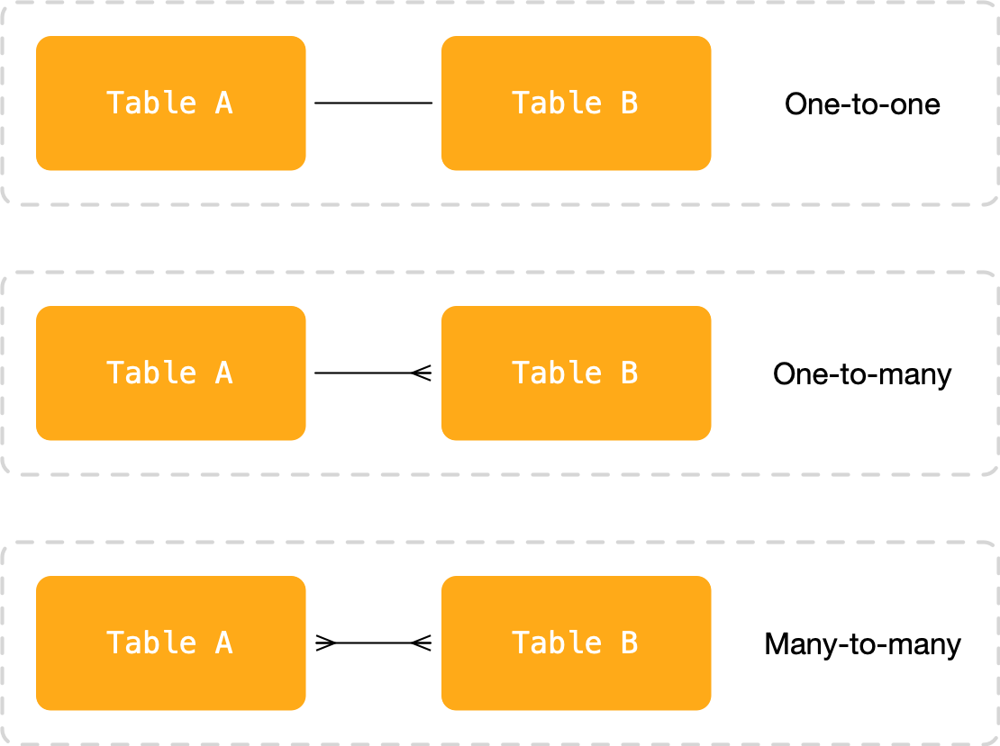
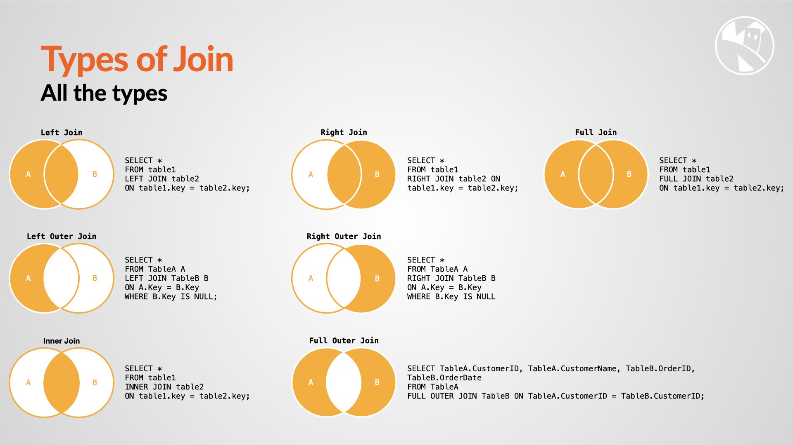

Module 6 focuses on more advanced querying techniques in SQLite, including working with multiple tables and performing joins. You will learn how to retrieve data from multiple tables, establish relationships, and use join operations to combine data.

### Working with Multiple Tables

Real-world databases often involve multiple tables that are related to each other. To retrieve meaningful data, we need to understand how to work with these tables collectively.

#### Relationships Between Tables

Tables can be related to each other through common attributes or columns. Common types of relationships include:

- **One-to-One**: Each record in one table is associated with exactly one record in another table.
- **One-to-Many**: Each record in one table is associated with one or more records in another table.
- **Many-to-Many**: Multiple records in one table are associated with multiple records in another table, creating a junction table to represent the relationship.

Understanding these relationships allows us to retrieve related data effectively.

{:class="img-fluid w-100"}

### Joining Tables

To combine data from multiple tables, we use SQL join operations. SQLite supports several types of joins, including inner joins, outer joins, left joins, and right joins.

{:class="img-fluid w-100"}

---

#### Inner Join

The inner join returns only the records that have matching values in both tables being joined.

```python
# Inner join example
query = '''
    SELECT books.title, authors.name
    FROM books
    INNER JOIN authors ON books.author_id = authors.id
'''
result = connection.execute(query)
data = result.fetchall()
```

In this example, we join the "books" and "authors" tables based on the common column "author_id" and retrieve the book titles along with the corresponding author names.

#### Outer Join

Outer joins return all records from one table and the matching records from the other table. If no match is found, NULL values are filled in for the missing data.

```python
# Left outer join example
query = '''
    SELECT books.title, authors.name
    FROM books
    LEFT OUTER JOIN authors ON books.author_id = authors.id
'''
result = connection.execute(query)
data = result.fetchall()
```

In this example, we perform a left outer join between the "books" and "authors" tables, retrieving all books and the corresponding author names. If there is no matching author, NULL is returned for the author name.

### Joining Multiple Tables

We can join multiple tables together to retrieve data across related tables.

```python
# Joining multiple tables example
query = '''
    SELECT books.title, authors.name, genres.genre_name
    FROM books
    INNER JOIN authors ON books.author_id = authors.id
    INNER JOIN genres ON books.genre_id = genres.id
'''
result = connection.execute(query)
data = result.fetchall()
```

In this example, we join the "books," "authors," and "genres" tables, retrieving book titles along with author names and genre names.

### Aliasing Tables

To make SQL queries more readable, we can use table aliases to provide shorthand names for tables.

```python
# Using table aliases example
query = '''
    SELECT b.title, a.name
    FROM books AS b
    INNER JOIN authors AS a ON b.author_id = a.id
'''
result = connection.execute(query)
data = result.fetchall()
```

In this example, we use the aliases "b" and "a" for the "books" and "authors" tables, respectively, to simplify the query.

By understanding how to work with multiple tables and perform joins, you will be able to retrieve and combine data from various sources, providing more comprehensive insights from your databases.

---
