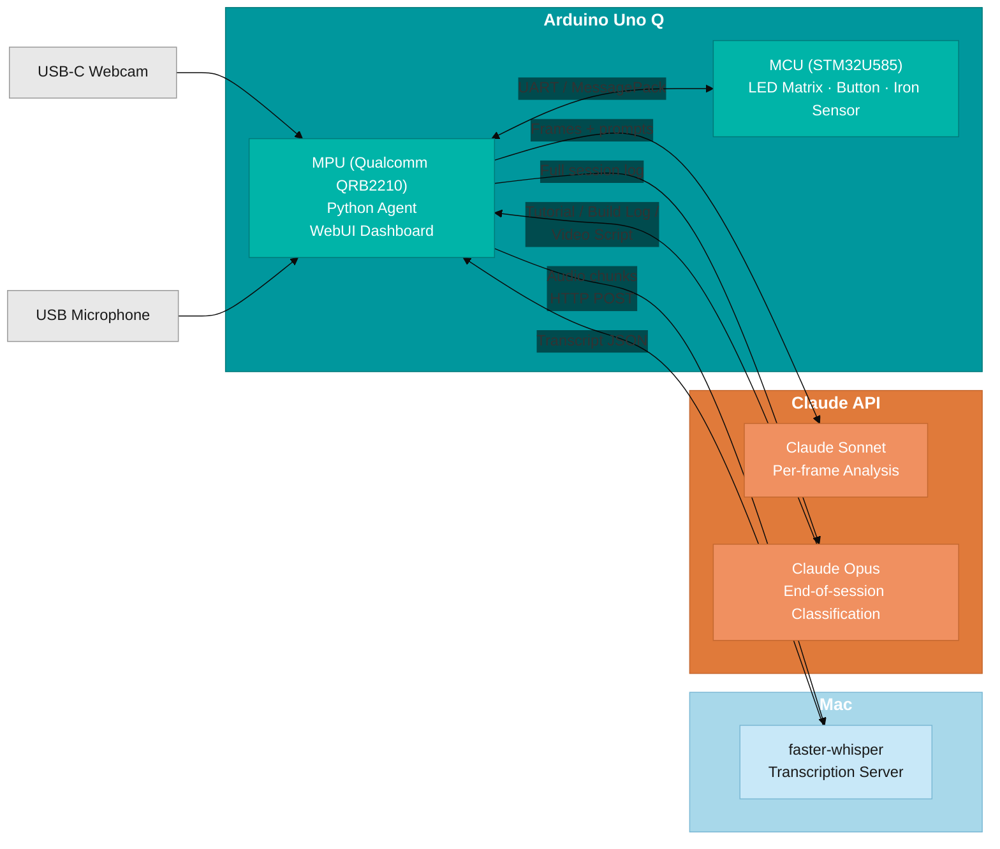

Ahoy there makers,

Every time I build something at the bench, I have the same thought afterwards --- I should have documented that. I should have taken photos. I should have written down what I did. But I never do, because when you're in the middle of a build the last thing you want to do is stop, pick up your phone, frame a photo, write a note, and then try to remember where you were.

There's another problem too, one that'll be familiar if you film tutorial videos. You've got an overhead camera pointing down at what you're building, and half the time the action drifts out of shot. You're so focused on getting the solder joint right that you forget the camera can't actually see what your hands are doing. I was thinking about putting a monitor in my eyeline to check the framing --- but then I thought, what if the system actually *understood* what it was looking at?

That's what this project is. I'm calling it the **Self-Documenting Workshop**. An Arduino Uno Q with an overhead camera watches me work, transcribes what I'm saying, identifies the components and build steps, and at the end of a session uses AI to decide what kind of work it just observed and generate the appropriate documentation. I just work, and it documents.

---

{:class="w-50 d-block mx-auto"}

---

## The Architecture --- Three Machines, Each Doing What It's Best At

This isn't a single script on a single computer. The system is split across three machines, and each one has a specific job:



---

{:class="w-50 d-block mx-auto"}

### 1. Arduino Uno Q (the hub)

The Uno Q is the heart of the system. It's two computers in one board --- a **Qualcomm QRB2210** running Debian Linux (the MPU) and an **STM32U585** microcontroller running Zephyr (the MCU). That split is perfect for this project.

**The MPU side** runs the Python agent (`main.py`) which orchestrates everything:

- Captures frames from a USB-C webcam using OpenCV
- Runs a local frame-change gate (more on this below)
- Sends changed frames to Claude's vision API for analysis
- Records audio and sends it to the Mac for transcription
- Hosts a browser-based **WebUI dashboard** showing a live camera feed, scrolling transcript, session controls, and event counter --- all updating in real-time over Socket.IO

**The MCU side** runs an Arduino sketch (`sketch.ino`) that handles the hardware:

- An **8x13 LED matrix** with five visual states (idle, watching, noticed, thinking, done)
- A **push button** --- short press marks a moment as important, long hold ends the session
- An **SCT-013 current clamp** on the soldering iron that detects when it's drawing power
- Communication with the MPU via UART at 115,200 baud using MessagePack encoding

---

{:class="w-50 d-block mx-auto"}

### 2. Mac (transcription server)

A tiny Flask server (~60 lines of Python) running **faster-whisper** with the `base.en` model. The Uno Q records 10-second audio chunks and POSTs the raw WAV bytes to the Mac over the network. The Mac transcribes them locally and sends back JSON with the text.

I moved the transcription to a separate machine deliberately. Running Whisper and the WebUI and the camera pipeline all on the Uno Q at the same time was asking too much --- the transcription was eating into the processor time the WebUI needed to stay responsive. Splitting it out to the Mac freed up the Arduino to focus on capturing data and presenting the dashboard. It also keeps costs down because there's no cloud speech-to-text API involved.

---

{:class="w-50 d-block mx-auto"}

### 3. Claude API (the brain)

Two models, used at different tiers:

- **Claude Sonnet** handles routine per-frame analysis --- "what components are visible? what activity is happening? is this a key moment?" Fast, cheap, good enough for the job.
- **Claude Opus** fires once at the end of a session --- it gets the full event log, all the transcribed audio, and the key moment frames, and makes the judgement call about what kind of session it just watched.

A typical 90-minute session costs about **40p** in API calls.

---

## The Two-Tier Cost Strategy

Cost control is baked into the design at every level:

1. **Local frame-change gate**: OpenCV compares each frame to the previous one pixel by pixel. If less than 4% of the image has changed, the frame gets skipped entirely. This filters out ~70% of frames before any API call happens.

2. **Sonnet for routine, Opus for judgement**: Per-frame analysis uses the cheaper, faster model. The expensive thinking happens exactly once, at the end.

3. **Local transcription**: Faster-whisper on the Mac costs nothing per minute. No cloud ASR billing.

4. **Hardware gating**: The SCT-013 current clamp on the soldering iron tells the system when work is actually happening. No point analysing frames when I've gone to make tea.

The analysis loop runs every **30 seconds** (not continuously), and the timelapse loop captures a frame every **10 seconds** for a visual record. Only the analysis frames go through the gate and potentially to the API.

---

## The LED Matrix --- The Agent's Face

The LED matrix is connected to the MCU side and has five distinct visual states:

| State | Pattern | RGB Colour | Meaning |
|---|---|---|---|
| **Idle** | Single dim dot, slow heartbeat | Blue | Not recording |
| **Watching** | Two dots scanning left-right | Cyan | Recording, analysing |
| **Noticed** | Full bright flash, 1.5s fade | Orange | Important event detected |
| **Thinking** | Diagonal sweep animation | Purple | Opus classification in flight |
| **Done** | Checkmark glyph | Green | Session complete |
{:class="table table-single table-narrow"}

I designed each state to be visually distinct on camera. The matrix is essentially the agent's face --- it's how you can see what the AI is "thinking" without needing to check the dashboard.

---

## The Button

A single momentary push button on the bench edge, wired to digital pin 2 with the internal pull-up resistor:

- **Short press**: marks the current moment as important. The system flags the most recent frame as a key moment, which increases the chance Opus will use it in the final output.
- **Long hold (2+ seconds)**: ends the session. The MCU fires a `session_end` event, the matrix switches to the thinking animation, and the classification begins.

The MCU handles all the debouncing (30ms) and distinguishes between short and long presses using a state machine.

---

## The Iron Sensor

The **SCT-013** is a non-invasive AC current clamp. It clips around the soldering iron's power cable and reads the magnetic field --- no contact with mains, completely safe. The MCU samples 200 ADC readings on pin A0, computes the peak-to-peak voltage, and if it crosses a threshold it fires an `iron_on` event to the MPU.

This is a cheap but useful signal. When the iron is on, work is probably happening. When it's been off for a while, maybe the session is winding down.

---

{:class="w-50 d-block mx-auto"}

## The WebUI Dashboard

The MPU side serves a browser-based dashboard using the App Lab WebUI brick. It shows:

- **Live camera feed** --- refreshes twice per second (JPEG at quality 50, base64-encoded, broadcast via Socket.IO)
- **Scrolling transcript** --- each transcribed chunk appears with a timestamp as it comes in
- **Status pill** --- reflects the current state (idle, recording, thinking, done)
- **Event counter** --- how many events the agent has logged so far
- **Start/Stop buttons** --- though in practice I mostly use the physical button

The dashboard solves the original framing problem too. I can glance at it to confirm the component I'm working on is actually in the overhead camera's shot, without breaking my flow.

---

## The Classification --- The Whole Hook

When I long-press the button, the system sends the entire session to Claude Opus with a classification prompt. Opus looks at the full event log, the transcript, and the key frames, and decides what kind of work session it just observed:

- **Clean linear progression + narration** --- classifies as a **tutorial** and generates a full blog post with title, introduction, BOM, step-by-step instructions, and embedded photos
- **Iterative debugging, multiple attempts, frustration in the audio** --- classifies as a **build log** with "what I tried" and "what actually fixed it" sections
- **Heavy hands-on work, clear finished artefact, minimal narration** --- classifies as a **video script** outline with the narrative arc structured

The AI picks the output format based on what it observed. It's not just recording --- it's making a creative judgement.

---

{:class="w-50 d-block mx-auto"}

## Bill of Materials

| Component | Purpose | Pin/Connection |
|---|---|---|
| Arduino Uno Q | Hub --- MPU runs Python agent, MCU runs sensors + LEDs | --- |
| USB-C webcam (1080p) | Overhead frame capture | USB host port |
| SCT-013 current clamp | Detect when soldering iron is drawing power | A0 (with burden resistor + DC bias) |
| Momentary push button | Mark moments / end session | D2 (INPUT_PULLUP) |
| 8x13 LED matrix | Visual status display | I2C |
| USB microphone | Ambient audio capture | USB |
| Mounting arm + clamp | Hold camera overhead | --- |
| Mac or laptop (on network) | Run faster-whisper transcription server | HTTP, port 8178 |
{:class="table table-single table-narrow"}

---

{:class="w-50 d-block mx-auto"}

## Software Setup

### On the Uno Q

The project is an Arduino App Lab application. The Python agent uses:

- `anthropic` --- Claude API client
- `opencv-python-headless` --- frame capture and change detection
- `sounddevice` --- audio recording from USB mic
- `requests` --- HTTP POST to the Mac's Whisper server
- `numpy` --- image processing

The sketch running on the MCU side uses:

- `Arduino_LED_Matrix` --- 8x13 matrix rendering
- `MsgPack` --- MessagePack encoding for Bridge RPC
- Standard Arduino libraries for GPIO, ADC, and timing

### On the Mac

```bash
pip install faster-whisper flask
python whisper_server.py
```

The server loads the `base.en` model on startup (~150MB download the first time) and exposes a single endpoint at `POST /transcribe`. That's it.

---

## What It Got Right

{:class="w-25"}

After running the system through a real build session (a Pico-based servo tester):

- **Component identification** was spot on --- it correctly identified every part I used, including reading the specific servo model from a frame where I held it up to check the label
- **Step ordering** was correct --- it tracked the build sequence accurately
- **Photo selection** was genuinely good --- the frames it chose for each step were the best ones from that part of the build, not random grabs
- **The writing** was a solid first draft --- a bit generic in tone, but perfectly publishable as a starting point

## What It Got Wrong

{:class="w-25"}

- **Code sections** were a problem. The camera could see my screen in some frames but not clearly enough to read actual code, so Opus hallucinated what it thought the code should be. The logic was right (it knew I was using PWM to control a servo) but specific pin assignments and variable names were made up.
- **Debugging was smoothed out.** I spent ten minutes troubleshooting a wiring mistake, and the final tutorial compressed that into a single clean step. That's arguably the right call for a tutorial, but it means the debugging story was lost. If it had classified the session as a build log instead, it might have kept that detail.

---

## What's Next

The core concept works. I now have a draft blog post that would have taken me an hour to write, and I didn't have to stop working once to create it. But there are things I want to improve:

- **Better code capture** --- give the system direct access to the file I'm editing rather than trying to read it off the screen
- **Better audio** --- a directional microphone would help, because the current setup picks up the soldering iron fan and the 3D printer
- **Multiple outputs** --- instead of picking one format, generate a tutorial *and* a timelapse *and* a parts list from the same session

---

## Links

- **Full source code:** <https://www.github.com/kevinmcaleer/self-documenting-workshop>
- **Arduino Uno Q:** <https://store.arduino.cc/products/uno-q>
- **faster-whisper:** <https://github.com/SYSTRAN/faster-whisper>
- **Claude API:** <https://docs.anthropic.com/>

---

If you've ever finished a build and thought "I really should have written that down" --- this is for you. The system isn't perfect, but it turns a two-hour session into a publishable first draft without you lifting a finger. And the classification decision at the end --- watching the AI decide "that was a tutorial" and then reading what it wrote --- is genuinely fun.

If you found this useful, watch the video and give it a thumbs up. It really does help the channel.

See you next time. Bye for now.

---

> # Meet Nibsy
> ## The Workshop's Watchful Eye
> Nibsy is the name of our new mascot. Nibsy is a little robot who lives in the workshop and documents everything. Nibsy is always watching, always learning, and always ready to write the next tutorial. Say hi to Nibsy!
>
>{:class="w-50 d-block mx-auto"}

---
