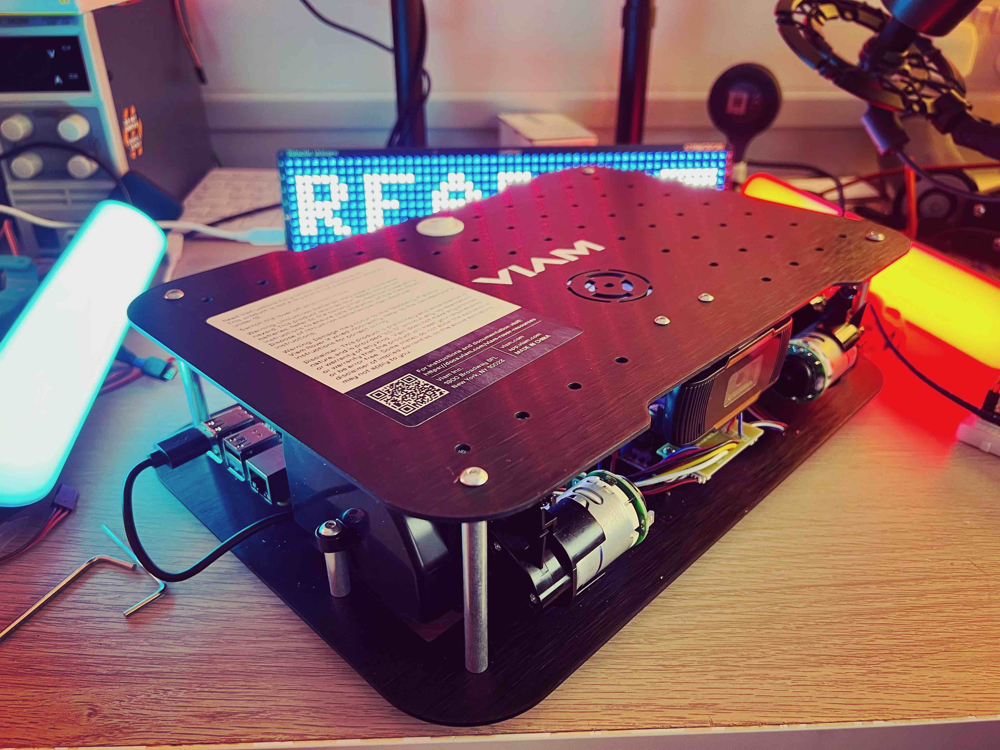

## What hardware does Viam run on?

Viam is a comprehensive software suite for robotics, compatible with both Linux and macOS, and provides support for a broad range of widely-used systems. including:

- Nvidia Jetson Nano
- Raspberry Pi 4
- BeagleBone AI-64
- Texas InstrumentS TDA4VM
- Espressif ESP32
- Raspberry Pi 3
- NVidia Jetson Orin

---

## Viam Rover

Viam also sell robots such as the Rover, which is powered by a Raspberry Pi 4, and has two motors, an accelerometer, webcam and microphone.

{:class="img-fluid w-100"}
