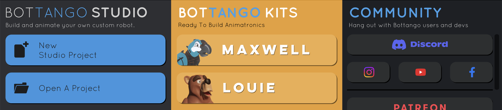

{:class="cover"}

---

## 💾 Step 1: Download Bottango

To get started, head over to the official Bottango website:

🔗 [https://bottango.com](https://bottango.com)

Click the **Download Bottango** button. Choose the version that matches your operating system:

- 🪟 **Windows 10 or later**
- 🍎 **macOS 10.14 Mojave or later**

Save the installer to your computer.

---

## 💻 Step 2: Install Bottango

### On Windows:

1. Double-click the downloaded `.exe` file.
2. Follow the on-screen prompts to install Bottango.
3. If prompted by Windows Defender, click **More Info > Run Anyway**.
4. Launch Bottango when the installation is complete.

### On macOS:

1. Open the downloaded `.dmg` file.
2. Drag the **Bottango** app into your **Applications** folder.
3. On first launch, you may need to bypass the security warning:
   - Right-click on Bottango and choose **Open**.
   - Click **Open** again when the system asks for confirmation.

---

## 🧪 Step 3: Launch Bottango

After installation, open Bottango and you’ll see the main interface:

- A **timeline** where you can create motion sequences
- A **connected devices panel** for managing microcontrollers
- A **servo view** that shows the status of each connected actuator

You’re ready to connect a board and start animating!

---

## 🧰 Troubleshooting

If Bottango doesn’t start or crashes:

- Make sure your system meets the minimum requirements
- On Windows, try running it as Administrator
- On macOS, check **System Preferences > Security & Privacy** and allow Bottango to run
- Ensure your graphics drivers are up to date (Bottango uses hardware acceleration)

---

Next up: [Setting up Your Board](03_setup_board.md)

---
