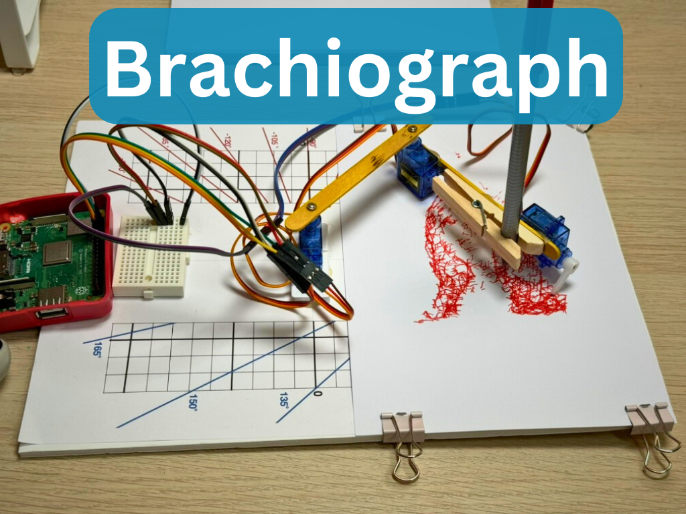

{:class="cover"}

---

## Overview

A BrachioGraph (from the Greek `Brachio`; *Arm*, and `Graph`; *draw*) is a simple pen plotter that you can build at home using a few simple components. It's a fun project that will help you learn about robotics, programming, and electronics while creating a working drawing robot!

A BrachioGraph is a type of robotic arm designed for drawing using a pen or pencil. It's made up of hobby servos and household items such as popsicle sticks, hot glue, and a foam core board. The robot is controlled by a Raspberry Pi, which sends commands to the servos to move the pen in the X and Y directions.

In this tutorial we'll use a Raspberry Pi to drive the arm. The Raspberry Pi will run a Python script that sends commands to the servos to move the pen precisely. The BrachioGraph can draw simple shapes, write text, or even create intricate designs and plot images!

The BrachioGraph Python code is available at <https://github.com/evildmp/brachiograph> and we'll walk you through the complete process of building the hardware, installing the software, and creating your first drawings.

---

## Course Content

In this course, you'll learn:

- How to assemble the BrachioGraph hardware from simple materials (popsicle sticks, servos, foam board)
- Wiring servos to Raspberry Pi GPIO pins safely and correctly
- Installing and configuring the BrachioGraph Python library
- Understanding servo control and coordinate systems
- Writing Python code to control the robotic arm
- Creating your first drawings with simple shapes
- Converting bitmap images to vector format for plotting
- Calibrating and fine-tuning your plotter for accuracy

---

## Key Results

After completing this course, you will be able to:

- Build a working pen plotter robot from inexpensive household materials
- Understand how servo motors are controlled using GPIO pins
- Write Python code to control a 2-axis robotic arm
- Create drawings programmatically using coordinates
- Convert images to plottable vector format
- Troubleshoot and calibrate a servo-based robot
- Apply these skills to other robotics projects with similar mechanics

---

## What you'll need

### Hardware

Item | Description | Quantity | Approx. Cost
-----|-------------|----------|-------------
**SG90 Servo Motors** | Micro servo motors for controlling the arm joints | 3 | $3
**Raspberry Pi 3+** | Microcontroller for running the code (any Pi 3 or newer) | 1 | $25
**Popsicle Sticks** | Craft sticks for building the mechanical structure | Pack of 50 | $1
**Hot Glue Gun** | For assembling the parts (with glue sticks) | 1 | $5
**Clothes Peg** | For holding the pen or pencil | 1 | $0.50
**Foam Core Board** | For the base (A4 size minimum) | 1 | $1
**Jumper Wires** | Female-to-female for connecting servos to Pi | 1 pack | $5
**Mini Breadboard** | For organizing the servo connections | 1 | $1
**Pen or Pencil** | For drawing (ballpoint or fine-tip marker works best) | 1 | You have this!
{:class="table table-bordered table-striped"}

**Total Cost:** Approximately $40 (assuming you already have a Raspberry Pi)

### Software

- Raspberry Pi OS (latest version)
- Python 3.x (pre-installed on Raspberry Pi OS)
- BrachioGraph library (installation covered in the course)

### Tools

- Small drill (1-2mm bit) for making pilot holes
- Ruler or measuring tape
- Pencil for marking
- Scissors or craft knife (optional, for cutting foam board)

### Skills

This course is beginner-friendly! You don't need:
- Prior robotics experience
- Advanced Python knowledge (basic familiarity helpful)
- Electronics expertise

If you're completely new to Raspberry Pi, you might want to familiarize yourself with basic setup first, but we'll guide you through everything you need for this project.

---

## How the course works

This course combines hands-on hardware construction with Python programming. You'll physically build the robot first, then progressively learn to control it with code.

**What to expect in each lesson:**

- **Clear step-by-step instructions** with numbered steps
- **Photos and diagrams** showing assembly details and wiring
- **Working Python code examples** you can type and run immediately
- **Troubleshooting tips** for common issues
- **Interactive exercises** to practice your skills

**Learning approach:**

1. **Build** - Assemble the physical plotter from simple materials
2. **Wire** - Connect servos safely to GPIO pins
3. **Install** - Set up the software on your Raspberry Pi
4. **Code** - Learn to control servos with Python
5. **Draw** - Create your first programmatic drawings
6. **Advanced** - Convert images and create complex plots

Each lesson builds on the previous one, so work through them in order for the best learning experience.

> **Note:** Code examples use the BrachioGraph Python library and are designed to be typed into the Python REPL or saved as scripts. Don't worry if you make mistakes - debugging is part of learning!

---

## Prerequisites

**This course assumes you have:**
- Basic comfort using a computer
- A Raspberry Pi set up with Raspberry Pi OS
- Basic familiarity with the command line (helpful but we'll guide you)

**No prior experience needed with:**
- Python programming (we'll teach you what you need)
- Electronics or wiring (we'll show you step-by-step)
- Robotics or servo motors (you'll learn by building!)

If you've never used a Raspberry Pi before, consider checking out our [Raspberry Pi Getting Started Guide](/learn/raspberry-pi/) first - but it's not required!

---

## What's Next

After completing this course, you might enjoy:

- [SMARS Robot](/learn/smars/) - Build a wheeled robot with similar servo control concepts
- [MicroPython GPIO](/learn/micropython_gpio/) - Deep dive into GPIO pin control
- [Python for Beginners](/learn/python/) - Expand your Python programming skills
- [Robot Arm Kinematics](/learn/pca9685/) - Build more complex robot arms with PCA9685 servo controller

You'll also have the skills to create your own custom drawings, automate art creation, and even design your own servo-based robotic projects!

---

Let's get building!

---
