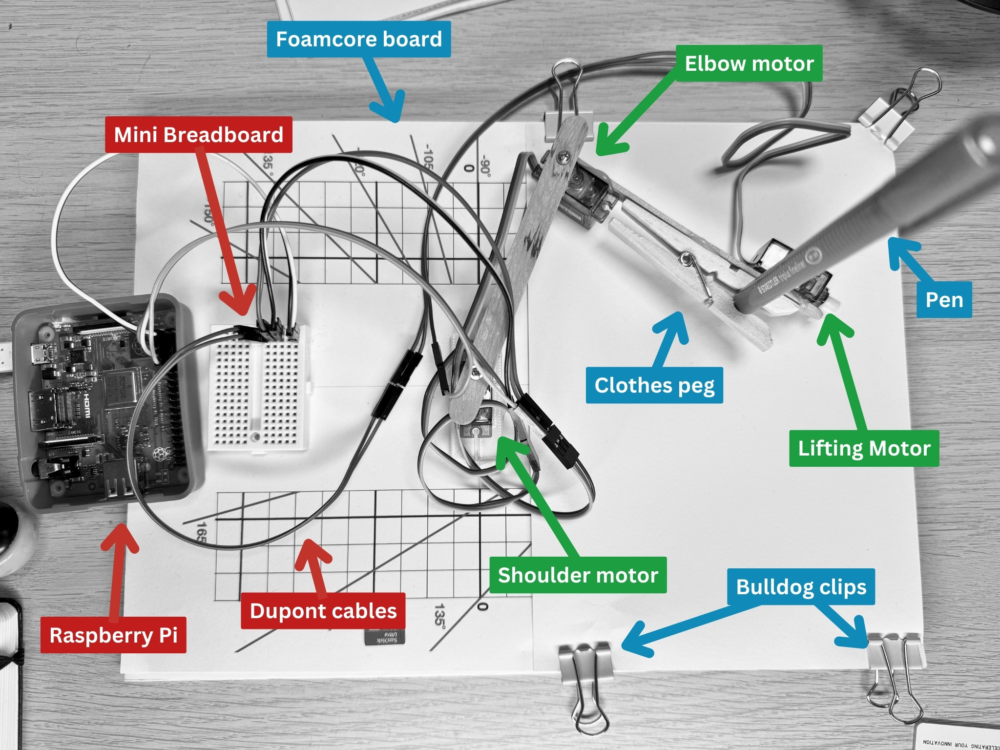
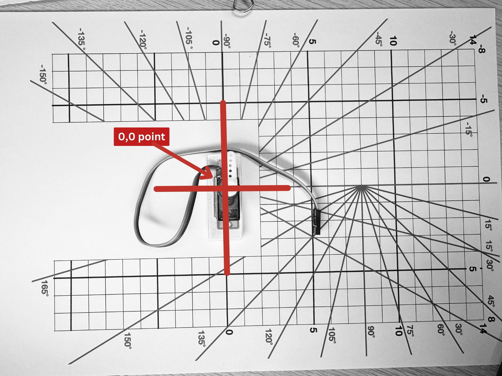
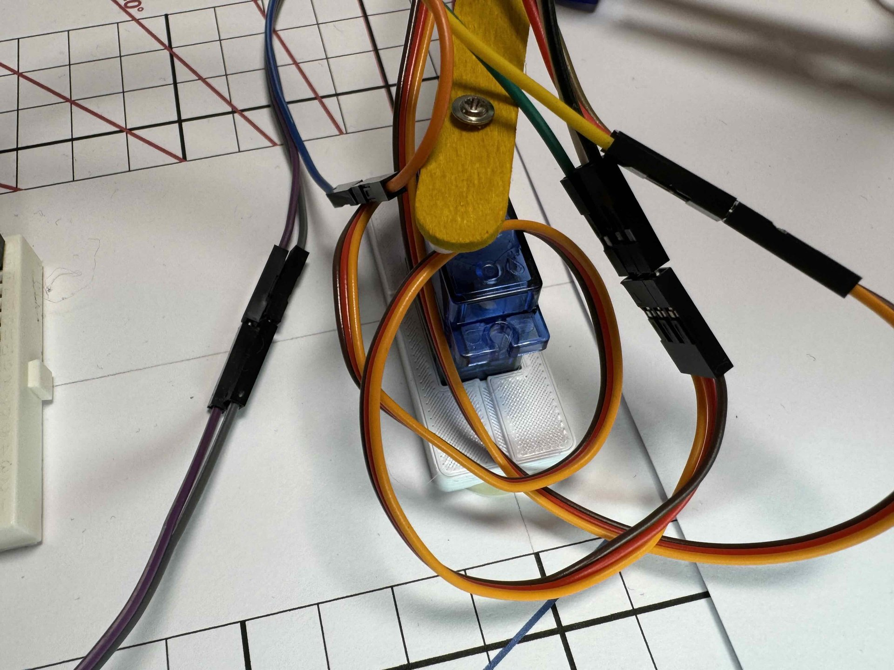
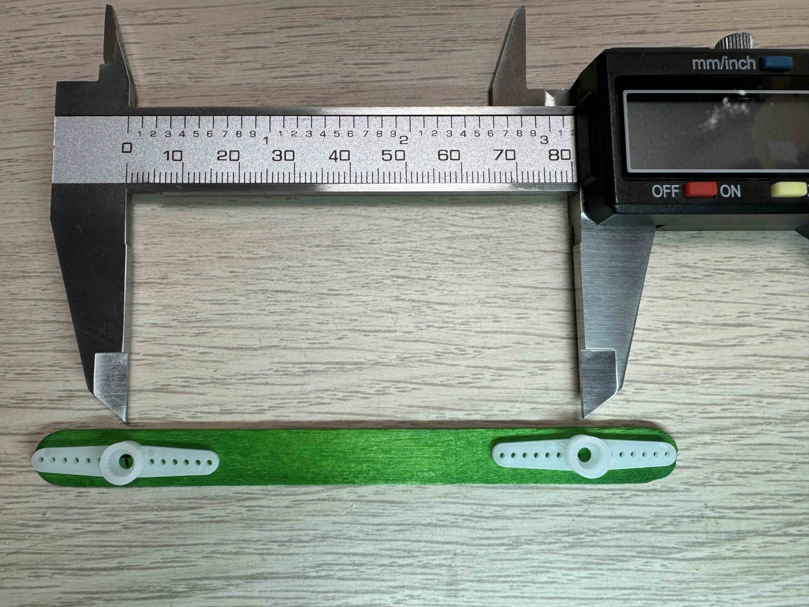
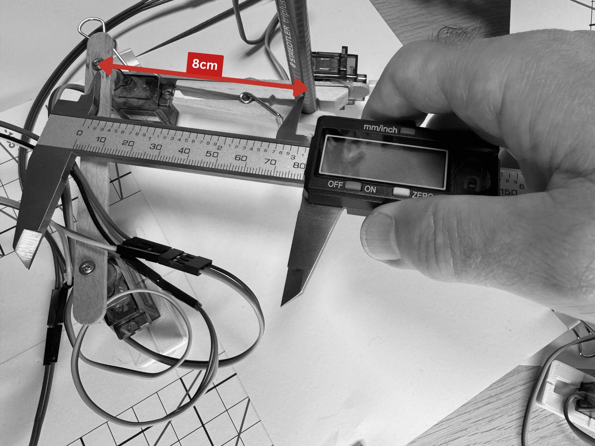
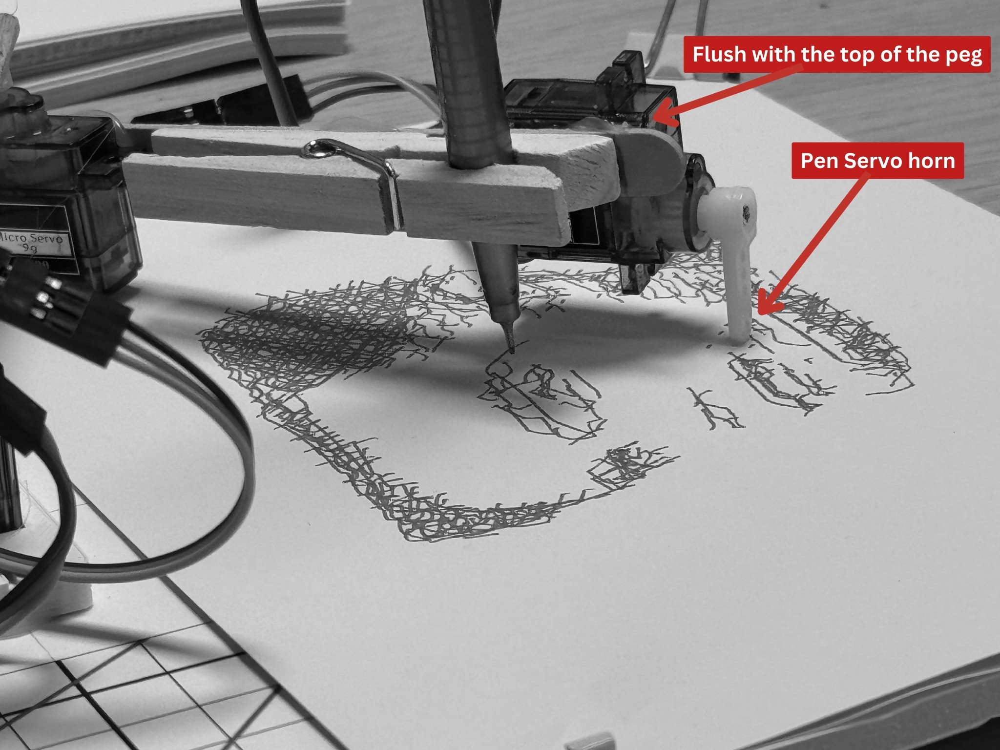

## Bill of Materials

To build the BrachioGraph plotter, you will need the following components:

Item             | Description                                        | Quantity       | Price  | Total
-----------------|----------------------------------------------------|----------------|--------|-------
SG90 Servo Motor | Micro servo motor for controlling the joints       | 3              | $1     | $3
Raspberry Pi 3+  | Microcontroller for running the code               | 1              | $24.99 | $24.99
Popsicle Sticks  | Craft Sticks for building the mechanical structure | 2 - pack of 50 | $1     | $1
Hot Blue Gun     | For assembling the parts                           | 1              | $5     | $5
a clothes peg    | For holding the pen                                | 1              | $0.50  | $0.50
Foam Core board  | For the base                                       | 1              | $1     | $1
Jumper wires     | For connecting the servos                          | 1 pack         | $5     | $5
MiniBreadboard   | For wiring up the servos                           | 1              | $1     | $1
{:class="table table-bordered table-striped"}

---

## Assembling the BrachioGraph

{:class="w-100 card-hover card-shadow rounded-3"}

---

## Step 1: Building the Base

1. Take the foam core board and cut it to the desired size for the base, I chose A4 size as the paper I will be using is A5 (A4 cut in half).

1. Print out the [base template](assets/template-grid.pdf) [^1] and stick it to the foam core board using a glue stick.

1. The shoulder servo needs to be lifted slightly (between 4-6mm) above the base to allow the arm to move freely. To do this, cut out a small piece of foam core board and glue it to the base where the shoulder servo will be placed.
  
    You can 3D printed a [small spacer](assets/base.stl) to lift the servo, but you can also use anything you have to hand.

1. Glue the shouler servo to the base using hot glue; the center of the servo should be aligned to the 0,0 point on the grid.

    {:class="w-100 card-hover card-shadow rounded-3"}

    {:class="w-100 card-hover card-shadow rounded-3"}

---

## Step 2: Building the  Inner Arm

1. Mark a line on the center of the popsicle stick, 8cm end to end.

1. Drill a small pilot hole (1-2mm drill bit) on either side of the line; this will enable the servo horn to be securely crewed to the stick.

1. Glue the two servo horns to the popsicle stick, ensuring the center of the horn is aligned with the center of mark the stick.

    {:class="w-100 card-hover card-shadow rounded-3"}

---

## Step 3: Building the Outer arm

1. Attach a servo with hot glue to the other popsicle stick; the servo mountings should be roughly in the center of the stick.

    {:class="w-100 card-hover card-shadow rounded-3"}

1. Attach the clothes peg with hot glue to the end of the outer arm; this will hold the pen; be sure to make the center point of the pen and the center point of the elbow servo are 8cm a part.

1. Attach the pen servo with hot glue to the end of the outer arm. The servo horn should be able to move the pen up and down freely.

    {:class="w-100 card-hover card-shadow rounded-3"}

[^1]: Provided by <https://brachiograph.art>

---
