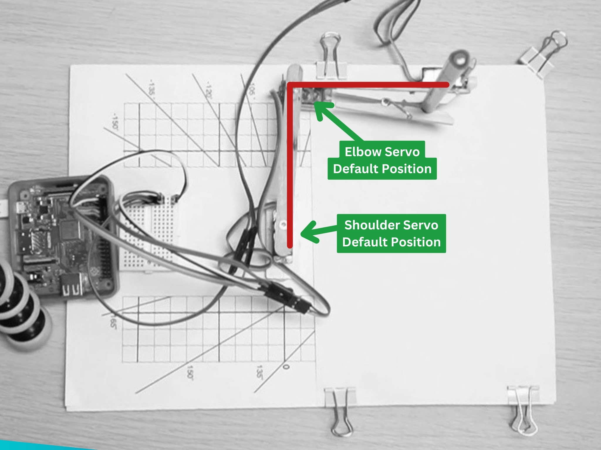

## Creating a BrachioGraph

In this lesson, we will learn how to code the BrachioGraph plotter using Python.

---

Type the following code into the Python command line (also known as the Read Execute Print Loop or REPL) to import the BrachioGraph library:

```python
from brachiograph import BrachioGraph

bg = BrachioGraph() # This will create a new BrachioGraph object
```

---

You can now use the `bg` object to control the BrachioGraph plotter.

When the BrachioGraph object is created, the arm will move to the default position.

---

## Attach the inner arm to the Shoulder servo

Now that the servo motor has been set to its default position by the code we have just run, we can attach the inner arm to the shoulder servo.

{:class="w-100 card-hover card-shadow rounded-3"}

---

The servo might not attach at exactly 90 degrees, but that's okay. The calibration code will take care of that, later.

---

Test the arm by running the following code:

```python
bg.set_angles(0, 90)
```

This will move the arm to the 0, 90 position; the shoulder servo will move to 0 degrees and the elbow servo will move to 90 degrees. Note that the arm will move their very quickly, without any motion easing.

---

## Park the arm

To park the arm, run the following code:

```python
bg.park()
```

This will move the arm to the park position, which is the default position.

---

## Attach the outer arm to the Elbow servo

Now that the inner arm is attached to the shoulder servo, we can attach the outer arm to the elbow servo.

You can also add the pen (or pencil) to the clothes peg at the end of the outer arm. The tip of the pen should not be touching the paper.

Let's test the arm by running the following code:

```python
bg.set_angles(-90, 120)
```

This will move the arm to the -90, 120 position; the shoulder servo will move to -90 degrees and the elbow servo will move to 120 degrees.

---

## Rasing and lowering the pen

To lower the pen to the writing position, run the following code:

```python
bg.pen.down()
```

The pen should now be touching the paper, if its not, adjust the positon of the pen accordingly.

To raise the pen, run the following code:

```python
bg.pen.up()
```

---

## Check the status of the BrachioGraph

You can check the status of the BrachioGraph by running the following code:

```python
bg.status()
```

The BrachioGraph will report its status:

```bash
------------------------------------------
                      | Servo 1 | Servo 2
                      | Shoulder| Elbow
----------------------|---------|---------
          pulse-width |    1500 |    1500
                angle |     -90 |      90
hysteresis correction |     0.0 |     0.0
------------------------------------------

------------------------------------------
pen: up
------------------------------------------
bottom left: (-8, 4) top right: (6, 13)
------------------------------------------
```

---

## Try it Yourself

Congratulations! Your BrachioGraph just moved for the first time! Now let's practice controlling it:

1. **Explore Servo Angles**: Try different angle combinations to see where the arm can reach:
   ```python
   bg.set_angles(45, 45)   # Try this
   bg.set_angles(-45, 135) # And this
   bg.set_angles(0, 180)   # What about this?
   ```
   Watch how the arm moves to each position. Which position reaches furthest from the base?

2. **Test the Pen**: Practice raising and lowering the pen:
   ```python
   bg.pen.down()
   # Wait 2 seconds - is the pen touching the paper?
   bg.pen.up()
   ```
   If the pen doesn't touch the paper when down, adjust it in the clothes peg.

3. **Movement Sequence**: Create a simple movement pattern:
   ```python
   bg.set_angles(-90, 90)  # Move to one corner
   bg.set_angles(90, 90)   # Move to opposite corner
   bg.set_angles(0, 120)   # Move to center
   bg.park()               # Return to park position
   ```

4. **Check Status Between Moves**: Run `bg.status()` after different movements to see how the values change. This helps you understand what each servo is doing.

**Challenge**: Can you figure out which angle values make the arm point:
- Straight forward?
- To the left?
- To the right?
- Furthest away from the base?

Write down your observations - understanding the coordinate system now will help when you start drawing!

---

## Common Issues

- **Problem**: `ImportError: No module named 'brachiograph'`
- **Solution**: Make sure you installed the library with `pip install brachiograph` and are using Python 3
- **Why**: The BrachioGraph library must be installed before you can import it

- **Problem**: The servos don't move when I run the code
- **Solution**: Check that your servos are wired correctly to GPIO pins 14, 15, and 18. Verify the Pi has power and the code runs without errors. Try running `bg.status()` - does it show values?
- **Why**: Servos need proper power and signal connections to respond to commands

- **Problem**: The arm moves but to the wrong position
- **Solution**: This is normal! Each servo has slight variations. You'll calibrate the exact positions in a later lesson
- **Why**: Servos aren't perfectly accurate "out of the box" - calibration fixes this

- **Problem**: When I create the BrachioGraph object, I get a warning about GPIO
- **Solution**: Run your Python script with `sudo python3 script.py` or configure GPIO permissions
- **Why**: GPIO pin access on Raspberry Pi requires elevated permissions

- **Problem**: The pen servo doesn't lift the pen high enough
- **Solution**: Check the `bg.pen.up()` position - you may need to adjust the pen servo arm angle or the pen position in the clothes peg
- **Why**: The pen mechanism needs proper mechanical adjustment, not just code

- **Problem**: Servos make buzzing noise but don't move smoothly
- **Solution**: Make sure you're using an external 5V power supply for the servos, not powering them from the Pi's 5V pin
- **Why**: Servos draw significant current that can cause voltage drops and erratic behavior

---
