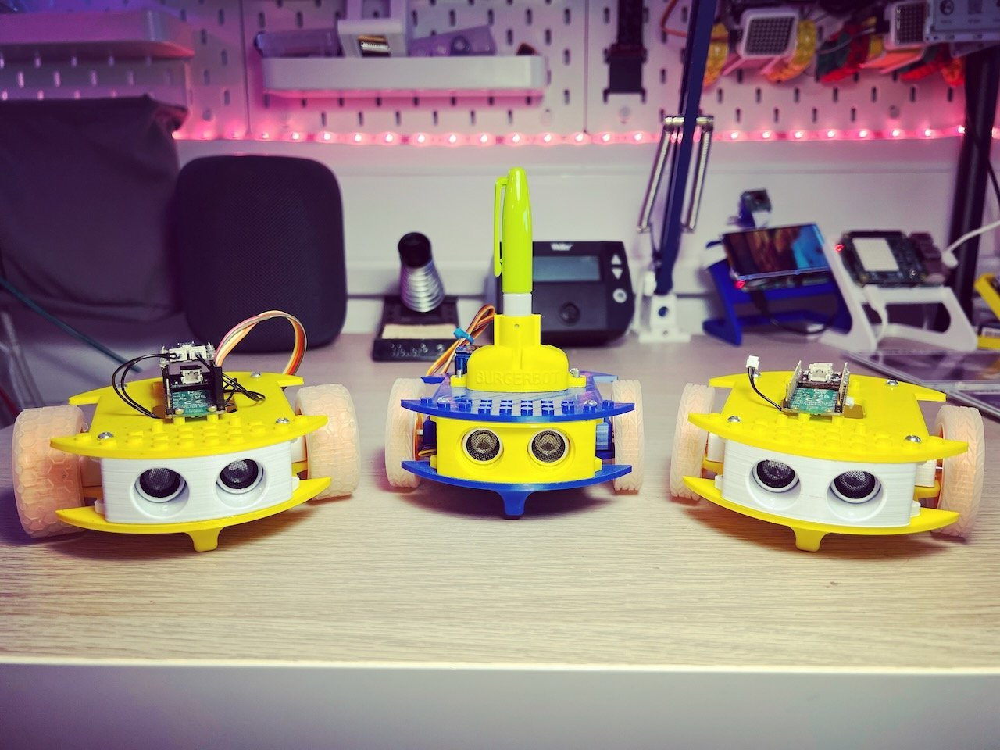

`BurgerBot`, as the name suggests, is a Burger-shaped robot. BurgerBot is quick and easy to print and assemble, with a low build cost and is designed for education and hobbyists. The Raspberry Pi Pico and Pico W board power the robot making it easy to program with MicroPython.

---

{:class="img-fluid w-100"}

---

## The 3d printable Parts

BurgerBot is made up of some quick to print pieces:

Part                          | Description
------------------------------|-----------------------------------------------------------------------------------------------------------------------------------------------------------------------------------------------------
The Base                      | Has two solid casters to prevent the robot from tipping over.
Motor Holder                  | The two motor holders are used to secure the motors to the base with 2x M3 nuts and bolts, each
Range Finder Holder           | This is the face of the robot and holds the ultrasonic range finder in place
Rear Support / Battery Holder | The rear support provides a platform for the top section to attach to. In v2 of burgerbot this also holds the Pico and the Galleon Battery pack.
Top section                   | The top section completes the basic robot build. There are alternative top sections depending on whether the burgerbot has the pen module attached, they keypad module, or the original pico holder.
{:class="table table-code-fit"}

---

## The other parts

Here are the list of electronics and other parts:

Part | Description
----|---
Moon Buggy Wheels             | The wheels are the 'moon buggy' type and provide good grip and traction to the robot
Motors                        | 2x motors are required to drive the robot, the can be the N20 type or the MMME variety
Raspberry Pi Pico             | The brains of the robot this can be either the wireless or non-wireless version
Ultrasonic Range Finder | The distance sensor, HC-SR04, 3v version
Some female to female dupont cables | These enable the Range fidner to be connected to the Pico
{:class="table table-code-fit"}

It uses two Micro Metal Motor which connect to the [Motor SHIM for Pico](https://collabs.shop/cinmes) from Pimoroni, and a Galleon Battery, which connects to the [LiPo SHIM for Pico](https://collabs.shop/6pumih).

BurgerBot has an ultrasonic rangefinder mounted at the front; however, this needs to be the 3.3v variant (a later post will cover the wiring).

BurgerBot also features two moon-buggy wheels that attach directly to the motors. In addition, there are two little 'nubs' underneath to stop the robot from falling over backwards or forwards.

The original top section has four mounting holes to secure the Pico using four M2 screws.

---

## STL files

Here are all the parts you need to print your own burgerbot:

* [Base](/assets/stl/burgerbot/base.stl)
* [Motor Holder](/assets/stl/burgerbot/motor_holder.stl) - print 2 of these
* [Top Section](/assets/stl/burgerbot/top_section.stl)
* [Rear Support](/assets/stl/burgerbot/support.stl)
* [Range Finder Holder](/assets/stl/burgerbot/rangefinder.stl)
