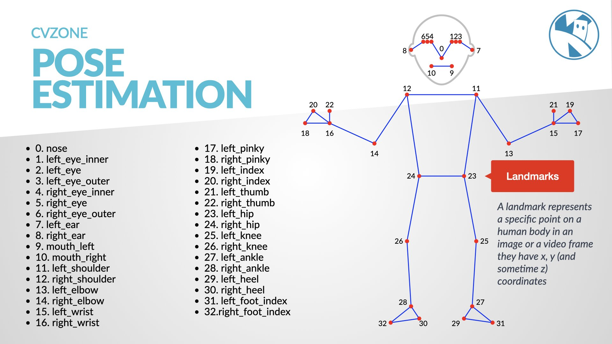

## Posture Detection

The ability to detect and assess posture has a multitude of applications ranging from health tech to gaming. While many libraries offer solutions for facial and hand detection, for full-body posture detection, a combination of tools like CVZone's PoseModule and the `mediapipe` library often provides more comprehensive results. Specifically, CVZone's PoseModule leverages the capabilities of `mediapipe` for pose estimation.

{:class="img-fluid w-75"}

---

1. **Install mediapipe:**

   To harness the capabilities of `mediapipe`, you'll first need to install it. Run the following command in your terminal or command prompt:

   ```bash
   pip3 install mediapipe
   ```

2. **Capture video and detect posture:**

   ```python
   from cvzone.PoseModule import PoseDetector
   import cv2

   # Initialize the webcam to the default camera (index 0)
   cap = cv2.VideoCapture(0)

   # Initialize the PoseDetector class. Here, we're using default parameters. For a deep dive into what each parameter signifies, consider checking the documentation.
   detector = PoseDetector(staticMode=False,
                           modelComplexity=1,
                           smoothLandmarks=True,
                           enableSegmentation=False,
                           smoothSegmentation=True,
                           detectionCon=0.5,
                           trackCon=0.5)

   # Loop to continuously get frames from the webcam
   while True:
       # Capture each frame from the webcam
       success, img = cap.read()

       # Detect human pose in the frame
       img = detector.findPose(img)

       # Extract body landmarks and possibly a bounding box 
       # Set draw=True to visualize landmarks and bounding box on the image
       lmList, bboxInfo = detector.findPosition(img, draw=True, bboxWithHands=False)

       # If body landmarks are detected
       if lmList:
           # Extract the center of the bounding box around the detected pose
           center = bboxInfo["center"]

           # Visualize the center of the bounding box
           cv2.circle(img, center, 5, (255, 0, 255), cv2.FILLED)

           # Calculate the distance between landmarks 11 and 15 and visualize it
           length, img, info = detector.findDistance(lmList[11][0:2],
                                                     lmList[15][0:2],
                                                     img=img,
                                                     color=(255, 0, 0),
                                                     scale=10)

           # Calculate and visualize the angle formed by landmarks 11, 13, and 15
           # This can be used as an illustrative example of how posture might be inferred from body landmarks.
           angle, img = detector.findAngle(lmList[11][0:2],
                                           lmList[13][0:2],
                                           lmList[15][0:2],
                                           img=img,
                                           color=(0, 0, 255),
                                           scale=10)

           # Check if the calculated angle is close to a reference angle of 50 degrees (with a leeway of 10 degrees)
           isCloseAngle50 = detector.angleCheck(myAngle=angle,
                                                targetAngle=50,
                                                offset=10)

           # Print the result of the angle comparison
           print(isCloseAngle50)

       # Display the processed frame
       cv2.imshow("Image", img)

       # Introduce a brief pause of 1 millisecond between frames
       cv2.waitKey(1)
   ```

### Deepening Your Understanding:

- **Visualizing Landmarks:** To get a clearer grasp of what's being detected, consider drawing lines connecting the landmarks. This can help visualize the skeletal structure detected by the PoseModule.

- **Analyzing Posture:** By computing angles between specific landmarks (e.g., the angle between the hip, knee, and ankle), you can discern certain postures like slouching or leaning.

- **Real-time Feedback:** Innovate by developing a system that alerts users in real-time if they adopt an incorrect posture.

- **Integration with IoT:** Envision a future where smart chairs adjust automatically based on a user's posture or devices that offer gentle reminders to adjust one's seating position. The possibilities are vast!

---

This lesson lays the foundation for posture detection and assessment. The real charm in computer vision emerges when you amalgamate techniques and integrate systems to tackle real-world challenges.

---
