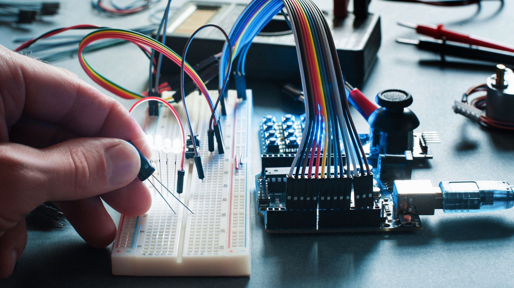

{:class="cover"}

## What is Electronics?

Welcome to the fascinating world of electronics! Are you ready to delve into a field that powers our modern life, from the smartphone in your hand to the satellites orbiting our planet? Electronics, a vibrant blend of physics and technology, is all about the manipulation and control of electric power and information through specially designed circuits, components, and systems.

In this beginner's course, you'll go on a journey exploring electronic components, discovering how they interact within circuits, and understanding how these systems find their applications in everything from household appliances to sophisticated space equipment. With a mix of theory and practical exercises, you're about to embark on a riveting exploration of the electronic world that is key to our digital age. No prior knowledge is required – just bring your curiosity and get ready to learn!

---

## Applications of Electronics

{:class="img-fluid w-75"}

Electronics is used in numerous applications across a wide range of fields, including:

- **Communication**: Devices like smartphones, radios, and satellites
- **Computing**: Computers and data storage devices
- **Medicine**: Medical imaging machines and electronic medical devices
- **Transportation**: Electronic systems in cars, planes, and ships
- **Home appliances**: TVs, refrigerators, and washing machines

---
