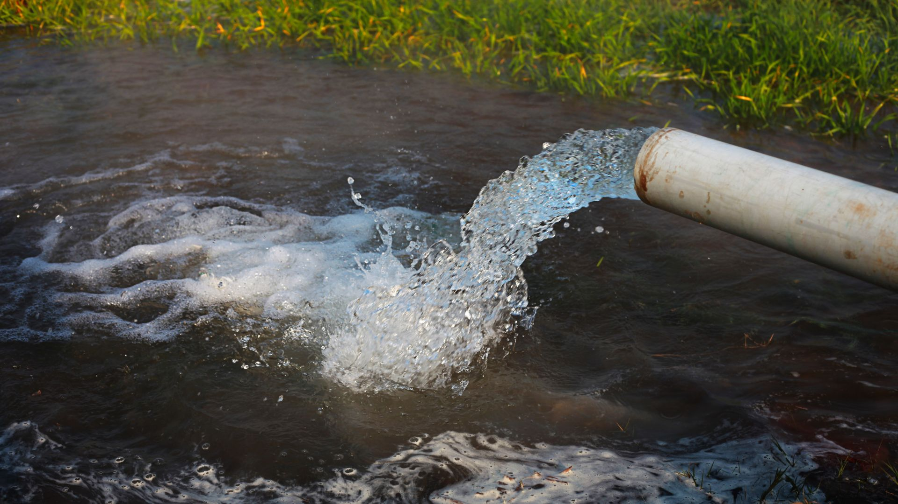

{:class="cover"}

In this lesson, we're going to delve into the foundational building blocks of electrical and electronic understanding: current, voltage, resistance, and power. These principles are critical for understanding and creating any electronic circuit. To make these concepts more relatable, we'll use water-based analogies throughout this lesson.

## Current

{:class="img-fluid w-75"}

Electric current, measured in amperes (A), can be likened to the flow of water in a river. The current represents the rate at which electric charge flows through the circuit. Imagine each electron as a drop of water - the electric current would be the amount of water (or electrons) flowing past a certain point per second. The stronger the flow (or the more water moving), the higher the current.

---

## Voltage

{:class="img-fluid w-75"}

Voltage, or electric potential difference, measured in volts (V), is similar to the water pressure in a system. It's the force that "pushes" the current through the circuit. In our water analogy, if a water pump creates pressure that moves water through a pipe, then in an electric circuit, the battery creates voltage that moves electrons (i.e., electric charge) along the circuit. The higher the voltage (akin to water pressure), the more potential there is for current (water flow) to occur.

---

## Resistance

{:class="img-fluid w-75"}

Resistance, measured in ohms (Ω), is a measure of opposition to the flow of current in a circuit. Imagine you have rocks or obstacles in a river. They would hinder or resist the flow of water. Similarly, every component in a circuit introduces some resistance which affects the ease with which current can flow. The higher the resistance, the more the current is "resisted" or impeded.

---

## Power

{:class="img-fluid w-75"}

Power in an electric circuit, measured in watts (W), is akin to the work done by a water wheel driven by the flow of a river. It's a measure of how much work can be done by the current in a certain amount of time, or how much energy is transformed by the circuit per second. Higher water flow can turn a larger water wheel - likewise, higher electric power (a product of voltage and current) can light up a brighter bulb or run a more powerful motor.

---

## Ohm's Law

{:class="img-fluid w-50"}

Finally, let's consider [`Ohm's Law`](/resources/glossary#ohms-law). Ohm's Law is like a relationship between the width of a pipe (resistance), the water pressure (voltage), and the amount of water that flows (current). It tells us that the current through a wire (our pipe) is directly proportional to the voltage applied (water pressure) and inversely proportional to the resistance (width of the pipe). This simple but powerful principle helps us understand and predict how changing one variable will impact the others.

Understanding these fundamental concepts will equip you with the knowledge needed to delve deeper into the exciting world of electronics.

---
