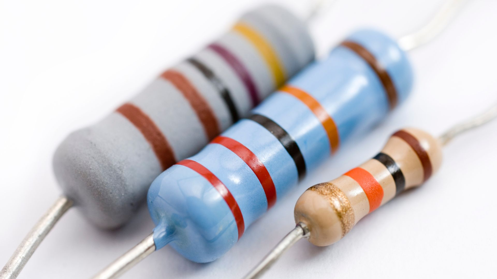
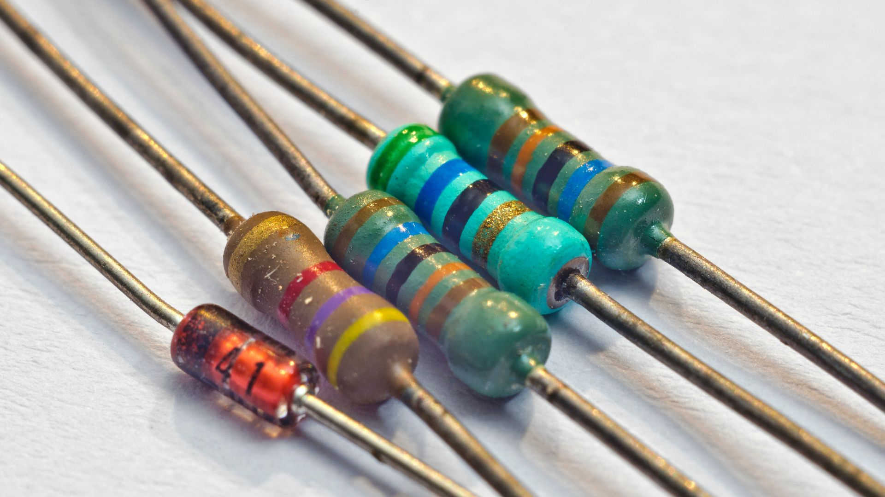
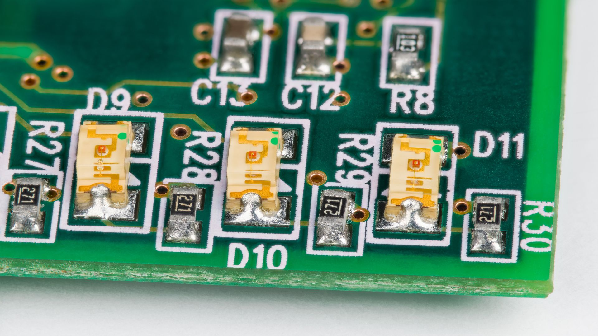
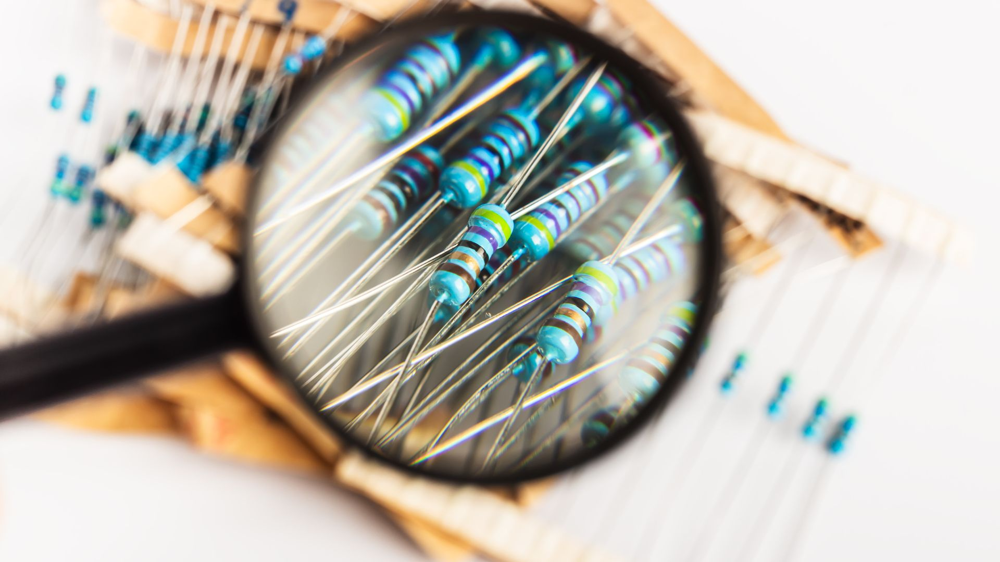
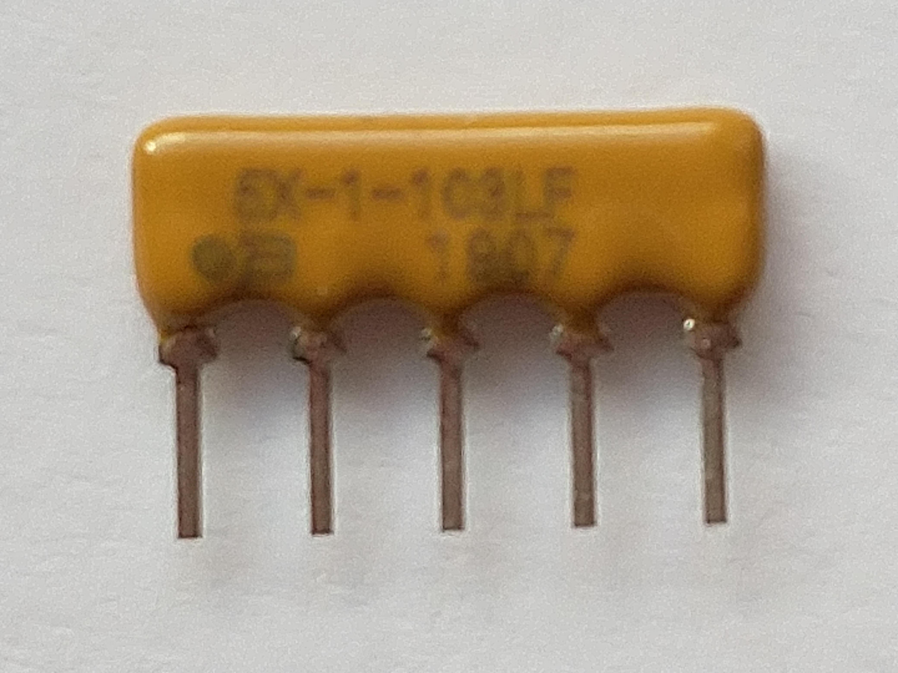
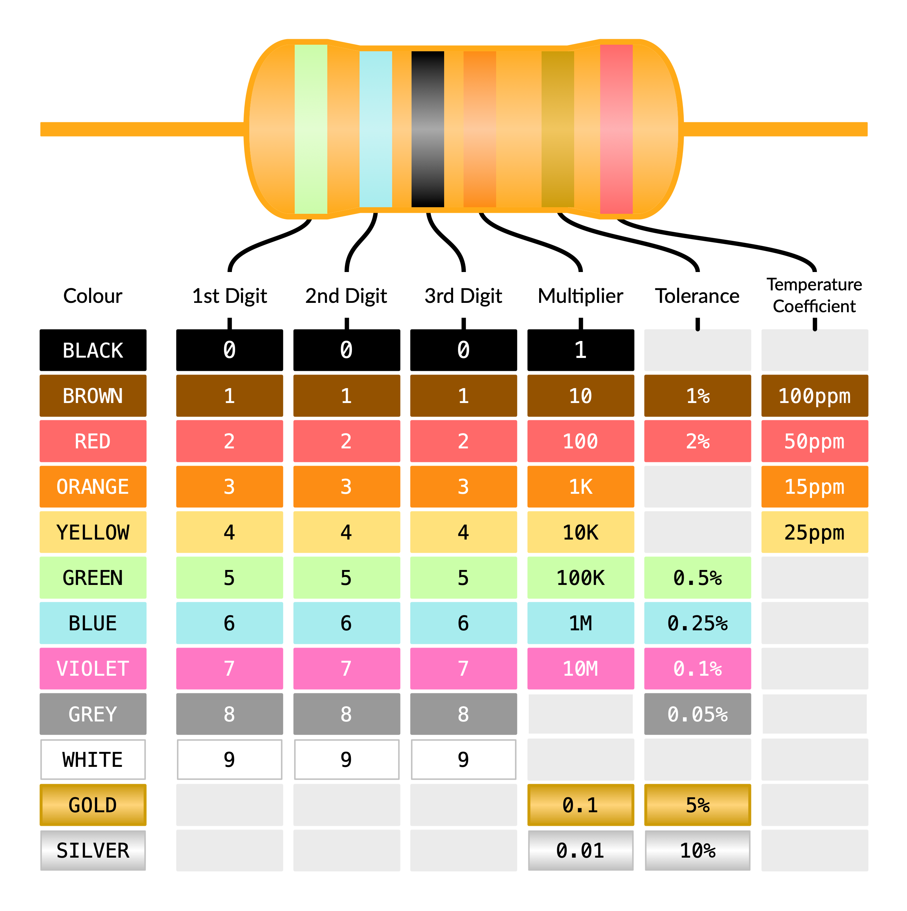
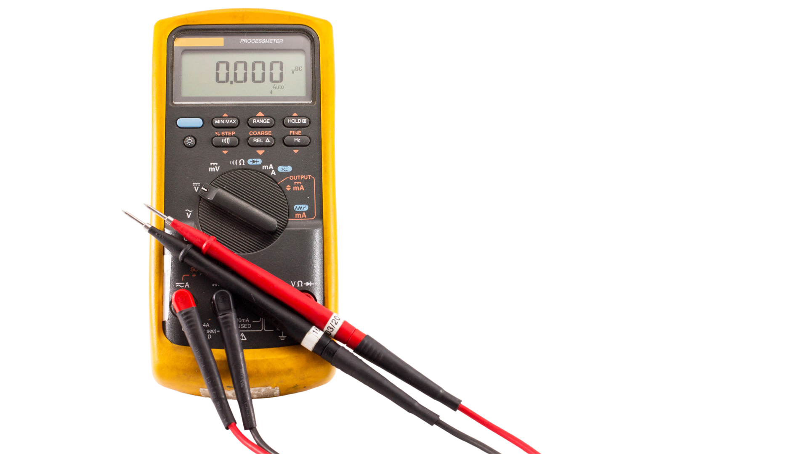

{:class="cover"}

In our last lesson, we introduced the resistor, likening it to a narrow part of a river that impedes the water's flow. Lets go in-depth about resistors, learning what they are, their function, their various types, and how they're used in electronic circuits.

---

{:class="img-fluid w-75"}

Resistors are a crucial part of any electronic circuit. This guide will cover everything you need to know about resistors, from their units of measurement to their types and applications.

---

## Units of Measure - Ohms

The electrical resistance of a resistor is measured in units called Ohms (Ω). The Ohm is named after the German physicist, George Simon Ohm, who formulated Ohm's Law.

---

## Schematic Symbol

{:class="img-fluid w-75"}

Resistors are depicted using schematic symbols in circuit diagrams. The American symbol represents a resistor as a zigzag line, while the International symbol is a rectangular box.

---

## What Does a Resistor Do?

Resistors control the flow of electric current in a circuit. Here are a few key uses:

- **Potential Divider:** Resistors are used in a potential divider circuit to create new voltage levels.
- **Biasing:** They can be used to set the operational points of active devices like transistors.
- **Op-amp Gain and Feedback:** In operational amplifiers, resistors define the gain and feedback of the circuit.
- **Current Limiting:** Resistors can limit the amount of current that passes through a circuit.
- **Impedance and Current Matching:** They are used for impedance matching, and to ensure current is evenly distributed in parallel circuits.
- **Data and Address Bus Pull-up:** Resistors are used in pull-up applications to ensure defined levels in a data bus.

---

## Types of Resistors

{:class="img-fluid w-75"}

Resistors can be categorized by their mounting type, among other features:

- **Through-hole or Surface Mount:** These are the two primary methods of mounting a resistor onto a circuit board.
- **Resistor Packs:** These are a set of resistors grouped together in one package.
- **Fixed Value Resistors:** These resistors have a set resistance that cannot be adjusted.
- **Variable Resistors (Potentiometers):** The resistance of these can be adjusted according to the needs of the circuit.

---

### Through-Hole

{:class="img-fluid w-75"}

Through-hole resistors, also known as plated through-hole (PTH) resistors, are characterized by leads that are inserted through holes in the PCB and then soldered. Common types include half-watt (1/2 W) and quarter-watt (1/4 W) resistors.

---

### Surface-Mount

{:class="img-fluid w-75"}

Surface-mount resistors are directly soldered onto the surface of the PCB. They come in various package sizes like:

- 0805: 0.08 inches long by 0.05 inches wide
- 0603: 0.06 inches by 0.03 inches
- 0402: 0.04 inches by 0.02 inches

---

## What's Inside a Resistor?

{:class="img-fluid w-75"}

Resistors are made from a variety of materials. The most common ones include:

- **Carbon Film:** These are made by depositing a carbon film on a ceramic rod.
- **Metal Film:** These are created by depositing a thin metal layer on a ceramic rod.
- **Wirewound:** Wirewound resistors consist of a metallic wire wrapped around a non-conductive core.
- **Metal-Oxide Film:** These are made with a metal oxide film on a ceramic rod.
- **Metal Strip:** Metal strip resistors are made by shaping a metal alloy strip into a resistive element.

Resistors also come in thick and thin film types. Thick film resistors are cheaper but less accurate. Thin film resistors, on the other hand, are more expensive but offer greater accuracy.

---

## Resistor Packages & Resistor Networks

{:class="img-fluid w-50"}

Resistors sometimes come in arrays of five or more, often sharing a common pin. This can be advantageous when the same resistance value is needed in multiple places within a circuit. They're typically found in single inline (SIL) or dual inline (DIL) packages.

---

## Colour Bands

Resistors often have colored bands on them which indicate their resistance value, tolerance, and sometimes their temperature coefficient. There are different schemes used including:

- **Four Band:** This is the most common and includes two bands for the resistance value, one for the multiplier, and one for the tolerance.
- **Five and Six Band:** These include additional bands for increased precision or to indicate the temperature coefficient.

{:class="img-fluid w-50"}

---

## Power Rating

The power rating of a resistor refers to the maximum amount of power it can dissipate without overheating or failing. Common power ratings for resistors include 1/4 watt, 1/2 watt, 1 watt, and 2 watts. This rating is determined by the physical size of the resistor, with larger resistors generally able to dissipate more heat and thus handle more power.

---

## Using a Multimeter to Measure Resistance

You can measure the resistance of a resistor using a multimeter. To do this, you'll want to set the multimeter to the resistance setting (usually indicated by the Greek letter Omega, Ω), connect the probes to either end of the resistor, and read the resistance value on the screen.

{:class="img-fluid w-50"}

---

## Resistors in Series and Parallel

When resistors are connected in a series, their total resistance is simply the sum of their individual resistances. In a parallel circuit, however, the total resistance is found by summing the reciprocals of the individual resistances, and then taking the reciprocal of that sum.

---

## Pull-Up Resistors

Pull-up resistors are used to ensure that a wire is pulled to a high logical level in the absence of an input signal. This can prevent undefined states in a digital logic circuit, particularly in scenarios where the input may float if not otherwise driven.

---

## Temperature Coefficient

The temperature coefficient of a resistor describes how its resistance changes as temperature changes. Resistors with low temperature coefficients are less likely to see their resistance change with temperature, making them suitable for precise applications.

---

## Resistor Aging and Stability

Over time, a resistor's value can change due to various factors such as temperature, humidity, voltage, and time. This process is known as aging. High-quality resistors tend to have better stability, meaning their resistance value changes less over time.

---

## Thermal Resistance and Power Rating

Thermal resistance is a measure of a resistor's ability to dissipate heat. A lower thermal resistance means the resistor can dissipate heat more effectively. This is closely related to the power rating, which is the maximum amount of power a resistor can handle before it risks damage.

---

## Resistor Noise

All resistors generate some amount of electrical noise, often referred to as Johnson-Nyquist noise or thermal noise. This noise is due to the random motion of charge carriers (like electrons) in the resistor and can interfere with the signal in sensitive electronic devices.

---

## High-Frequency Behavior

At high frequencies, the behavior of resistors can change. They can start to act as capacitors or inductors due to their physical construction, and their resistance can also vary with frequency. This is important to consider in high-speed or high-frequency applications.

---
