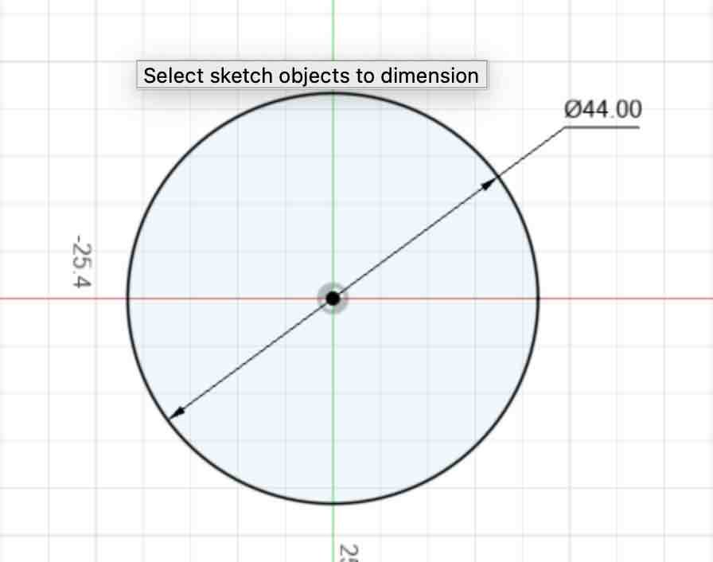
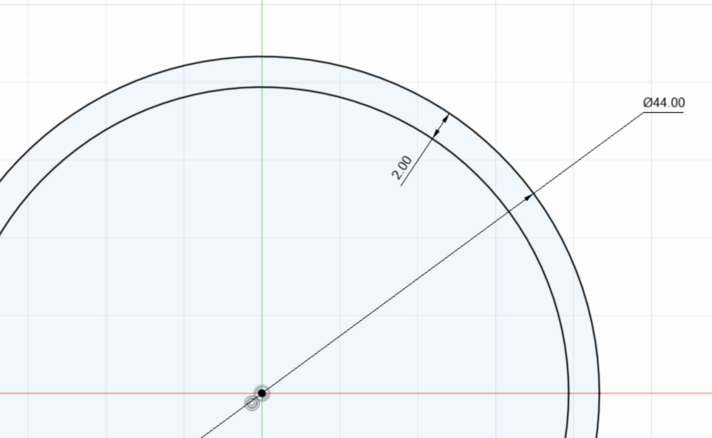
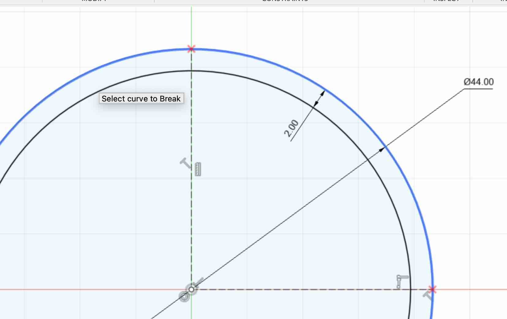
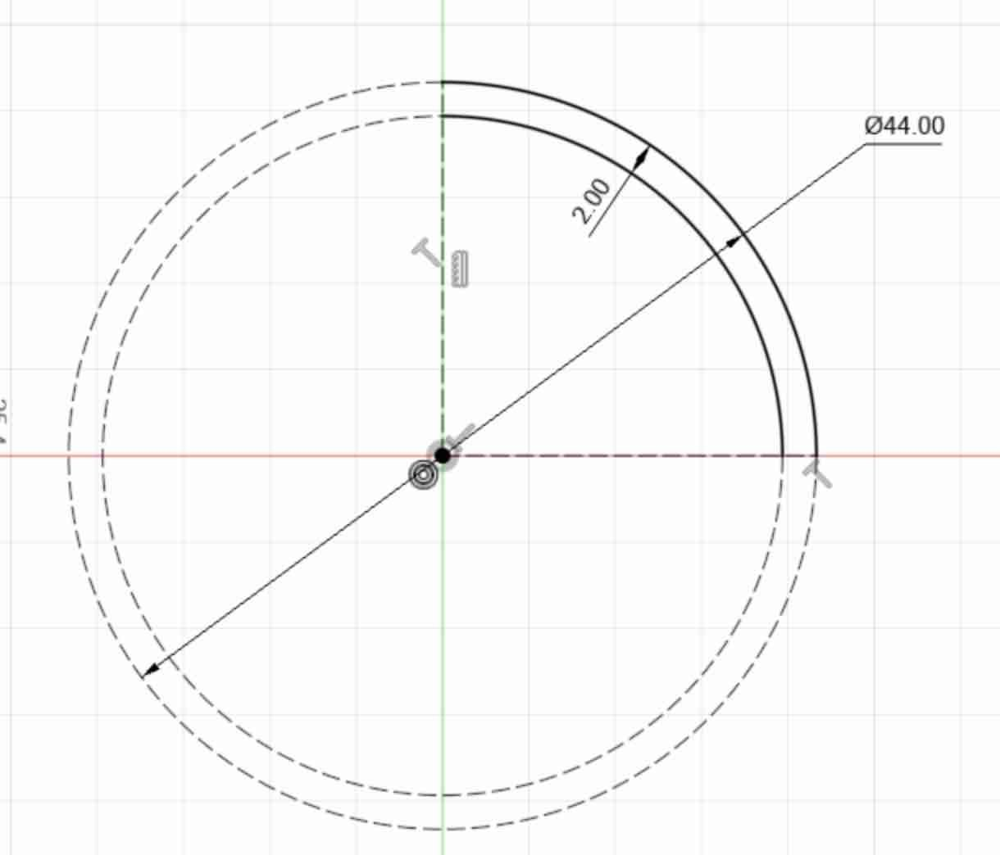
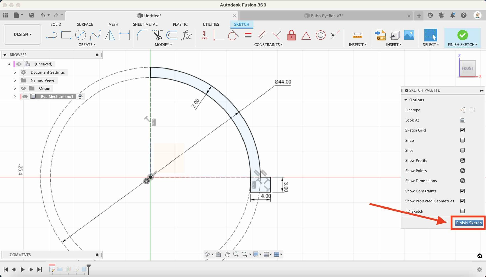

## Create a Sketch

* **Click Create Sketch** - Click on the Create Sketch button on the toolbar

{:class="img-fluid w-50"}

---

* **Select Y Plane** - Click on the Y Plane, so that the Front is facing you

{:class="img-fluid w-100"}

---

* **Press C to draw a Circle** - Press `c` on the keyboard to enter circle drawing mode.

{:class="img-fluid w-100"}

---

* **Click the origin point and drag out the circle** - move the mouse over the origin point; its the point where the the axis cross and has a little `puck` at the center, and then drag the circle outline out, clicking again to release the circle drawing mode.

You can set the circle diameter next, so don't worry about getting this just right now.

---

* **Press D to enter Dimension mode** - Press `d` on the keyboard to enter `dimension` mode. You can use this to set the dimension of a line, diameter of a circle or distance between two points.

* **Set the Dimension** - Click on the blue circle and type `44` to set the diameter of the circle to `44mm`. The circle will turn `black` once the dimension is set; this incidates the sketch is fully defined, locked into place, and cannot float about the canvas.

{:class="img-fluid w-50"}

---

* **Press C to draw another Circle** - Press `c` on the keyboard to enter circle drawing mode again.

---

* **Click the origin point and drag out the circle** - move the mouse over the origin point again, and then drag the circle outline out, click again to release the circle drawing mode. Make the circle smaller than the first one.

---

* **Press D to enter Dimension mode** - Press `d` on the keyboard to enter `dimension` mode.

* **Set the second circle Dimension** - Click on the blue circle and then click the original circle, you can now set the distance between the two; type `2` to set the diameter of the circle to `2mm`. The circle will turn `black` as it is now fully defined.

{:class="img-fluid w-50"}

---

* **Press L to enter Line drawing mode** - Press `l` on the keyboard to enter `line drawing` mode.

---

* **Press X to make the line a construction line** - Press `x` on the keyboard to make the line a `construction line`.

> Note that you can toggle between a `regular line` and a `construction line` by pressing `x` when the line geometry is selected.

---

* **Draw a verticle line** - Draw a verticle line from the origin point to the top of the circle. The line will snap to the circle geometry. The line will also snap to 90° from horitonal.

{:class="img-fluid w-50"}

---

* **Draw a horizonal line** - Draw a horizontal line from the origin point to the right edge of the circle. The line will snap to the circle geometry. The line will also snap to 90° from verticle.

{:class="img-fluid w-50"}

---

> ## Breaking lines
>
> You can `break` a line into pieces using the `break` function, from the `MODIFY` menu.
>
> {:class="img-fluid w-100"}
>
> `Break` will split the line into pieces wherever it touches another line or piece of geometry. We can use this to keep the geometry, but make different pieces either regular lines or a construction lines.
>

---

* **Break the circle line** - Click `Break` from the `Modify` menu and then click on the left and side of the larger circle.

You will see two red `x`'s appear where the horizontal and verticle lines intersect the larger circle.

{:class="img-fluid w-50"}

---

* **Break the smaller circle** - Click `Break` again and then click on the left and side of the smaller circle.

---

* **Make the left hand circle parts construction lines** - Click the left hand side of the larger and smaller circles and press `x` on each to make these sections into `construction lines`.

{:class="img-fluid w-50"}

---

* **Close the top of the circle** - Press `l` to enter line drawing mode, and the draw a verticle line between the larger and smaller circle sections.

{:class="img-fluid w-50"}

---

* **Draw a profile and dimension** - Draw the profile shown below, and use the dimension tool (press 'd') to set the dimensions accourdingly.

{:class="img-fluid w-50"}

{:class="img-fluid w-50"}

---

* **Finish Sketch** -Click on the finish Sketch button

{:class="img-fluid w-50"}

---
