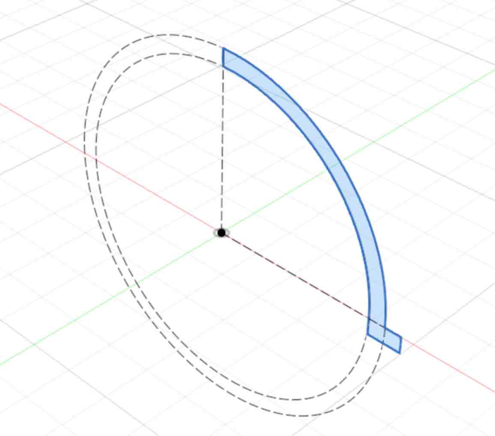
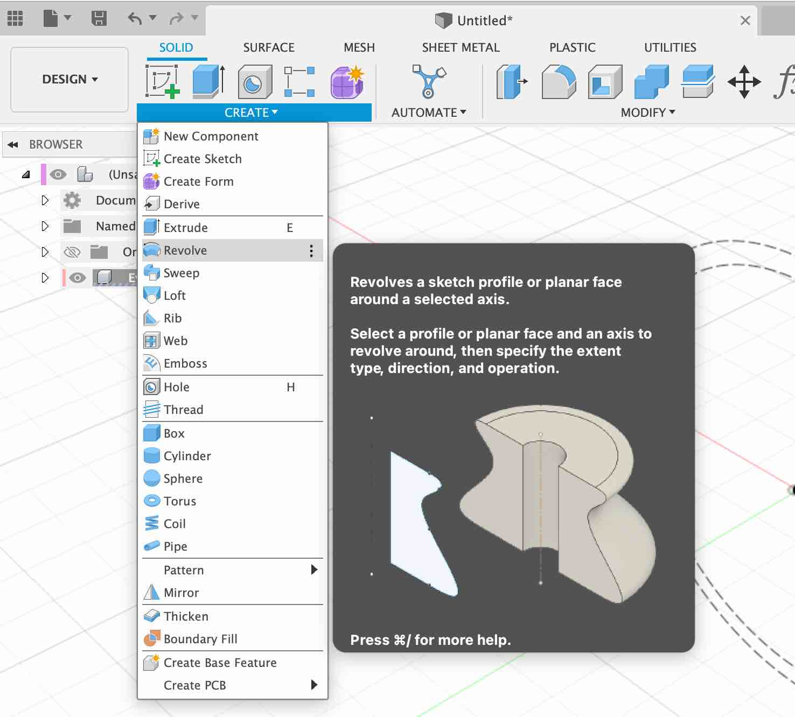
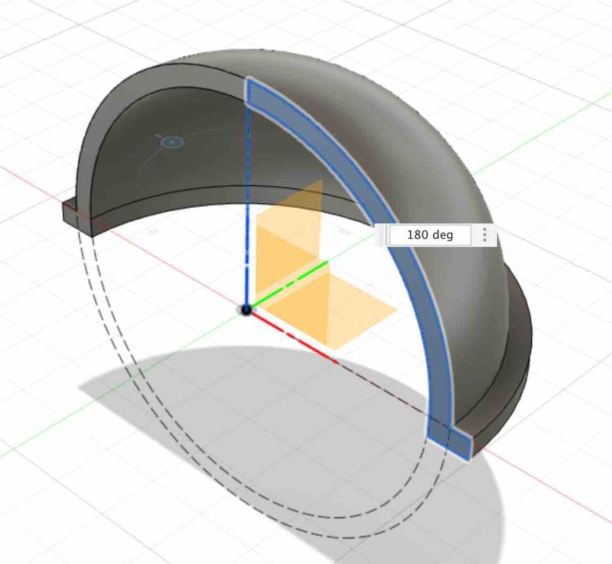
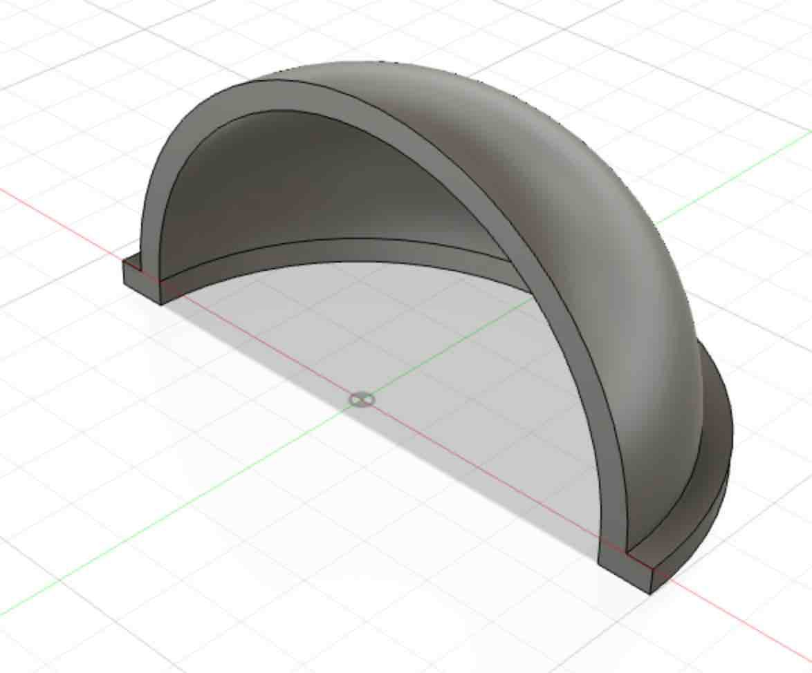

* **Select the profile** - Click within the newly created profile to select it

{:class="img-fluid w-50"}

---

* **Revolve the profile** - Click the Revolve Tool from the 'CREATE' Menu

{:class="img-fluid w-50"}

* **Select the Axis** - Select the Blue `Z` Axis and you will see the new shape appear.

{:class="img-fluid w-50"}

* **Set the rotation** - Set the rotation to 180° so the shape looks like the quarter of a hollow sphere.

{:class="img-fluid w-50"}

---
