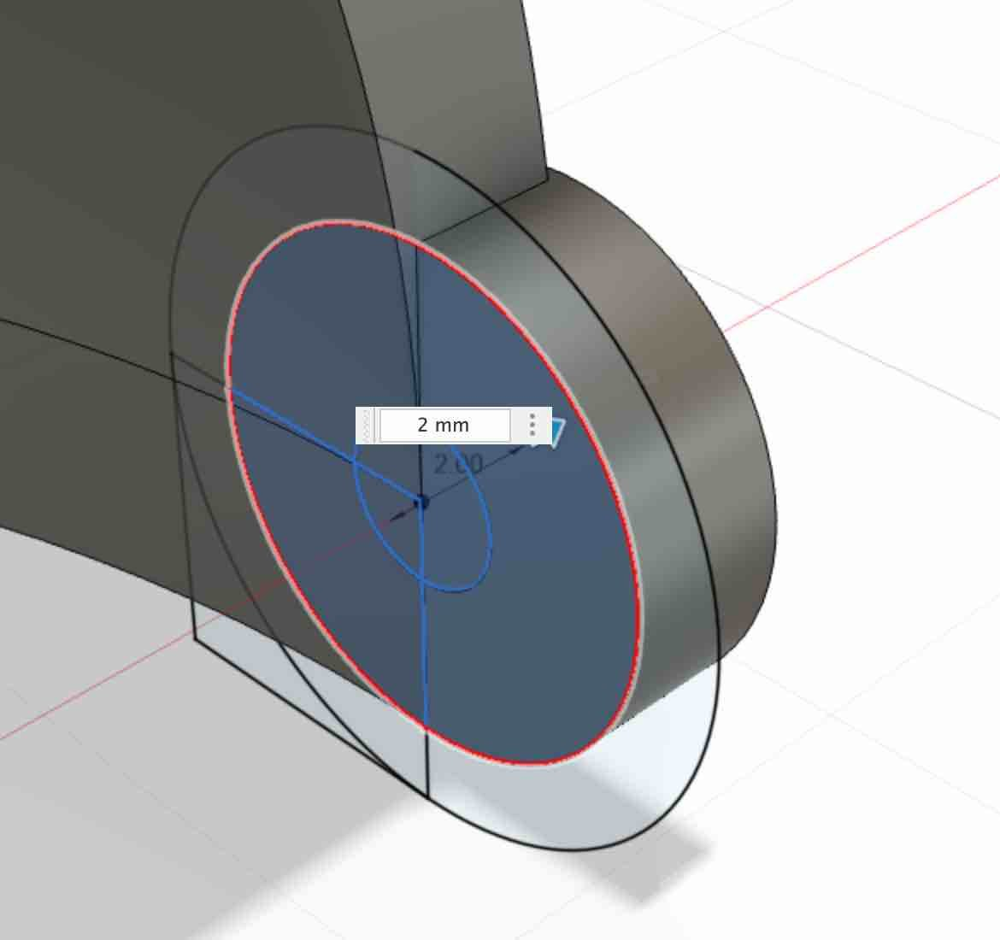
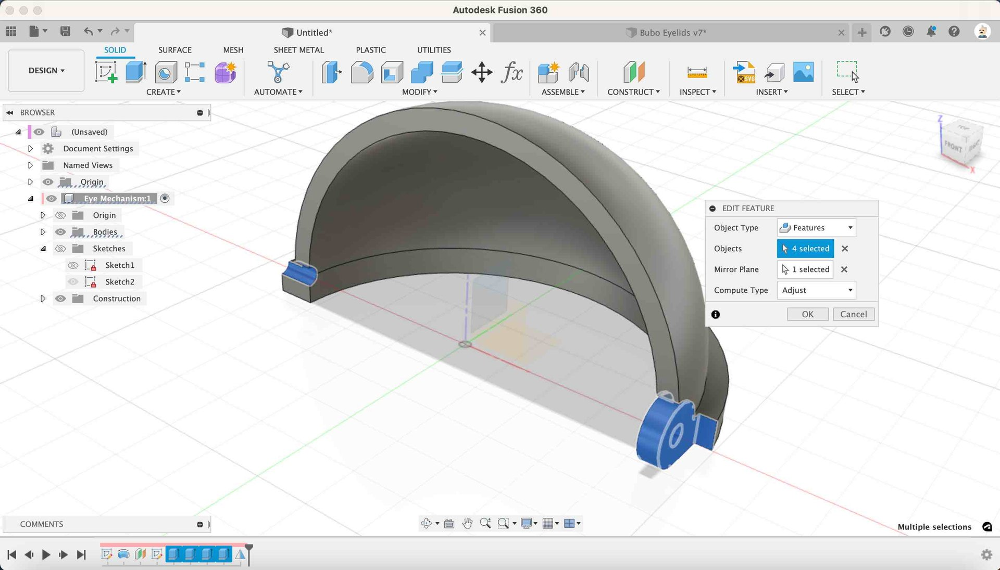

* **Extrude Join** - Extrude the middle and inner circle out towards the outer edge of the eyelid by `2mm`.

{:class="img-fluid w-50"}

Make sure the operation is set to `join` in the `Edit Feature` dialog box, then click `Ok`.

{:class="img-fluid w-50"}

---

When you Clicked `ok` in the last operation, Fusion hid the Sketch2 profile that we had created. To make this visible again we need to click the little `eye` icon next to the sketch.

{:class="img-fluid w-50"}

* **Make the Sketch Visible** - Click the `eye` icon next to the sketch named `sketch1`

{:class="img-fluid w-50"}

---

* **Extrude Cut** - Select the same profile again, press `e` to enter Extrude mode and this time type `1mm` as the measurement. You will notice that the extrusion of the profile turns red indicating that this is a `cut` operation.

{:class="img-fluid w-50"}

---

* **Extrude Cut** - Select the small profile from the sketch, press `e` to enter Extrude mode, and set the:

  * `Direction` to `Symmetric`
  * `Extent Type` to `All`
  * `Distance` to `All`

* **Click Ok** - Then click `Ok`

This will cutout the screw hole in both directions.

{:class="img-fluid w-100"}

---

> To make this next step easier, move the camera so you can see the outside edge of the eyelide. Use the [viewcube](04_create_hinges#the-viewcube) to move the camera.
{:class="bg-blue"}

* **Extrude Cut** - Select the square shape along with the rest of the profile from the sketch, press `e` to enter Extrude mode, and set the:

  * `Start` to `Object` and click the flat outside surface of the eyelid
  * `Extent Type` to `All`
  * `Distance` to `All`
  * `Operation` to `Cut`

{:class="img-fluid w-100"}

---

The finished result:

{:class="img-fluid w-50"}

---

> ## Mirror function
>
> We can mirror `bodies`, `components`, `features` and `faces` using the `Mirror` function. This is a huge timesaver, especially when parts need to be symmertical; we can build one half and mirror the rest.
>
> {:class="img-fluid w-100"}

---

* **Mirror** - Click the `Mirror` function from the `CREATE` toolbar menu.

{:class="img-fluid w-100"}

* **Select the Feature** - Select the last for features from the Timeline (they are all the Extrude operations we just did)

* **Select the Mirror Plane** - Click the `Mirror Plane` option from the `Edit Feature` Dialog box and then click the `YZ` Origin plane.

* **Click Ok** - Click `Ok` to complete the mirror operaiton.

The Eyelid Model should look like this:

{:class="img-fluid w-100"}

---
