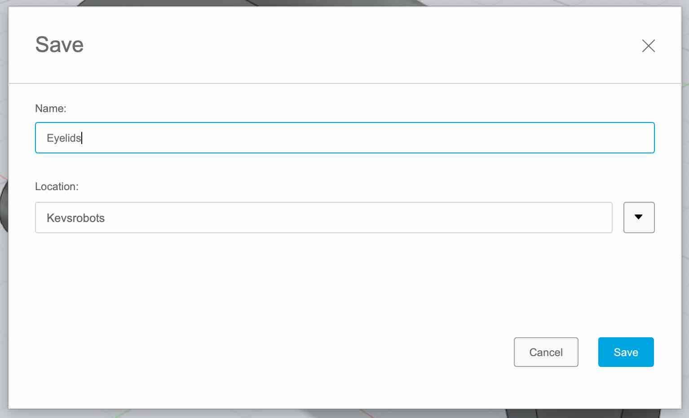
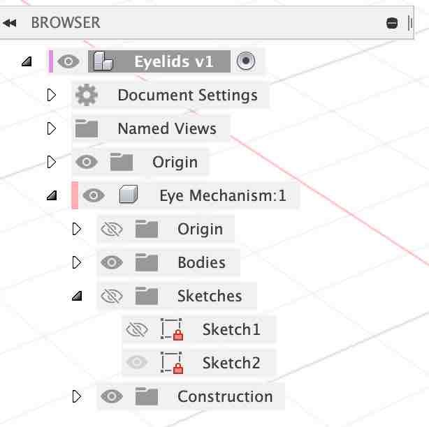

{:class="cover"}

> ## Components
>
> It's good practice to separate each part of our model into different components. This will make is possible to attach them together later with articulated joints.

---

> ## Save our design
>
> Oops, we forgot to do something quite important; Save our design.
>
> Fusion saves a new version of our model each time we click the save button. This helps when we're working on one part of the design in one file, and assemble the parts in another file - Fusion will know if there is a newer version of the part and ask you to update the assembled version.
>
> Let's do this now.
>
> {:class="img-fluid w-100"}
{:class="bg-blue"}

* **Save the model** - Click on the Save command from the File menu, and give your model a name such as `eyelids`.

---

## New Component

We want to create the new component at the same level as the original component we created. This will allow us to join them together later.

* **Select the root component** - Click on the `Eyelids` component at the root (the radio button to the right of the component name to select it.)

{:class="img-fluid w-50"}

---

{:class="img-fluid w-100"}

* **Rename Component** - rename the existing component to Upper Eyelid

The result should look like this:

{:class="img-fluid w-150"}

---

* **Create a new Component** - Click the `ASSEMBLE` toolbar menu item then click `Create New Component`

{:class="img-fluid w-100"}

---

* **Name the Component** - Name the new component `Lower Eyelid`

{:class="img-fluid w-50"}

---
