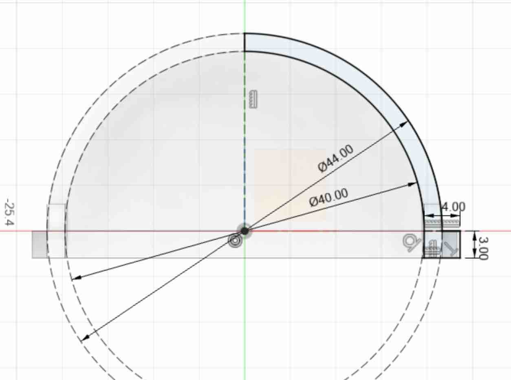
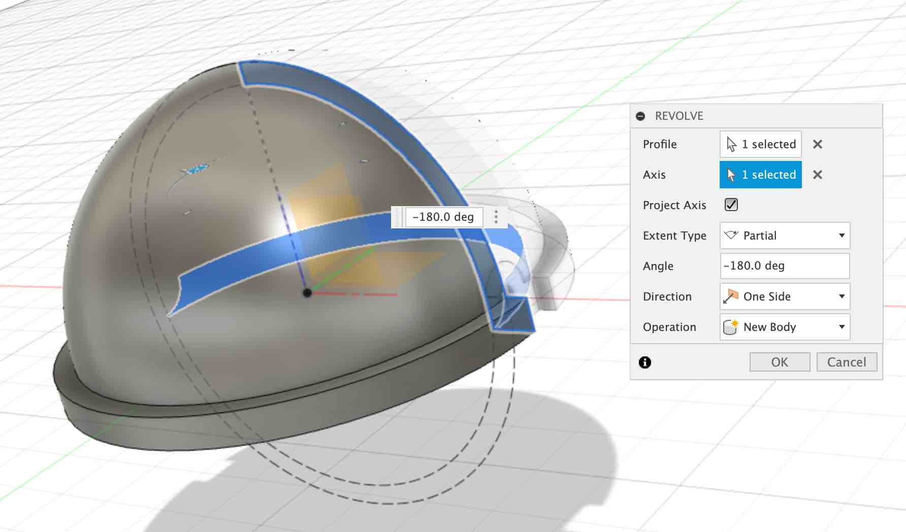
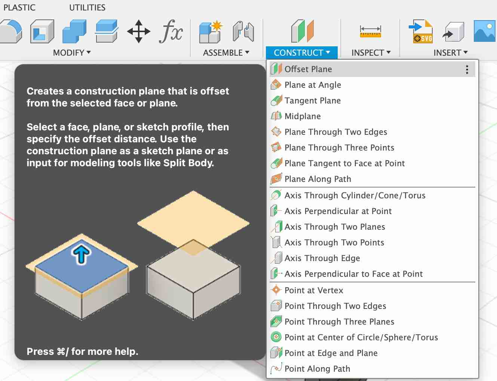
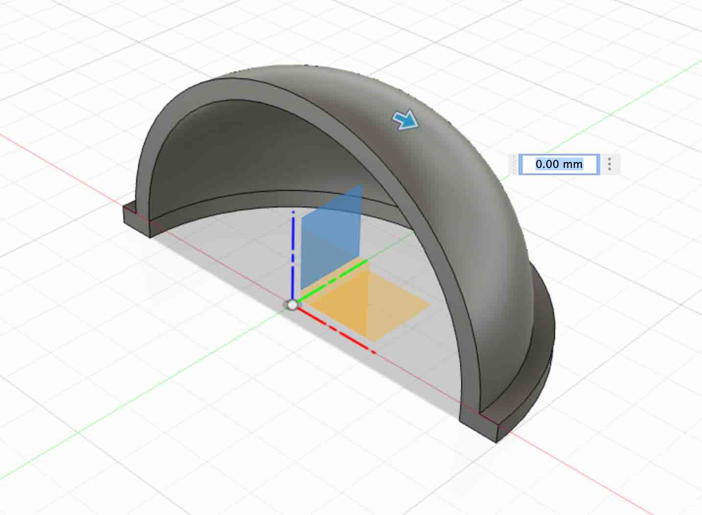
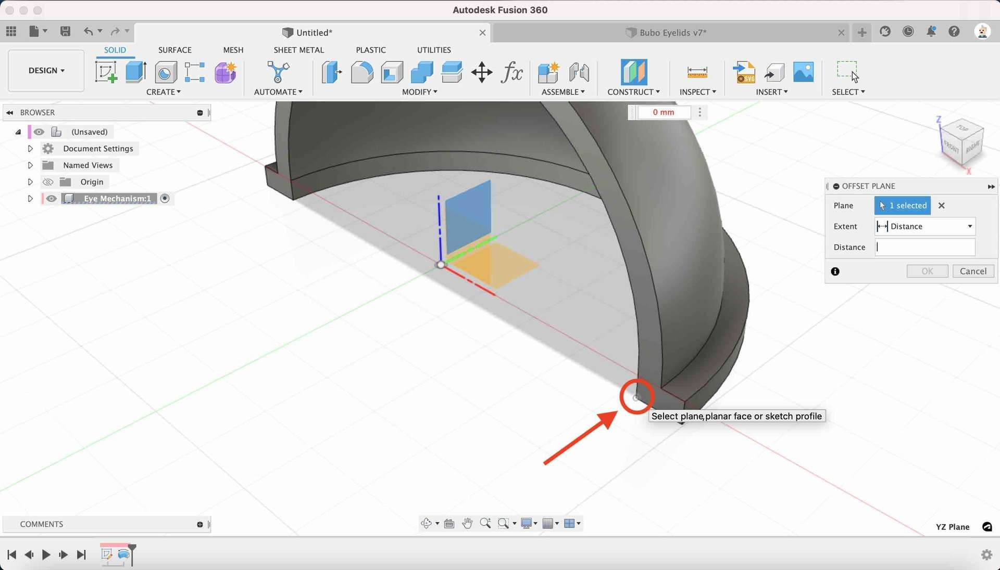
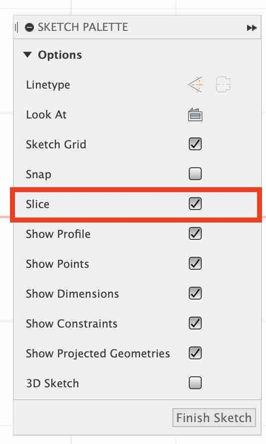
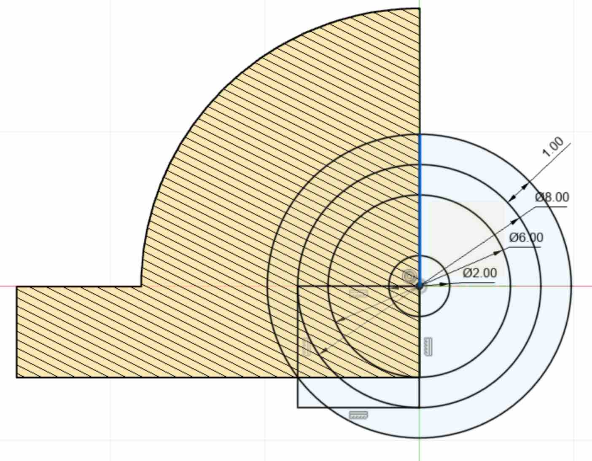

## Picking up the pace

This next step is similar to creating the profile for the upper eyelid. Now that you have the hang of how to do that, we will pick up the pace a little and show the profiles needed, and just the operations to perform.

---

## Lower Eyelid sketch

* **Create a new sketch** - on the XY Plane (the bottom plane), draw out 2 circles using the same dimension as before

  * 44mm for the outer circle
  * 40mm for the inner circle

This is the same sketch you created in [Lesson 2](02_create_sketch#create-a-sketch). 

---

{:class="img-fluid w-50"}

---

* **Rotate - 180** - Simliar to Lesson 2, but this time we will use the revolve tool to rotate the profile -180.

{:class="img-fluid w-100"}

---

## Create the hinges

Lets create the hinges similar to in [lesson 4](04_create_hinges#).

---

* **Create new Sketch** - Create a new sketch on the edge of the eyelid by clicking the `CONSTRUCT` Menu and selecting the `offset plane` option.

{:class="img-fluid w-50"}

---

* **Select the `YZ` plane** - select the `YZ` plane, this is th eone that is facing the right side of our model.

{:class="img-fluid w-50"}

---

* **Click on the point side the eyelid** - Click on the point thats highlighted in the image below. The new plane should then be offset by `20mm` from the `YZ` plane.

{:class="img-fluid w-100"}

---

* **Create the hinge profile** - Select the newly created offset plane and click on the `Create Sketch` button to create a new sketch on this plane.

---

* **Slice** - Click on the `Slice` option from the `Sketch Palette`. Slice will remove the parts of the model that are between the camera and the selected sketch profile. This allows us to see inside of the model.

{:class="img-fluid w-50"}

---

* **Create Four circles** - Using the circle creation mode (press `c`), create four circles:

  * one that is 2mm
  * one that is 6mm
  * one that is 8mm
  * one that is 10mm

---

* **Create a square** - Use the rectangle drawing mode by pressing `r`. Start the rectangle at the origin, and drag it until the bottom line is touches the bottom of the circle, and the leftmost side touches the left side of the circle. You can also use the Tangent tool to ensure the line and circles are aligned.

{:class="img-fluid w-50"}

---

* Finish Sketch**** - Click `the Finish Sketch` button

---
