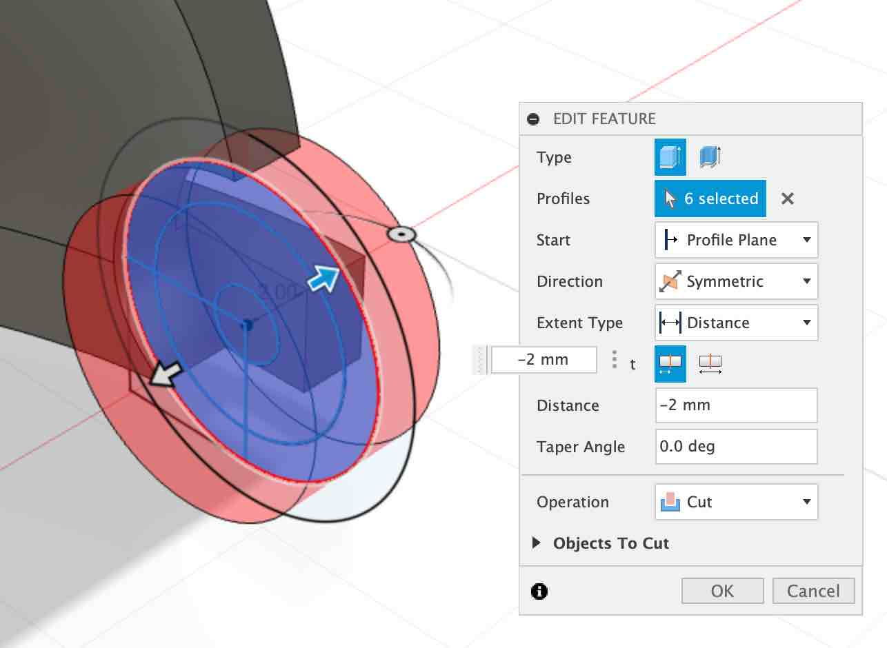
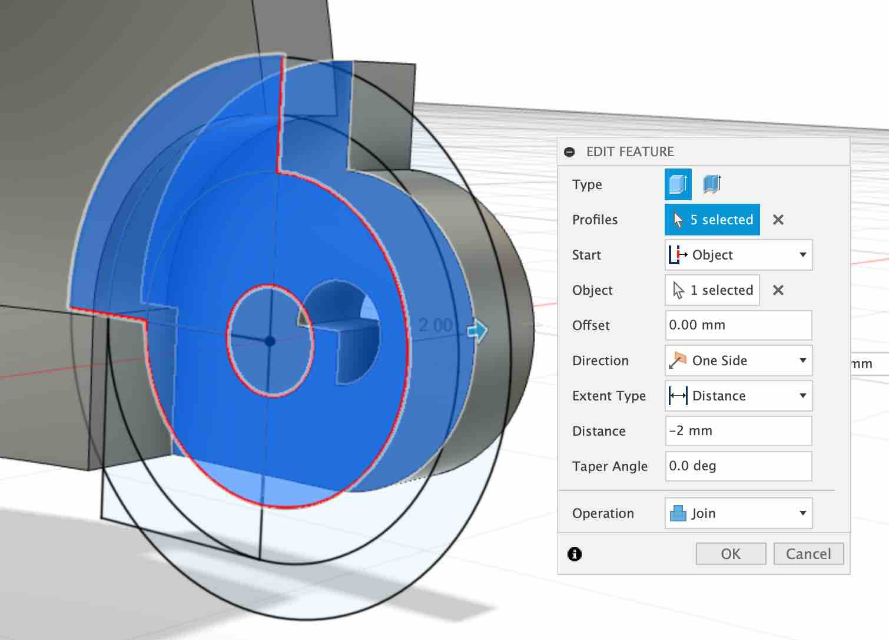
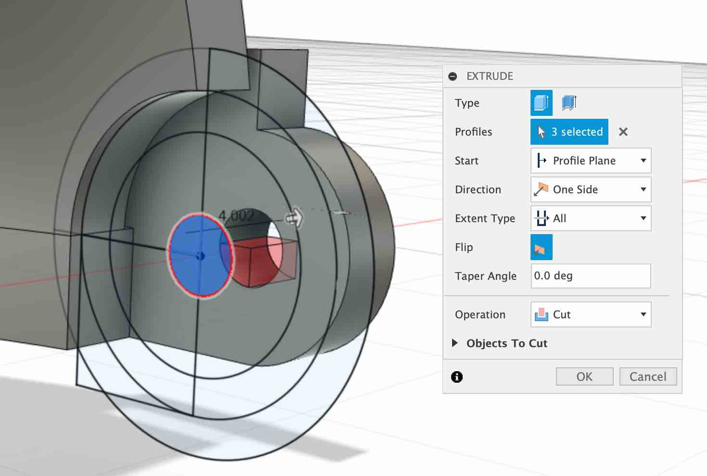
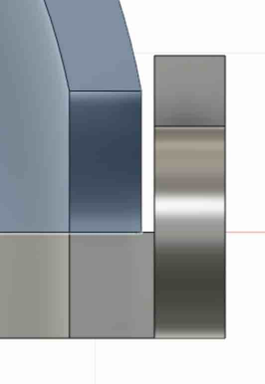
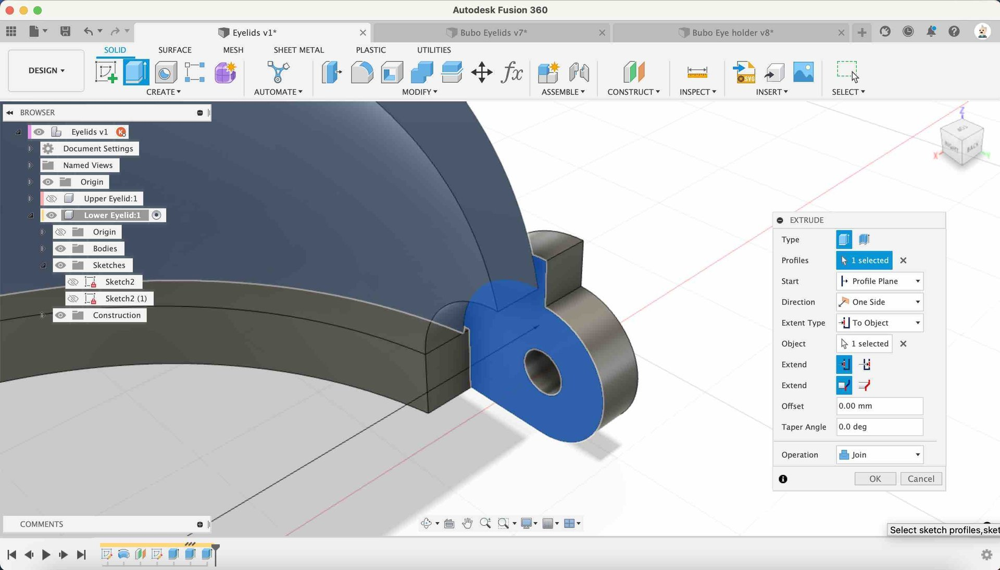
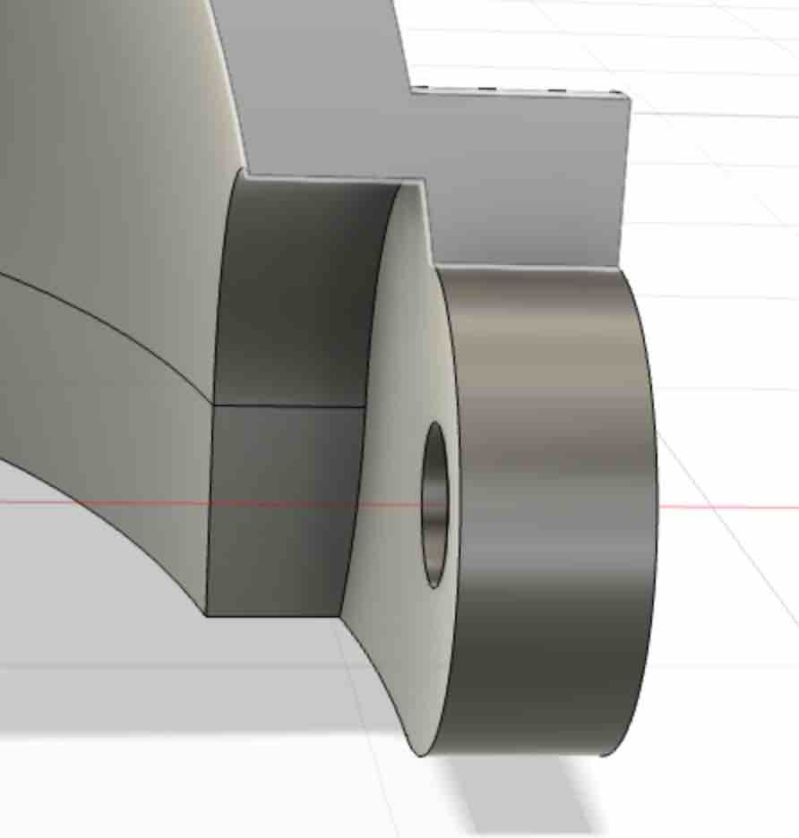

## Lower Hinge

The lower eyelid hinge needs to fit over the upper eyelid hinge, so we can use that to extrude from.

---

* **Extrude** - Select the circle profiles and extrude by 2mm symmetrically.

{:class="img-fluid w-50"}

---

* **Join** - Extrude the profile below by -2mm:
  
  * Set the `start` to `object`, and use the flat section as the new `object` profile

{:class="img-fluid w-50"}

---

* **Extrude the screw hole** - extrude the middle screw hole profile, setting the distance to `all`

{:class="img-fluid w-50"}

---

## Extrude to Object

There is a small gap between our parts that we need to fill.

{:class="img-fluid w-50"}

Fusion has a handy feature for this in the extrude dialog box in the extent type called `to object`.

{:class="img-fluid w-100"}

{:class="img-fluid w-50"}

---

## Mirror

Lets mirror this new feature.

* **Mirror** - Click on the `CREATE` and Mirror function, then select the 4 features that have just been created and the origin as the mirror plane.

---
