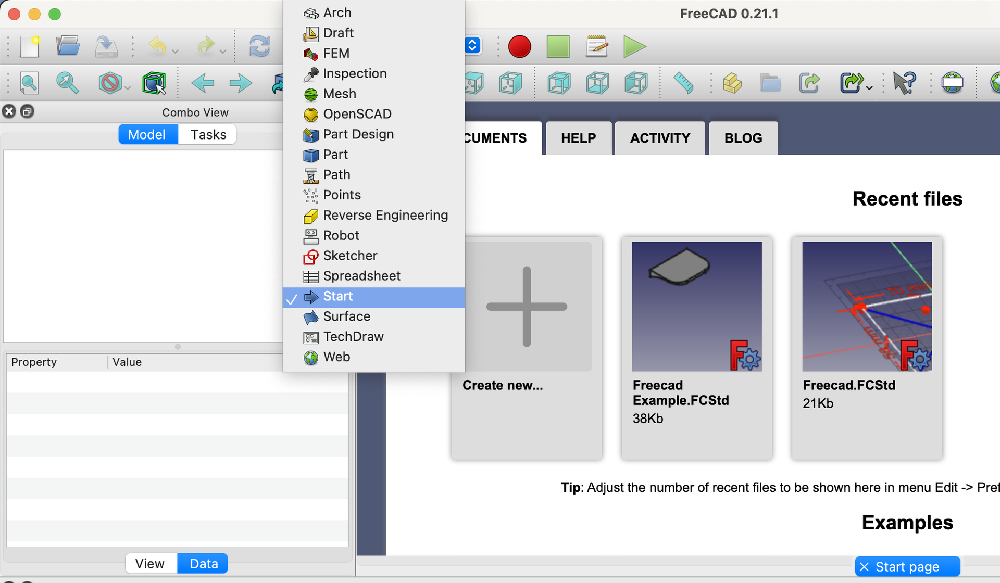
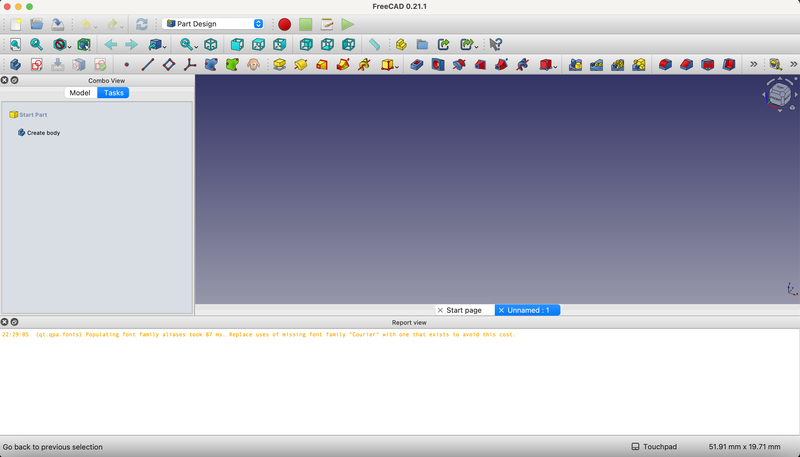
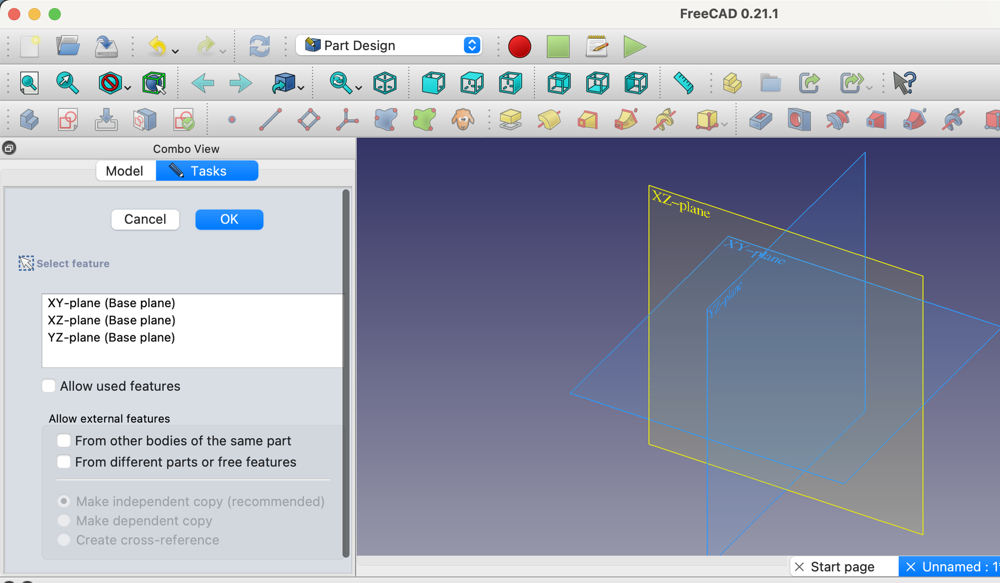
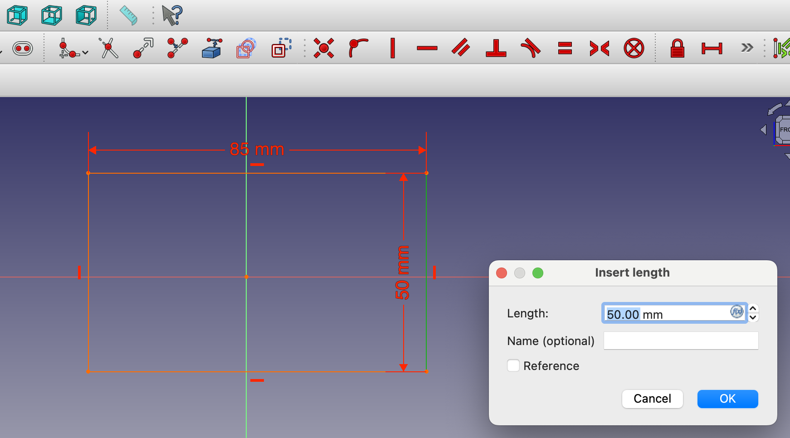

{:class="cover"}

## Welcome to FreeCAD

FreeCAD is a powerful, open-source parametric 3D modeler made primarily to design real-life objects of any size. Parametric modeling allows users to easily modify designs by going back into their model history and changing parameters.

---

## Brief History

Developed by a community of passionate developers and users, FreeCAD's open-source nature means it is continuously evolving. It began in 2002 and has grown to be a dependable tool in engineering, architecture, and product design.

---

## Exploring the Interface

Take a moment to open FreeCAD and familiarize yourself with the interface. Notice the different workspaces tailored to various tasks.

> ### Workspaces
>
> {:class="img-fluid w-100 rounded-3 shadow-lg"}
>
> Workspaces are collections of tools and commands that are grouped together for specific tasks. For example, the Part Design workspace is used for creating mechanical parts.
> Choose the 'Part Design' workspace and explore the tools available.

---

## Key Features of FreeCAD

- **Modular Architecture:** You can customize it to add or remove features.
- **Sketcher:** It has a powerful sketcher to draw 2D shapes.
- **Robot Simulation:** Contains modules for simulating robot movements.

---

## Visual Tour

Here are some screenshots to guide you through the main areas of the FreeCAD interface.

{:class="img-fluid w-100 rounded-3 shadow-lg"}

{:class="img-fluid w-100 rounded-3 shadow-lg"}

{:class="img-fluid w-100 rounded-3 shadow-lg"}

---

## Why Use FreeCAD?

- **Accessibility:** It's free and open-source, making it accessible to everyone.
- **Community:** Supported by a large community that offers tutorials, forums, and shared projects.

---

## Practical Applications

- **Engineering:** Used for creating mechanical parts and assemblies.
- **Architecture:** Helps in designing architectural layouts with precision.

---

## Get Involved

Join the FreeCAD forum to connect with other users and expand your learning. Here?s the link: [FreeCAD Community Forums](https://forum.freecadweb.org/)

---

## Lesson Assignment

Open FreeCAD and explore its default settings. Try accessing different modules from the workspace selector and view the available tools in each module. Reflect on how the interface and tools could help in projects you're interested in.

---

## Additional Resources

- [Getting Started with FreeCAD](https://www.freecadweb.org/wiki/Basic_Part_Design_Tutorial)
- [FreeCAD YouTube Channel for Beginners](https://www.youtube.com/user/FreeCADHowTos)

---
