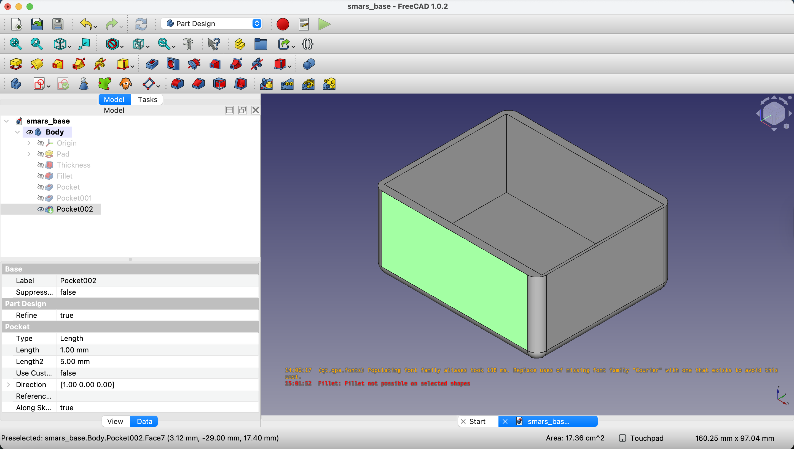
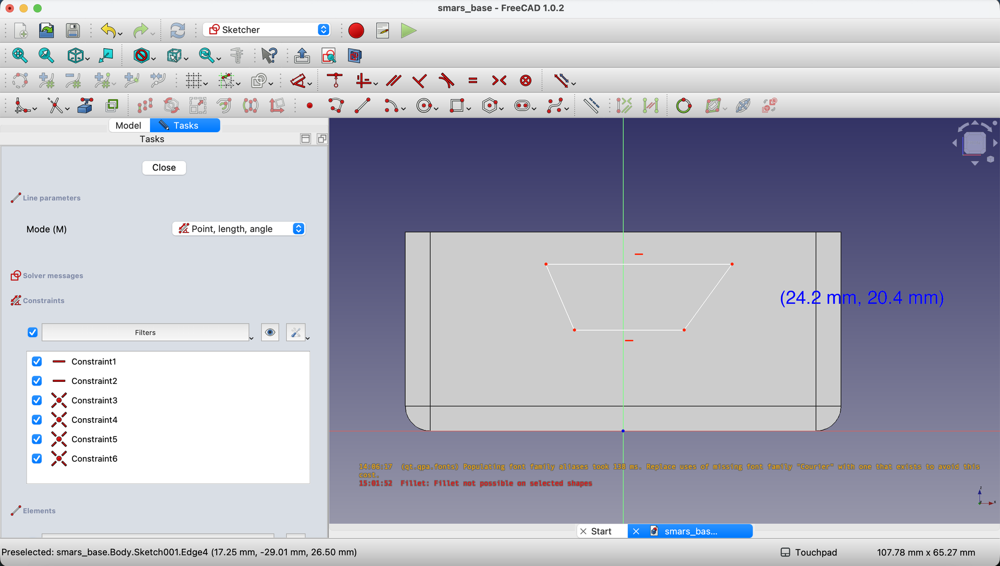
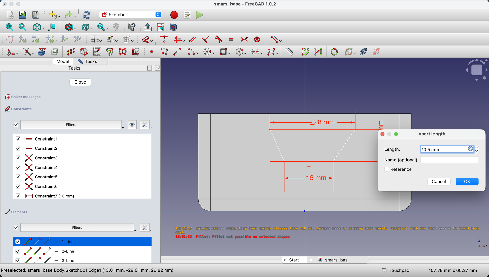
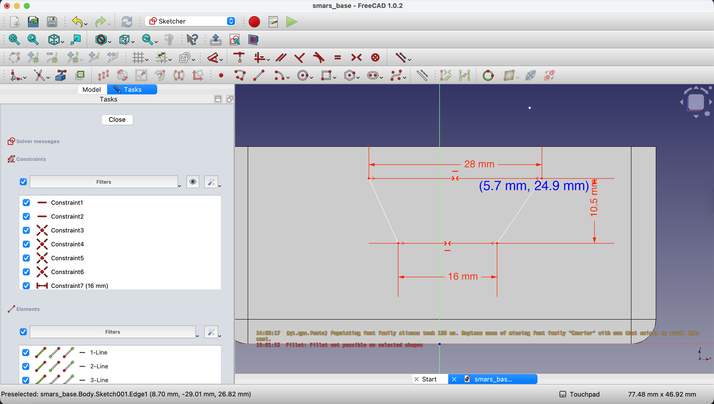
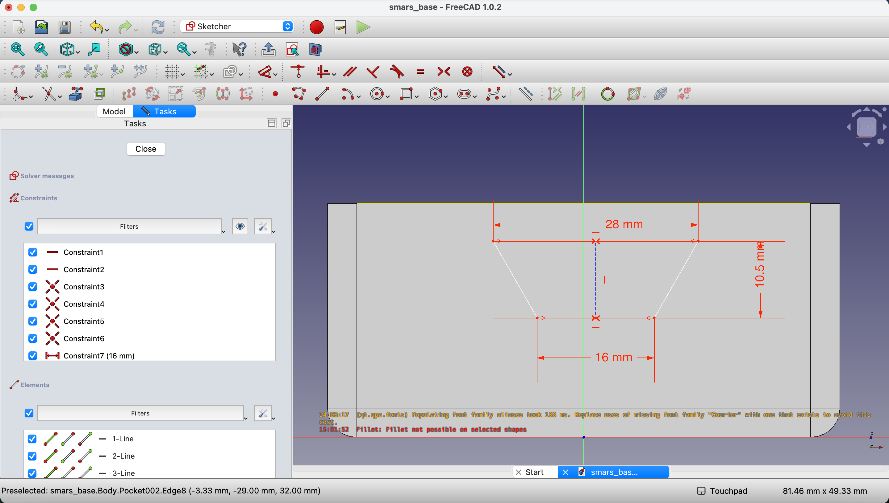
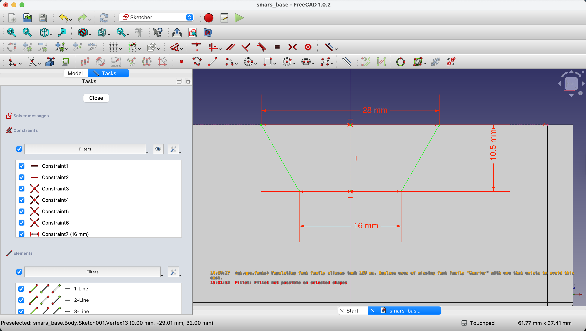
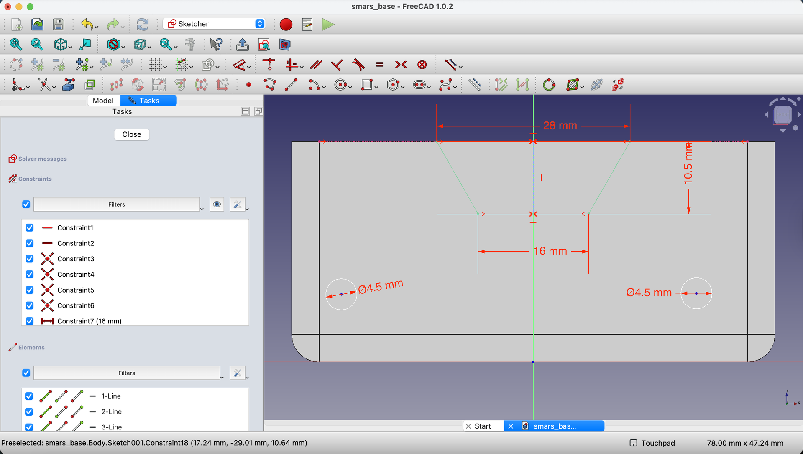
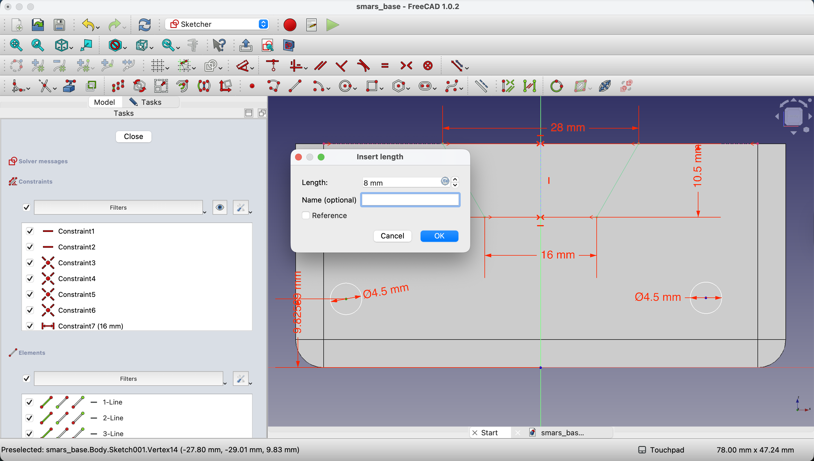
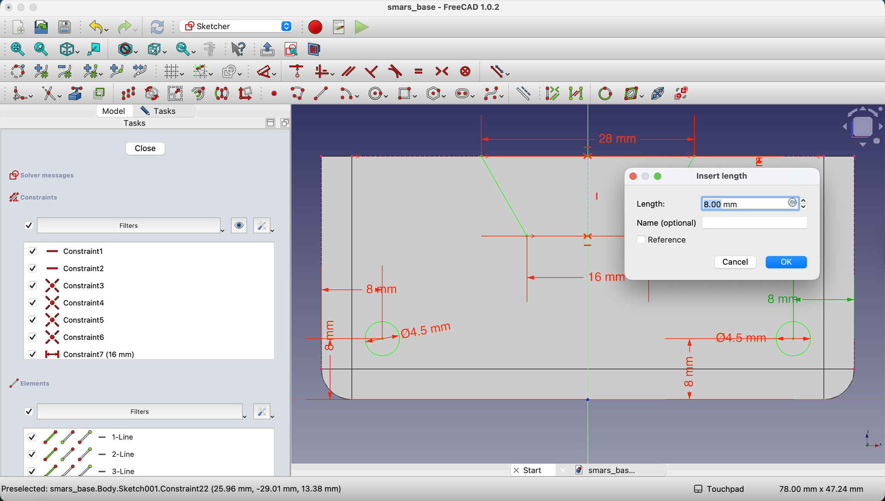
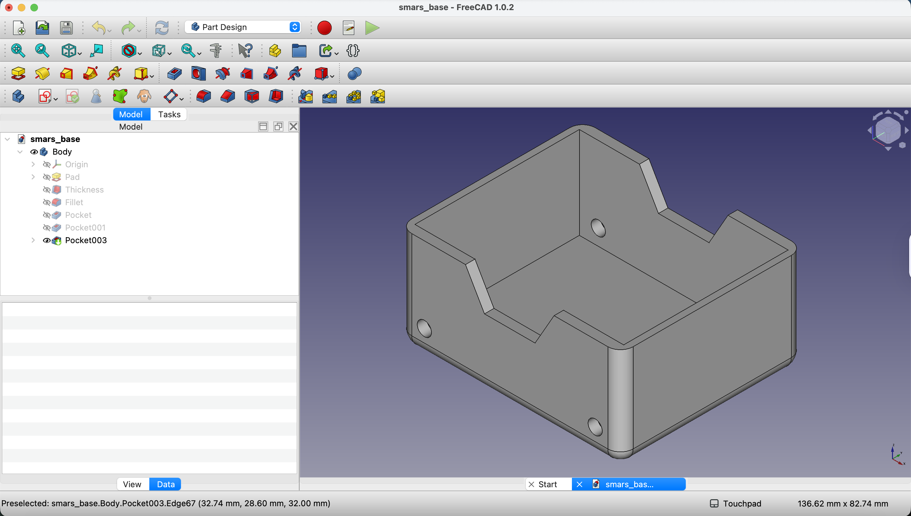

1. First, we need to create a new sketch on the side face of the base. Click on the side face to select it, then click on `Create Sketch` in the toolbar.

    {:class="img-fluid w-100"}

    {:class="img-fluid w-100"}

2. Using the `Line` tool, draw a rhombus shape. We'll add the dimensions in the next step.

    {:class="img-fluid w-100"}
    
3. Add dimensions to the rhombus using the `Dimensions` tool. the bottom line should be `16mm` long, the top line should be `28mm` long. the height of the rhombus should be `20mm`. Finally, constrain the center point of the rhombus to be `10.5mm` from the bottom edge of the base.

    {:class="img-fluid w-100"}

    - You'll notice that the rhobus is a bit lop-sided, we can fix that by adding a line from the middle of the top line to the middle of the bottom line, then constraining those two points to be horizontal.

4. Using the `Point` tool, create a point at the midpoint of the top line, and another point at the midpoint of the bottom line. The cursor will show a red symmetry indicator when you hover over the midpoints.

    - Using the `Line` tool, draw a line connecting the two midpoints.

    - If you're having trouble drawing the line, you can turn off the main body from the view by clicking the eye icon next to the body in the Model tree. Click on the Model Tab to return to the normal view.

    {:class="img-fluid w-100"}

5. After drawing the line, Select the line and use the `Vertical Constraint` tool to make the line vertical.

    {:class="img-fluid w-100"}

    - Lets make the vertical line a construction line by selecting it and clicking the `Toggle construction mode` button in the toolbar.

6. We now need to attach the rhombus to the middle of the top of our model. We can do that by projecting in the geometry into this sketch, creating a midpoint at the top edge and then constraining the top point of the rhombus to that midpoint.

    - First, click on the `Create external geometry` button in the toolbar.

    {:class="img-fluid w-100"}

    - Next, click on the top edge of the base to project it into the sketch.

    {:class="img-fluid w-100"}

    - Now, use the `Point` tool to create a point at the midpoint of the projected top edge.

    {:class="img-fluid w-100"}

    - Finally, select the top point of the rhombus and then hold `Ctrl` and select the midpoint we just created. Click on the `Constrain Coincident` button in the toolbar to attach the two points together.

    {:class="img-fluid w-100"}

7. We will now create the motor holes. Using the `Circle` tool, draw two circles, towards the bottom of the body - we'll add the dimensions in the next step.

    {:class="img-fluid w-100"}

    - Using the `Dimensions` tool, set the diameter of each circle to `4.5mm`.

    {:class="img-fluid w-100"}

    - Next, constrain the center of each circle to be `8.0mm` from the bottom edge of the base.

    - We'll need to bring in the sides of the base by using the `Create external geometry` tool again to project in both left and right side edges of the base.

    - Finally, constrain the center of the left circle to be `8mm` from the left edge, and the center of the right circle to be `8mm` from the right edge. The circles will turn green when fully constrained.

    {:class="img-fluid w-100"}

    {:class="img-fluid w-100"}

8. We can now close the sketch by clicking on the `Close` button in the toolbar.

    {:class="img-fluid w-100"}

---

9. We can now cutout the side profile and motor holes from the base. With the sketch selected in the Model tree on the left, click on the `Pocket` button in the toolbar.

    - In the `Pocket` dialog, set the `Length` value to `58mm` to cut through the side of the base. Click `OK` to apply the pocket.

    {:class="img-fluid w-100"}
    
10. You should now see the side profile and motor holes cut out of the base.

    {:class="img-fluid w-100"}

---
