## What We're Building

The Arduino Nano sits inside the SMARS base on two slots - one on each side wall. These slots:

- Hold the Arduino securely without screws
- Allow easy removal for programming
- Work with the "screwless" SMARS philosophy

| Feature | Dimension | Purpose |
|---------|-----------|---------|
| Slot width | 2mm | Matches Arduino PCB thickness (1.6mm) + clearance |
| Slot depth | 0.5mm | Shallow grip - won't weaken the wall |
| Position | 5.5mm from top | Centers Arduino at ideal viewing height |
{: .table .table-single }

---

## Understanding the Mirror Tool

We need identical slots on both side walls. We could create two separate sketches... but there's a better way!

The **Mirror** tool duplicates a feature across a plane. Benefits:
- **Perfect symmetry** - Both sides are guaranteed identical
- **Single edit** - Change one side, both update
- **Less work** - Create once, mirror once

This is how professionals handle symmetric parts!

---

## Step-by-Step: Create the First Slot

### 1. Start a Sketch on the Inside Right Face

Click on the **inside face** of the right side wall, then click `Create Sketch`.

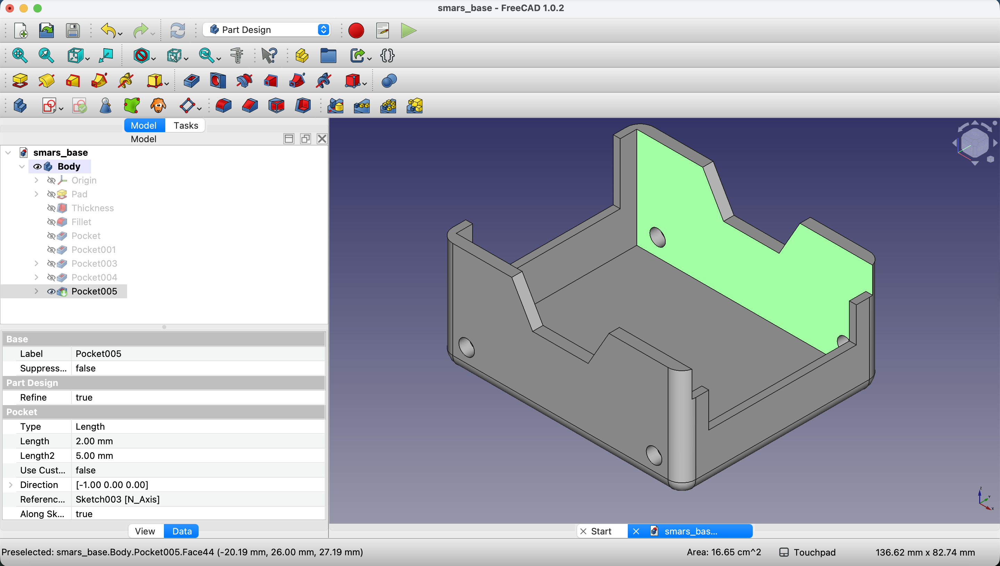{:class="img-fluid w-100"}

### 2. Enable Clipping View

When the sketch opens, you can't see the surface because the model is in the way. Let's fix that with a clipping plane.

Go to `View` menu → `Clipping plane`.

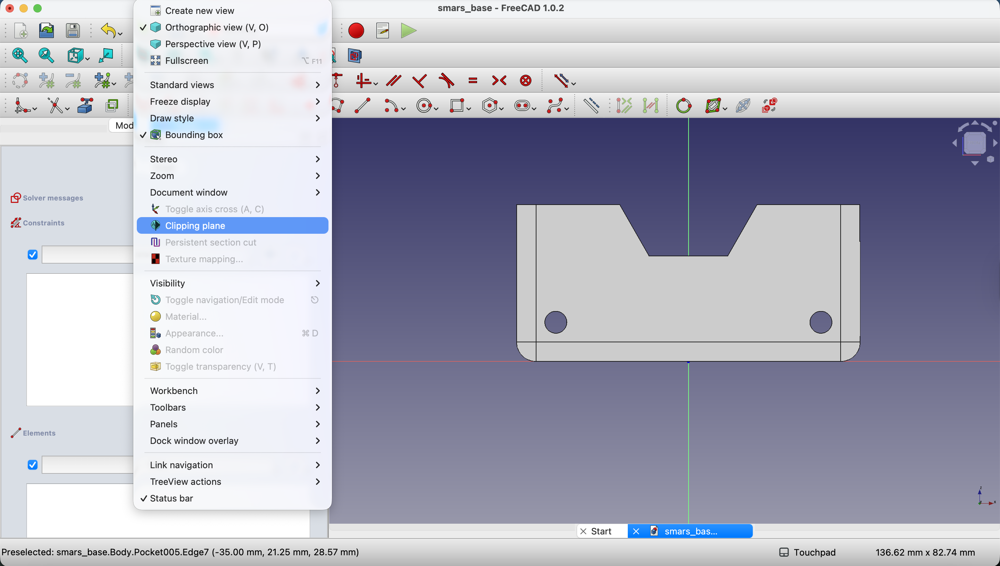{:class="img-fluid w-100"}

Click the appropriate clipping option to slice the view so you can see inside.

{:class="img-fluid w-100"}

**What's clipping?** It temporarily hides part of the model so you can see and work on interior surfaces. The model isn't changed - it's just a view setting.

### 3. Draw the Slot Rectangle

Using the **Rectangle** tool, draw a rectangle for the slot.

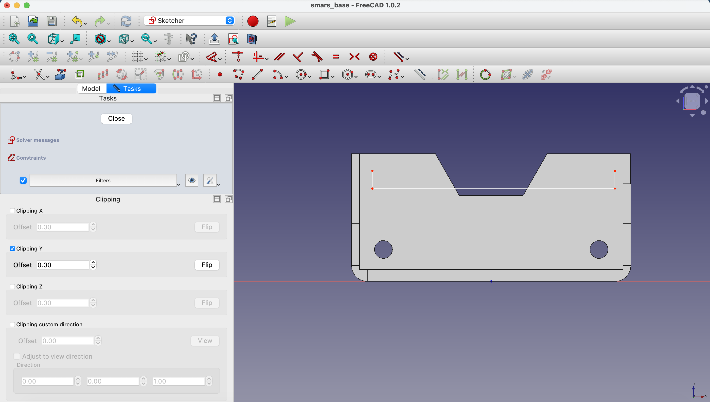{:class="img-fluid w-100"}

### 4. Add Dimensions

Set the rectangle height to `2mm` using the **Dimensions** tool.

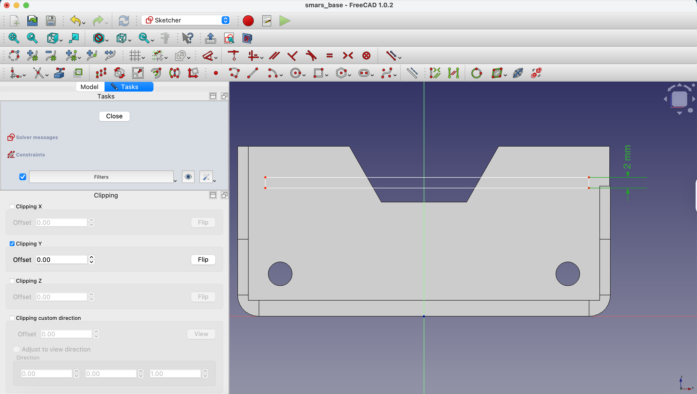{:class="img-fluid w-100"}

### 5. Position from Top Edge

Use **Create external geometry** to project the top edge of the base.

Constrain the bottom of the rectangle to be `5.5mm` from this top edge.

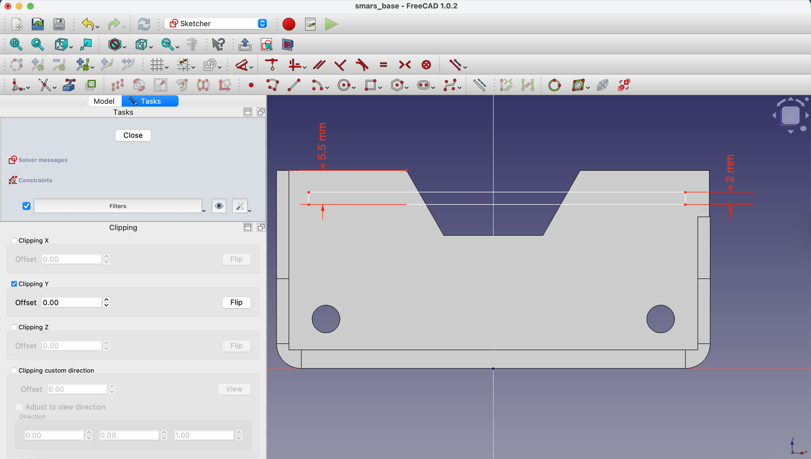{:class="img-fluid w-100"}

### 6. Extend to the Inner Edge

Project both the inner edge (where the slot starts) and the side edges as external geometry.

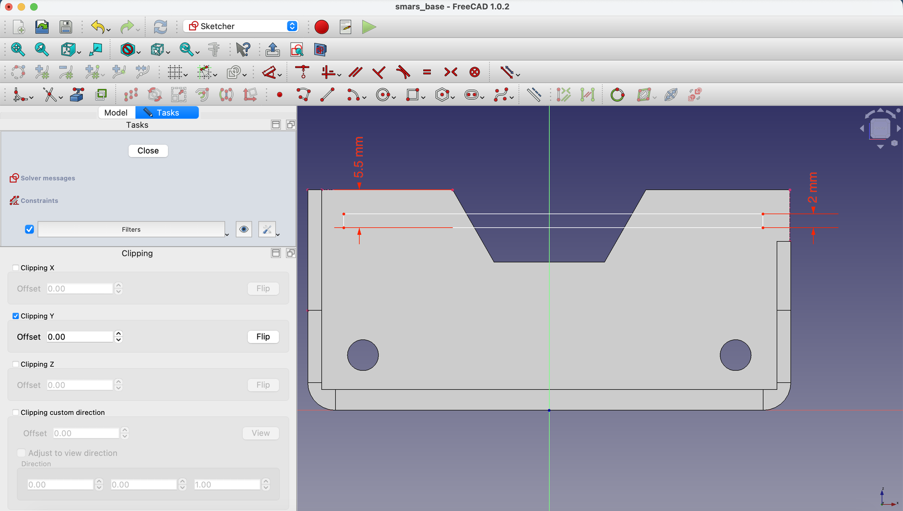{:class="img-fluid w-100"}

Constrain the left edge of the rectangle to the inner wall edge using **Constrain Coincident**.

{:class="img-fluid w-100"}

---

## Handling FreeCAD's Closed Sketch Requirement

Unlike some CAD tools (like Fusion 360), FreeCAD requires sketch shapes to be **fully enclosed**. Our slot runs into the rhombus cutout, so we need to handle this carefully.

### 7. Project the Rhombus Diagonal Edges

Use **Create external geometry** to project the diagonal edges of the rhombus cutout.

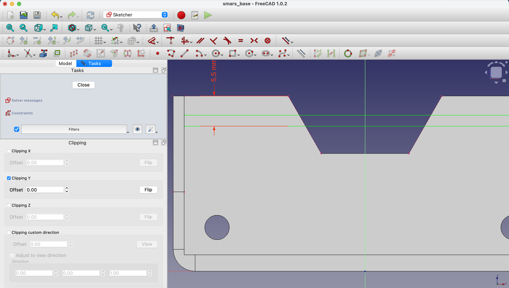{:class="img-fluid w-100"}

### 8. Convert Horizontal Lines to Construction

Select the two horizontal lines of the rectangle and click **Toggle construction mode** to make them construction lines.

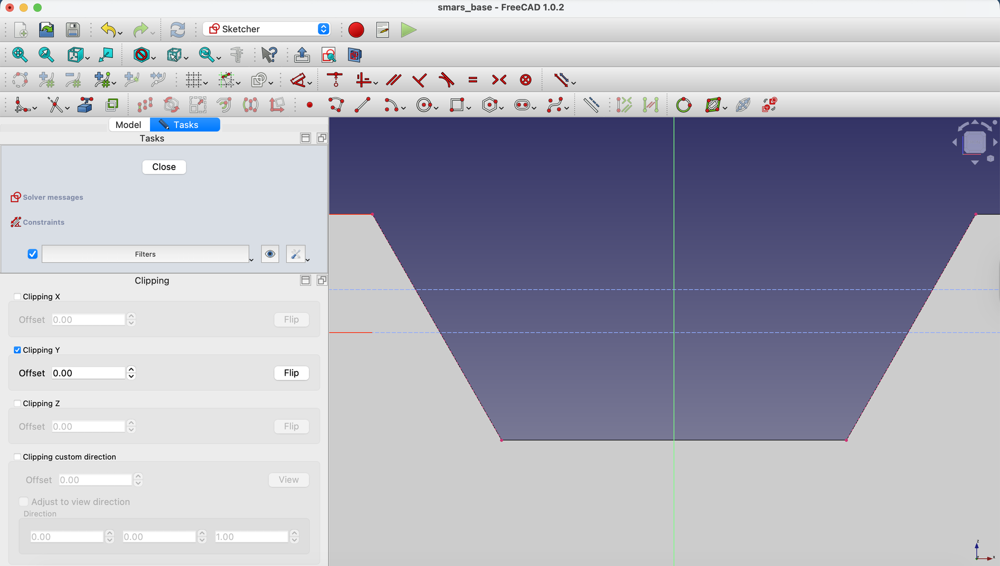{:class="img-fluid w-100"}

### 9. Create Intersection Points

Use the **Point** tool to create points along the projected diagonal lines - where the slot edges would intersect them.

{:class="img-fluid w-100"}

### 10. Constrain the Intersection Points

Use **Constrain Coincident** to attach these points to both the diagonal edges AND the horizontal construction lines.

{:class="img-fluid w-100"}

Repeat for the right side of the cutout profile.

{:class="img-fluid w-100"}

{:class="img-fluid w-100"}

### 11. Close the Shape with Solid Lines

Use the **Line** tool to connect the points, creating a closed shape that follows the diagonal edges.

{:class="img-fluid w-100"}

Connect the top and bottom construction lines to these new diagonal lines to create enclosed areas.

{:class="img-fluid w-100"}

{:class="img-fluid w-100"}

### 12. Close the Sketch

Click the **Close** button.

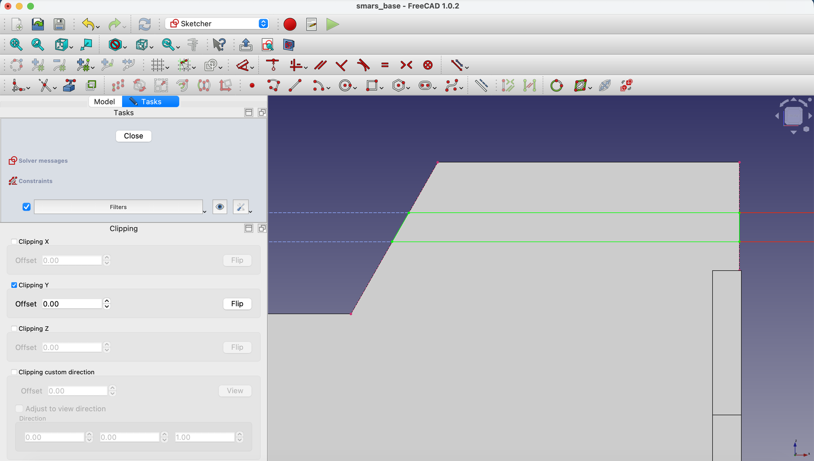{:class="img-fluid w-100"}

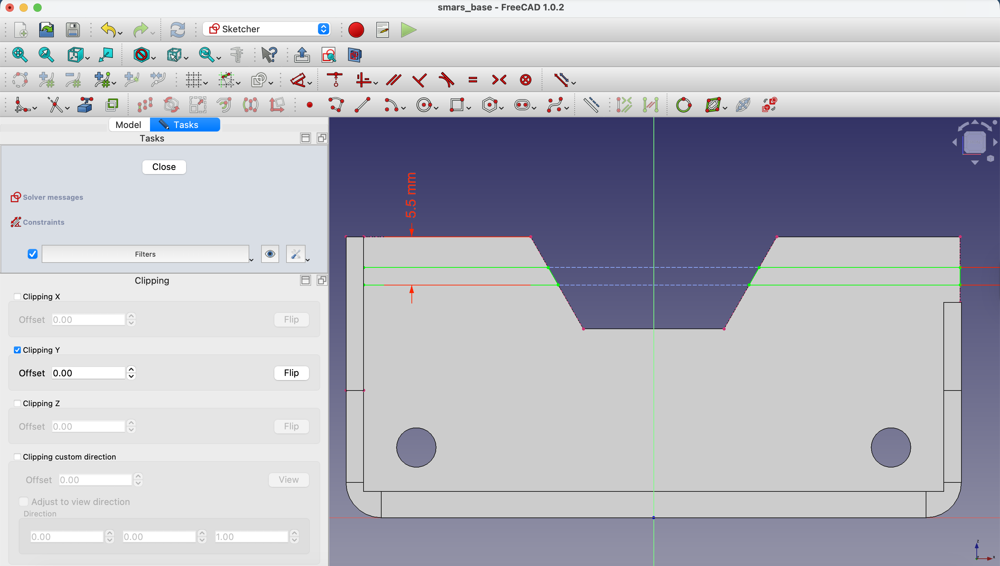{:class="img-fluid w-100"}

{:class="img-fluid w-100"}

---

## Create the Slot Pocket

### 13. Pocket the Slot

With the sketch selected, click **Pocket**.

Set the depth to `0.5mm` - just a shallow cut into the wall.

Click `OK`.

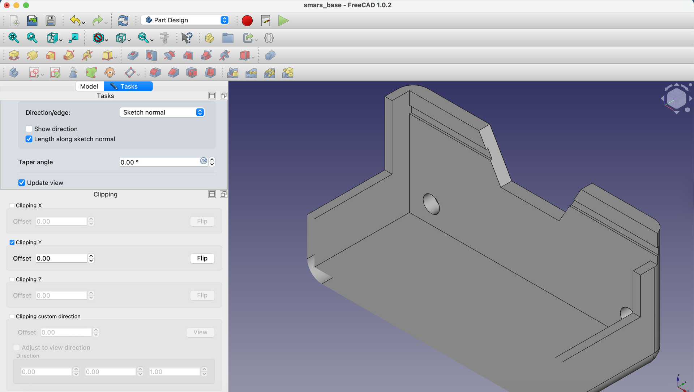{:class="img-fluid w-100"}

### 14. Close Clipping View

Close the clipping plane by clicking **Clipping Y** again in the Clipping View pane.

{:class="img-fluid w-100"}

**Mac tip**: If the close button is off-screen, double-click the pane's title bar to bring it into view.

---

## Create a Datum Plane for Mirroring

To mirror the slot, we need a plane exactly in the center of the base.

### 15. Create Reference Sketch

Create a new sketch on the back face of the base.

{:class="img-fluid w-100"}

### 16. Project and Mark Center

Use **Create external geometry** to project the top edge.

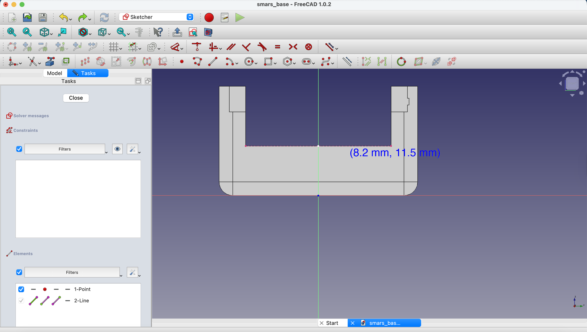{:class="img-fluid w-100"}

Use the **Point** tool to create a point at the midpoint of this edge.

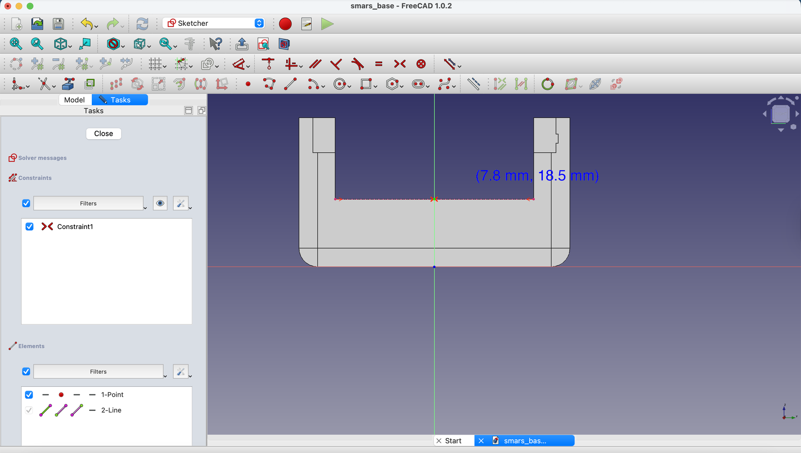{:class="img-fluid w-100"}

Close the sketch.

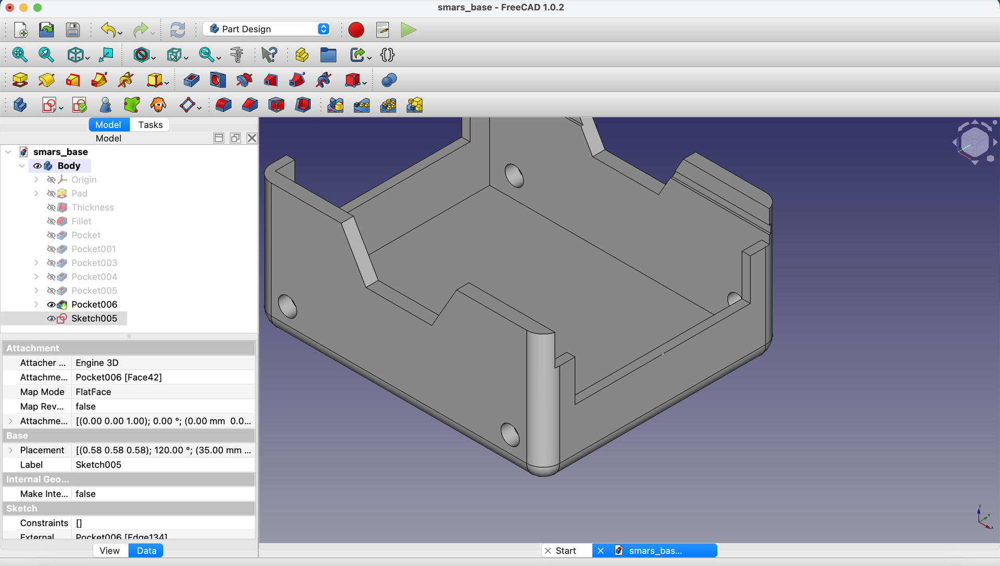{:class="img-fluid w-100"}

### 17. Create the Datum Plane

With the sketch selected, click **Datum Plane** in the toolbar.

In the dialog, set the attachment to `Object's YZ`.

Click `OK`.

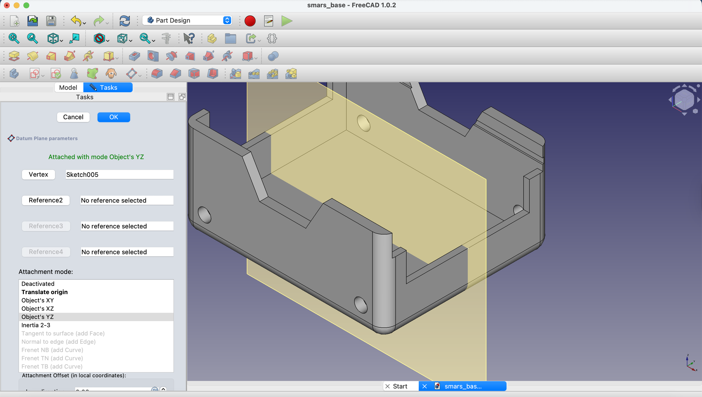{:class="img-fluid w-100"}

**What's a datum plane?** It's a reference surface that doesn't show in the final part but helps with operations like mirroring, measuring, or aligning.

---

## Mirror the Slot

### 18. Apply Mirror

Select the **Pocket** feature (the slot) in the Model tree.

Click the **Mirror** button in the toolbar.

Set the mirror plane to the datum plane you just created.

Click `OK`.

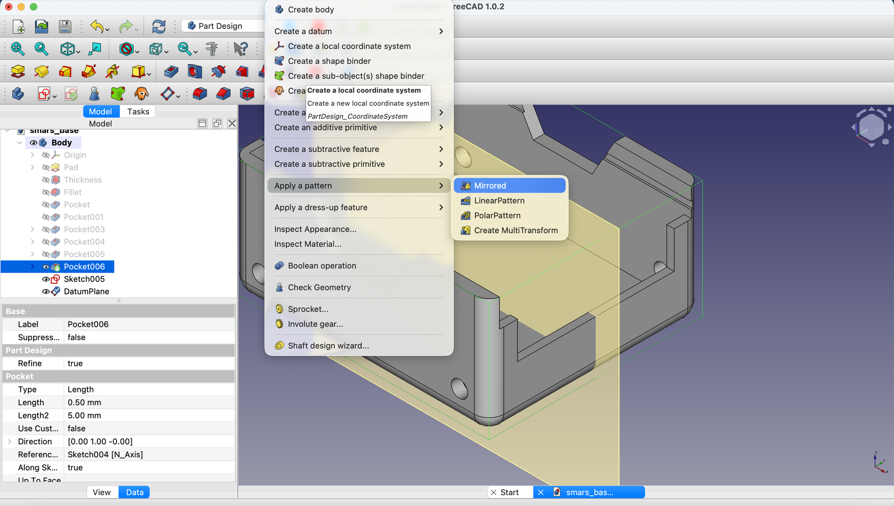{:class="img-fluid w-100"}

### 19. Verify Both Slots

You should now see Arduino slots on **both** sides of the base!

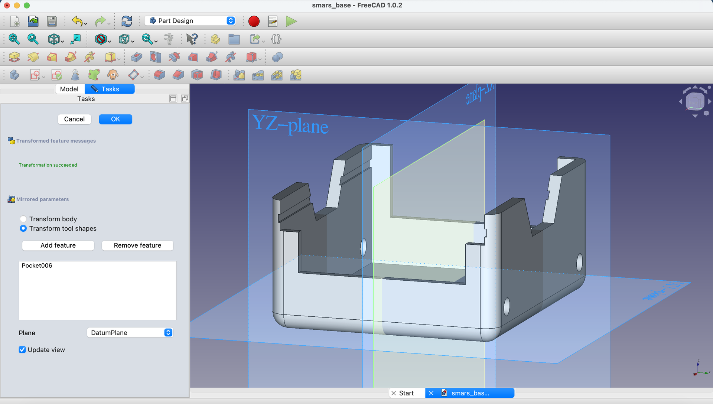{:class="img-fluid w-100"}

### 20. Hide the Datum Plane

Click the eye icon next to the datum plane in the Model tree to hide it.

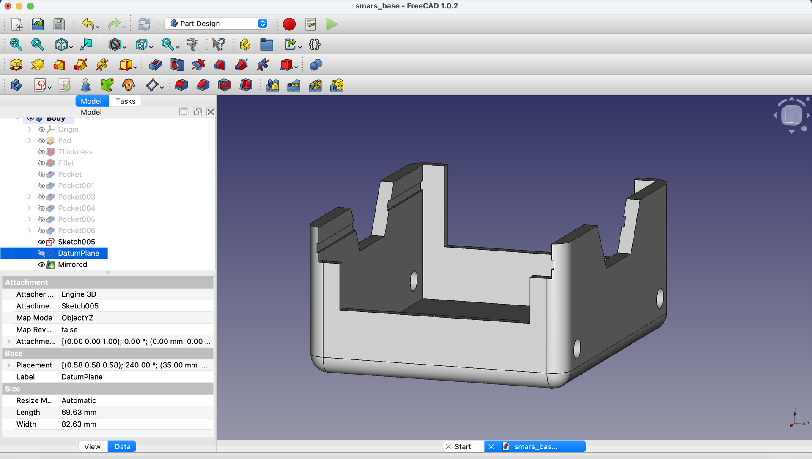{:class="img-fluid w-100"}

---

## Why This Technique Matters

The Mirror workflow is essential for professional CAD:

| Technique | Use Case |
|-----------|----------|
| Single feature + Mirror | Symmetric parts (like SMARS) |
| Datum planes | Reference surfaces for operations |
| Construction geometry | Guides that don't become features |

These skills transfer to any parametric CAD software!

---

## Try It Yourself

1. **Test the slot**: Would an Arduino PCB (1.6mm thick) fit in the 2mm slot? (Yes, with clearance)
2. **Edit and observe**: Change the slot depth in one pocket - does the mirror update?
3. **Visibility practice**: Hide/show the datum plane to understand what's construction vs. final geometry

---

## Common Issues

### "The mirror creates the slot in the wrong location"
**Problem**: The mirrored feature isn't on the opposite wall.
**Solution**: Check that your datum plane is truly centered. Edit the reference sketch and verify the midpoint is constrained to the center.

### "Clipping view won't close"
**Problem**: The clipping plane dialog is off-screen.
**Solution**: On Mac, double-click the title bar. On Windows/Linux, drag the dialog or restart FreeCAD.

### "The slot sketch won't close properly"
**Problem**: FreeCAD says the sketch isn't valid for pocket.
**Solution**: Check that all regions are fully enclosed. Use construction lines for reference but solid lines for the actual cut area.

### "Datum plane won't create"
**Problem**: The Datum Plane button is grayed out.
**Solution**: Make sure you have a sketch or point selected that can serve as a reference.

---

## What You Learned

In this lesson, you mastered:

- **Clipping views** - Seeing inside your model for interior work
- **Datum planes** - Creating reference surfaces for operations
- **Mirror tool** - Duplicating features with perfect symmetry
- **Closed sketch requirement** - Working with FreeCAD's geometry rules

---

## Next Up

Time to create the wheel stubs - the connection points for SMARS wheels. We'll use the **Revolve** tool and **Polar Pattern** for rotational features!

---
