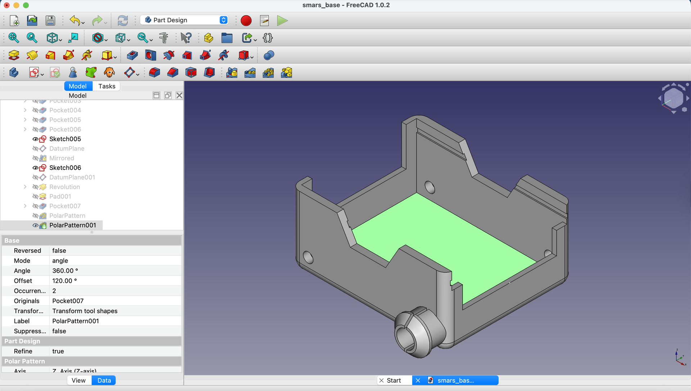
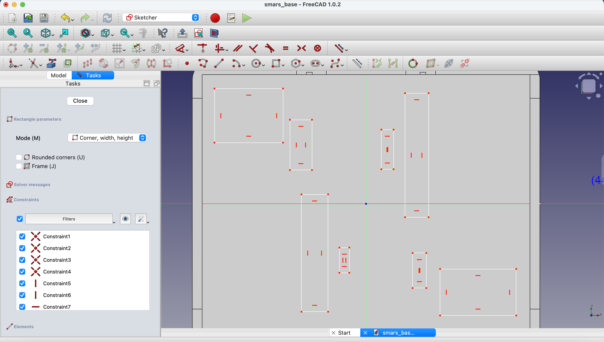
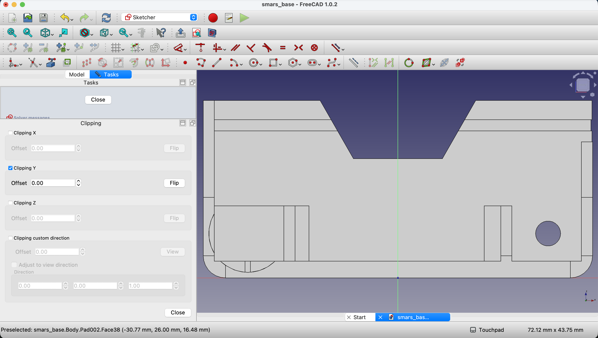
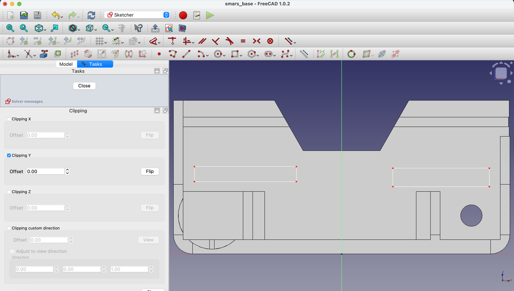
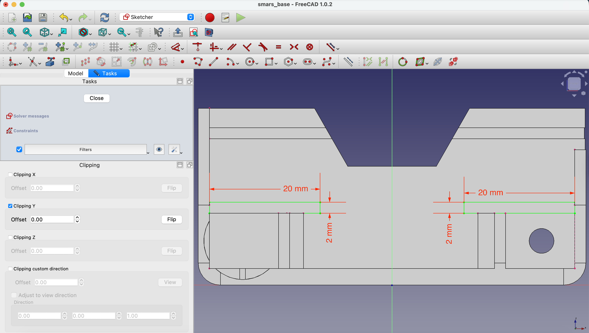
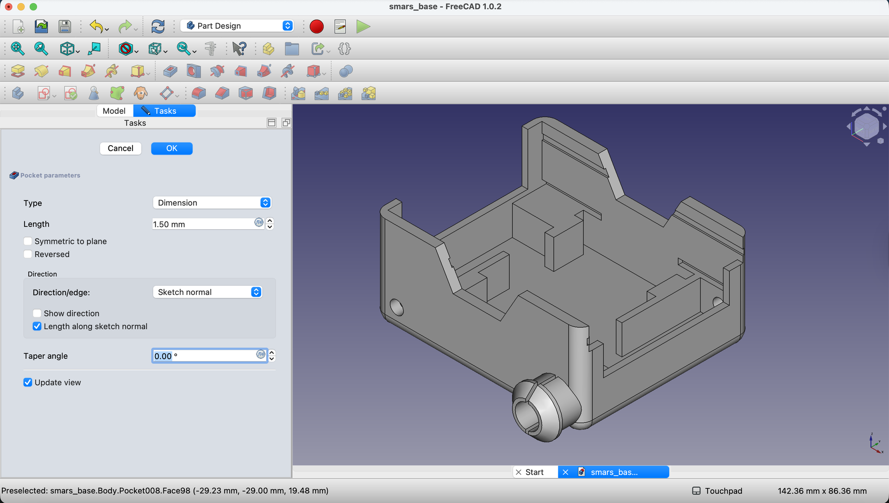
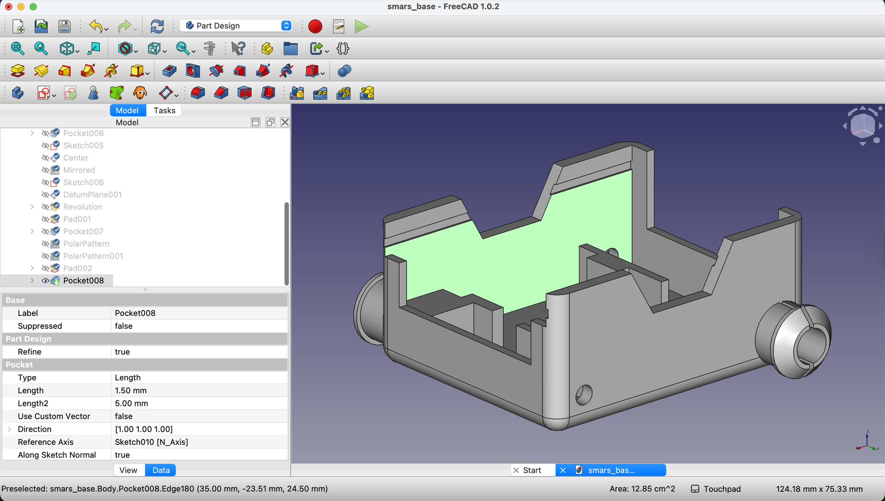
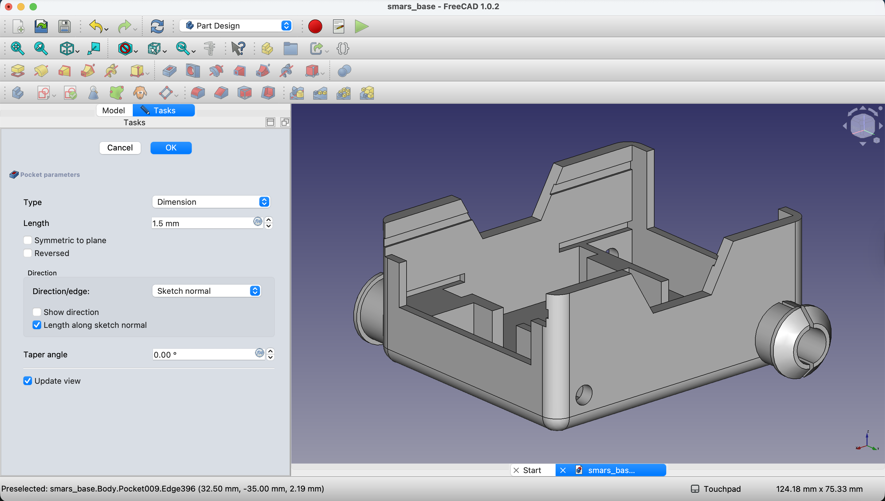

## What We're Building

The motor holder is the final structural feature of the SMARS base. It consists of:

1. **Floor mounting pads** - Raised areas on the base floor where motors sit
2. **Side retention cutouts** - Small slots that grip motor tabs to hold them in place

| Feature | Purpose |
|---------|---------|
| Floor pads | Elevate motors to align shafts with wheel stubs |
| Retention cutouts | Lock motor tabs without screws |
| Symmetric design | Holds both motors identically |
{: .table .table-single }

---

## Understanding the Motor Mounting System

### Why This Design?

SMARS uses N20 gear motors, which have small tabs on their sides. Instead of screws, we:

1. **Raise the motor** slightly off the floor with pads
2. **Create slots** in the side walls that grip the motor tabs
3. **Friction fit** holds everything in place

This is the "screwless" part of SMARS - assembly without tools!

### The Components

- **8 floor rectangles** - Create the raised mounting surface
- **4 side cutouts** - 2 per side wall, grip motor tabs
- **1.5mm depth** - Just enough to grip without weakening walls

---

## Step-by-Step: Create Floor Mounting Pads

### 1. Start a Sketch on the Floor

Create a new sketch on the floor (inside bottom) face of the base.

{:class="img-fluid w-100"}

### 2. Draw the Mounting Pad Rectangles

Using the **Rectangle** tool, draw 8 rectangles - these form the mounting pads where the motors will sit.

{:class="img-fluid w-100"}

### 3. Add Dimensions and Constraints

Add dimensions to position the rectangles correctly. Follow the dimensions shown - these align the pads with where the N20 motors will rest.

{:class="img-fluid w-100"}

**Design note**: The pad positions are calculated from:
- Motor body width
- Shaft position relative to motor center
- Clearance for motor wires

### 4. Close and Pad

Close the sketch and use the **Pad** tool to extrude the mounting pads upward by a small amount (typically 1-2mm).

---

## Step-by-Step: Create Side Retention Cutouts

Now we need to create the cutouts in the side walls that grip the motor tabs.

### 5. Sketch on Right Inside Face

Create a new sketch on the inside of the right wall.

{:class="img-fluid w-100"}

### 6. Enable Clipping View

Use `View` → `Clipping plane` and click `Clipping Y` to see the interior surface.

{:class="img-fluid w-100"}

### 7. Draw Two Retention Rectangles

Using the **Rectangle** tool, draw two small rectangles - these will become the cutouts for motor tabs.

{:class="img-fluid w-100"}

### 8. Project Reference Geometry

Use **Create external geometry** to project the inner edges of the base into the sketch.

{:class="img-fluid w-100"}

### 9. Add Dimensions

Dimension the rectangles to match motor tab positions and sizes.

{:class="img-fluid w-100"}

### 10. Constrain to Inner Edge

Use **Constrain Coincident** to attach the bottom edges of the rectangles to the projected inner edge of the base.

{:class="img-fluid w-100"}

### 11. Close the Sketch

Click **Close**.

{:class="img-fluid w-100"}

Also close the clipping plane if it's still active.

---

## Create Cutouts on Both Sides

### 12. Replicate on Left Side

Create a new sketch on the inside of the left wall.

{:class="img-fluid w-100"}

Draw and dimension the same rectangle pattern as the right side.

{:class="img-fluid w-100"}

Close the sketch when done, and close the clipping plane.

### 13. Pocket the Retention Cutouts

Select the first sketch (right side) in the Model tree and click **Pocket**.

{:class="img-fluid w-100"}

Set the depth to `1.5mm` - just enough to create a grip without weakening the wall.

Click `OK`.

### 14. Repeat for Left Side

Select the left side sketch and apply the same **Pocket** operation with `1.5mm` depth.

---

## Verify the Motor Holder

### 15. Final Inspection

Your SMARS base should now have:

- **Raised mounting pads** on the floor
- **Retention cutouts** on both inner walls
- **Perfect alignment** for N20 motors

Rotate the view to verify all features are present and symmetric.

---

## Understanding the Complete Motor System

The motor mounting works as a system:

| Component | Function |
|-----------|----------|
| Motor shaft holes | Allow shaft to pass through wall |
| Wheel stubs | Connect to wheels on outside |
| Floor pads | Elevate and position motor |
| Retention cutouts | Lock motor tabs in place |

When assembled:
1. Motor slides into position on floor pads
2. Shaft passes through the 4.5mm holes
3. Tabs snap into retention cutouts
4. Wheels attach to stubs on the outside

No screws, no glue - just clever geometry!

---

## Try It Yourself

1. **Visualize assembly**: Imagine sliding an N20 motor into position. Does everything align?
2. **Check symmetry**: Both sides should have identical cutout positions
3. **Measure clearances**: Are the pads the right height? Do cutouts match tab dimensions?

---

## Common Issues

### "Clipping plane won't close"
**Problem**: The clipping view stays active.
**Solution**: Go to View → Clipping plane and toggle the active clipping axis. On Mac, the close button may be off-screen - double-click the title bar.

### "Pockets cut in wrong direction"
**Problem**: Cutouts go outward instead of into the wall.
**Solution**: Check the "Reversed" option in the Pocket dialog, or verify you selected the correct (interior) face.

### "Rectangles aren't aligned"
**Problem**: Left and right cutouts are at different heights.
**Solution**: Use the same dimensions for both sides. Consider using Mirror instead of creating separate sketches.

### "Floor pads don't appear"
**Problem**: After padding, the floor looks unchanged.
**Solution**: The pad might be very small. Verify your pad height is at least 1mm. Also check you selected the correct sketch.

---

## What You Learned

In this lesson, you mastered:

- **Multiple features per face** - Creating several rectangles in one sketch
- **Interior wall work** - Using clipping planes for visibility
- **System design** - Understanding how parts work together
- **Friction fit design** - Creating screwless assemblies

---

## Next Up

The design is complete! In the next lesson, we'll export the model as an STL file for 3D printing, with tips for optimal print settings.

---
