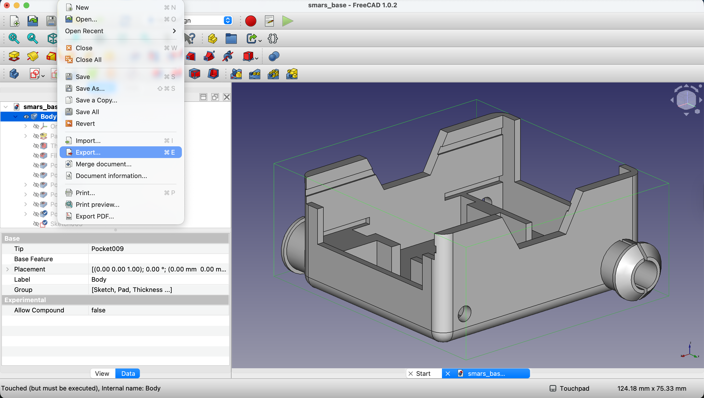
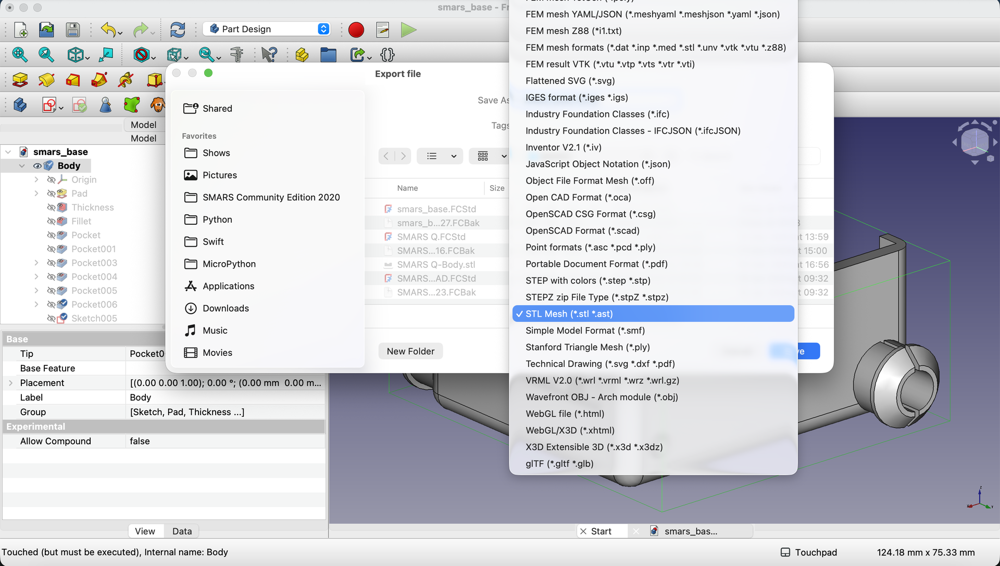

In this lesson we'll learn how to export the SMARS robot base as an STL file for 3D printing.

1. First, ensure that the SMARS robot base model is selected in the Model tree.

    {:class="img-fluid w-100"}

2. Next, click on the `File` menu in the top left corner of FreeCAD.

    {:class="img-fluid w-100"}

3. From the dropdown menu, select `Export...`.

    {:class="img-fluid w-100"}

4. In the file dialog that appears, navigate to the folder where you want to save the STL file.

    - In the `Save as type` dropdown, select `STL Mesh (*.stl)`.

    {:class="img-fluid w-100"}

5. Enter a name for your STL file, such as `smars_robot_base.stl`, and click the `Save` button.

---
