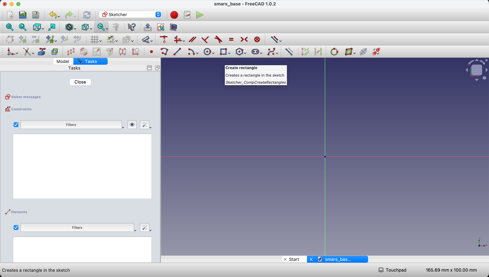
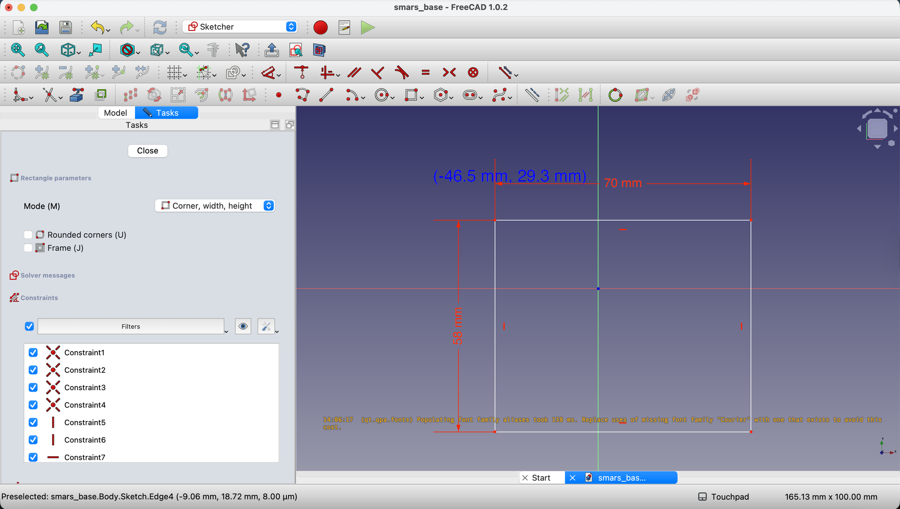
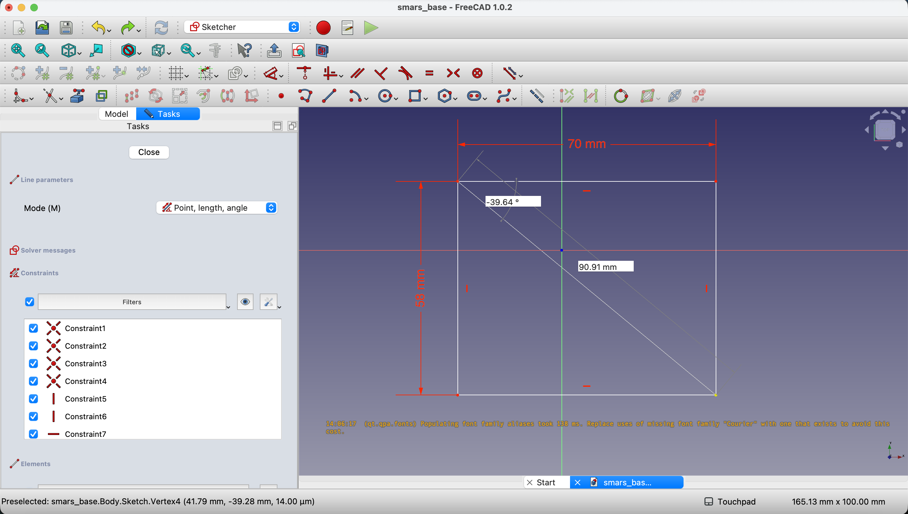
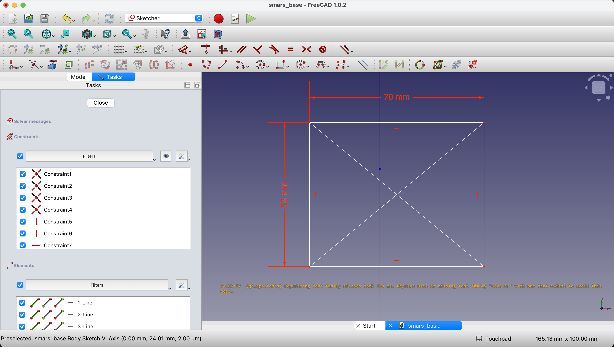
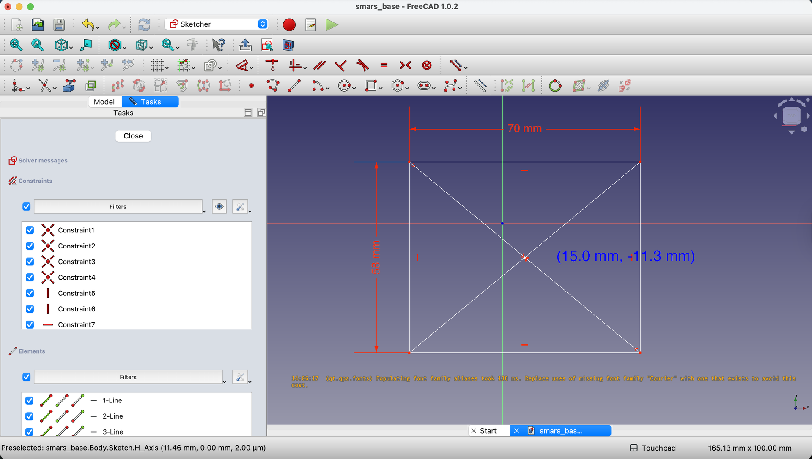
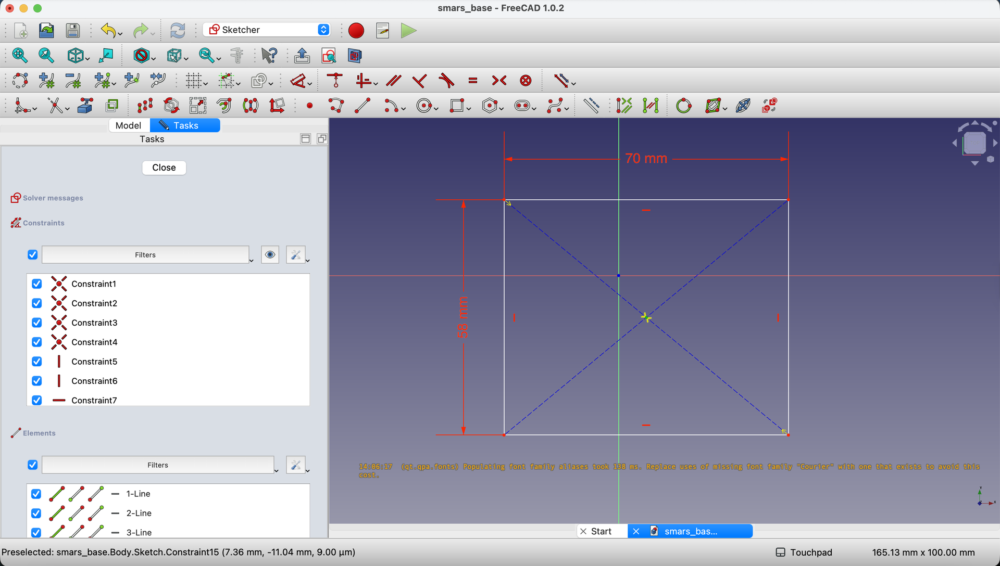
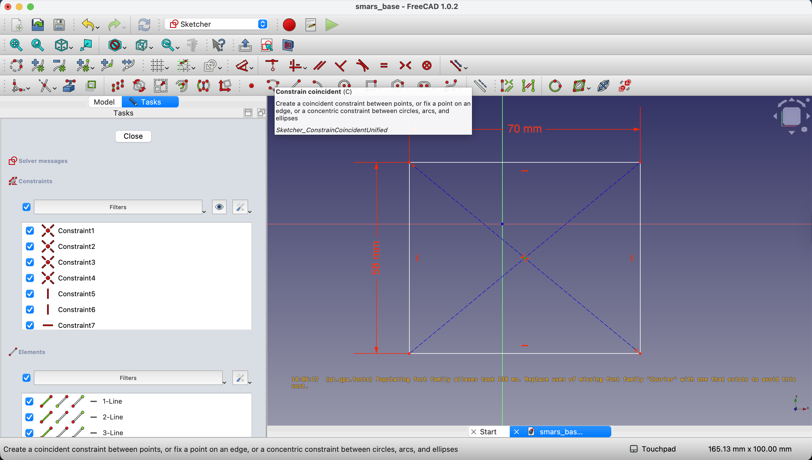
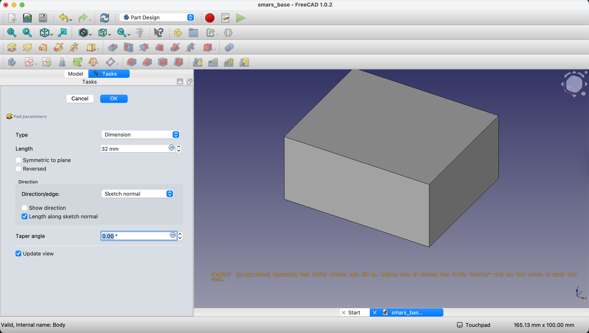

1. Create a new FreeCAD document by clicking on `File` > `New`.

    {:class="img-fluid w-100"}

2. Save the file as `smars_base.FCStd` by clicking on `File` > `Save As`.

    {:class="img-fluid w-100"}

3. Click on `Create Sketch` to create a new sketch. If you don't see this option, make sure you are in the `Part Design` workbench by selecting it from the drop-down menu in the toolbar.

    {:class="img-fluid w-100"}

4. Click on the `XY-Plane` to select it as the plane for your sketch.

    {:class="img-fluid w-100"}

5. Click on the Rectangle tool in the toolbar to draw a rectangle on the sketch plane.

    {:class="img-fluid w-100"}

6. Type in the length as `70mm` and the width as `58mm` in the dimension boxes that appear after drawing the rectangle. Press `Tab` to switch between length and width fields.

    {:class="img-fluid w-100"}

7. Next, we want to center the rectangle on the origin. We'll do this by adding two diagonal lines and create a point at the center, we'll then constrain this point to the origin.

    - Select the `Line` tool from the toolbar and draw a diagonal line from one corner of the rectangle to the opposite corner. Do this for both diagonals. When your mouse pointer comes close to the intersection of the top or bottom corners of the rectangle, you'll notice the cursor changes to indicate you can snap to that point.

    {:class="img-fluid w-100"}

    {:class="img-fluid w-100"}

    - Now, select the `Point` tool from the toolbar and click at the intersection of the two diagonal lines to create a point at the center of the rectangle.

    {:class="img-fluid w-100"}

    {:class="img-fluid w-100"}

8. We'll now make the two diagonal lines construction lines. Press `Escape` to exit the point tool. Select each diagonal line by clicking on it while holding the `Ctrl` key, then click on the `Toggle construction mode` button in the toolbar (it looks like a dashed line).

    {:class="img-fluid w-100"}

9. Finally, we need to constrain the center point to the origin. Select the center point by clicking on it, then hold the `Ctrl` key and click on the origin (the small red and green circle where the axes intersect). With both selected, click on the `Constrain Coincident` button in the toolbar (it looks like two points connected by a line). The shortcut key for this is `C`.

    {:class="img-fluid w-100"}

    {:class="img-fluid w-100"}

    {:class="img-fluid w-100"}

10. We can now close the sketch by clicking on the `Close` button in the toolbar.

    {:class="img-fluid w-100"}

11. Lets add some thickness to our base. With the sketch selected in the Model tree on the left, click on the `Pad` button in the toolbar (it looks like a yellow box floating above a red rectangle).

    {:class="img-fluid w-100"}

    Type in `32mm` for the length of the pad and click `OK`.

---
