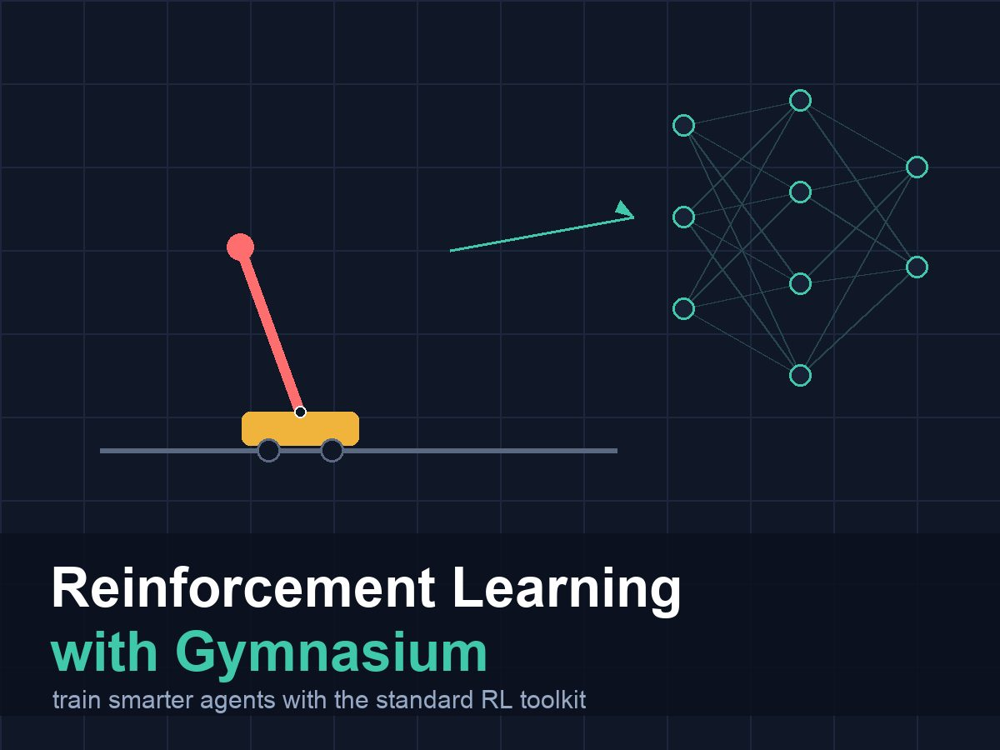

{:class="cover"}

---

## Why Register?

In lesson 2, you created CartPole with `gym.make("CartPole-v1")`. That string looked up the environment in Gymnasium's global registry and instantiated it for you.

Right now, `BurgerBotEnv` is just a class. You can instantiate it directly: `env = BurgerBotEnv()`. That works fine when your environment and your training code are in the same file. But once you split things into separate modules — or want to use Stable-Baselines3's wrappers that call `gym.make` internally — you need your environment registered by ID.

Registration also future-proofs your code. If you later publish the environment, anyone can install your package and `gym.make("BurgerBot-v0")` just works.

## Registering with gym.register

```python
import gymnasium as gym

# gym.register must be called before any gym.make("BurgerBot-v0") call.
# The id follows the convention: Name-vVersion
# entry_point is a string "module.path:ClassName" or a callable.

gym.register(
    id="BurgerBot-v0",
    entry_point="burgerbot_env:BurgerBotEnv",  # if in a file called burgerbot_env.py
    max_episode_steps=150,   # automatically adds a TimeLimit wrapper
)
```

After this call, `gym.make("BurgerBot-v0")` will find your class.

The `entry_point` string uses the format `"module:ClassName"`. The module is the Python module (file) that contains the class, and `ClassName` is the class itself.

> **Note:** `gym.register` only needs to be called once per Python session. It is common to put it at the top of your training script, or in the `__init__.py` of a package that contains your environments.

## A Self-Contained Registration Example

Here is a complete script that defines, registers, and uses BurgerBotEnv — all in one file. When the entry point is in the same script, use `__main__:ClassName` or pass the class directly:

```python
import numpy as np
import gymnasium as gym
from gymnasium import spaces

# ── World constants ──────────────────────────────────────────────────────────
GRID_ROWS, GRID_COLS = 7, 7
OBSTACLES = {(0,3),(1,1),(1,5),(3,0),(3,3),(4,5),(5,1)}
START, GOAL = (0,0), (6,6)
ACTIONS   = ["forward","turn_left","turn_right","stop"]
HEADINGS  = ["north","east","south","west"]
HEADING_DELTA = {"north":(-1,0),"east":(0,1),"south":(1,0),"west":(0,-1)}
NEAR, MEDIUM = 1, 3

class BurgerBotEnv(gym.Env):
    metadata = {"render_modes": ["ansi"]}
    def __init__(self, max_steps=150, render_mode=None):
        super().__init__()
        self.max_steps = max_steps
        self.render_mode = render_mode
        self.observation_space = spaces.MultiDiscrete([GRID_ROWS, GRID_COLS, 4, 3])
        self.action_space = spaces.Discrete(4)
    def _sensor(self):
        dr,dc = HEADING_DELTA[self.heading]
        r,c = self.row+dr, self.col+dc
        n=0
        while 0<=r<GRID_ROWS and 0<=c<GRID_COLS:
            if (r,c) in OBSTACLES: break
            n+=1
            if n>=5: break
            r+=dr; c+=dc
        if n<=NEAR: return 0
        if n<=MEDIUM: return 1
        return 2
    def _obs(self):
        return np.array([self.row,self.col,HEADINGS.index(self.heading),self._sensor()],dtype=np.int64)
    def reset(self,*,seed=None,options=None):
        super().reset(seed=seed)
        self.row,self.col=START; self.heading="east"; self.steps=0
        return self._obs(),{}
    def step(self,action):
        self.steps+=1
        a=ACTIONS[action]; hit=False; moved=False
        if a=="forward":
            dr,dc=HEADING_DELTA[self.heading]; nr,nc=self.row+dr,self.col+dc
            if 0<=nr<GRID_ROWS and 0<=nc<GRID_COLS and (nr,nc) not in OBSTACLES:
                self.row,self.col=nr,nc; moved=True
            else: hit=True
        elif a=="turn_left":
            self.heading=HEADINGS[(HEADINGS.index(self.heading)-1)%4]
        elif a=="turn_right":
            self.heading=HEADINGS[(HEADINGS.index(self.heading)+1)%4]
        reached=(self.row,self.col)==GOAL
        if hit: reward=-10.0
        elif reached: reward=50.0
        elif moved: reward=1.0
        else: reward=-0.1
        terminated=reached or hit; truncated=self.steps>=self.max_steps
        return self._obs(),reward,terminated,truncated,{}
    def render(self):
        if self.render_mode!="ansi": return
        h={"north":"^","east":">","south":"v","west":"<"}
        out=""
        for r in range(GRID_ROWS):
            for c in range(GRID_COLS):
                if (r,c)==(self.row,self.col): out+=h[self.heading]+" "
                elif (r,c) in OBSTACLES: out+="O "
                elif (r,c)==GOAL: out+="G "
                else: out+=". "
            out+="\n"
        return out

# ── Register ─────────────────────────────────────────────────────────────────
gym.register(
    id="BurgerBot-v0",
    entry_point=BurgerBotEnv,   # pass the class directly when in the same file
    max_episode_steps=150,
)

# ── Create and use ────────────────────────────────────────────────────────────
env = gym.make("BurgerBot-v0", render_mode="ansi")

obs, info = env.reset(seed=0)
print("Starting grid:")
print(env.render())

for step in range(10):
    action = env.action_space.sample()
    obs, reward, terminated, truncated, info = env.step(action)
    if terminated or truncated:
        print(f"Episode ended at step {step + 1}")
        break

print("Final grid:")
print(env.render())
env.close()
```

## How render_mode Works

Gymnasium sets the render mode at construction time:

```python
# ANSI text output — good for grid worlds and terminals
env = gym.make("BurgerBot-v0", render_mode="ansi")

# RGB image array — good for recording video or feeding to image models
env = gym.make("CartPole-v1", render_mode="rgb_array")

# Opens a display window — good for watching during development
env = gym.make("CartPole-v1", render_mode="human")

# No rendering — fastest, use this for training
env = gym.make("BurgerBot-v0")   # render_mode defaults to None
```

After construction, call `env.render()` with no arguments:

```python
output = env.render()
# For "ansi": output is a string
# For "rgb_array": output is a NumPy array of shape (H, W, 3)
# For "human": output is None (the window updates automatically)
# For None: output is None
```

## Reading the ANSI Output

BurgerBot's `render()` returns a multi-line string:

```
> . . O . . .
. O . . . O .
. . . . . . .
O . . O . . .
. . . . . O .
. O . . . . .
. . . . . . G
```

- `>` = the robot, currently facing east
- `O` = obstacle
- `G` = goal
- `.` = empty cell

The heading characters follow the natural conventions: `^` north, `>` east, `v` south, `<` west.

## Try It Yourself

1. Register `BurgerBot-v0` and print `gym.spec("BurgerBot-v0")`. What information does the spec contain?
2. Try `gym.make("BurgerBot-v0", max_episode_steps=10)`. Gymnasium passes keyword arguments through to the constructor when you register with `entry_point=ClassName`. Does the time limit actually change?
3. Add `"rgb_array"` to `BurgerBotEnv.metadata["render_modes"]` and implement `render()` for that mode: return a `(GRID_ROWS * 32, GRID_COLS * 32, 3)` NumPy array where each cell is a coloured 32x32 block. Use `np.zeros` and fill in colours for the robot, obstacles, goal, and empty cells. Run `check_env` on it.

## Common Issues

**Problem:** `gymnasium.error.NameNotFound: Environment BurgerBot-v0 doesn't exist`
**Solution:** Make sure `gym.register(...)` is called before `gym.make(...)`. If they are in different files, import the file that contains the `gym.register` call first.
**Why:** The registry is checked at the time of the `gym.make` call. If `register` has not run yet, the ID is not in the registry.

**Problem:** `gym.make("BurgerBot-v0")` ignores keyword arguments like `max_steps=50`
**Solution:** The keyword argument must match the `__init__` parameter name exactly. `max_steps` is the parameter name in our BurgerBotEnv, so `gym.make("BurgerBot-v0", max_steps=50)` works.
**Why:** `gym.make` passes keyword arguments directly to the environment's `__init__`.
