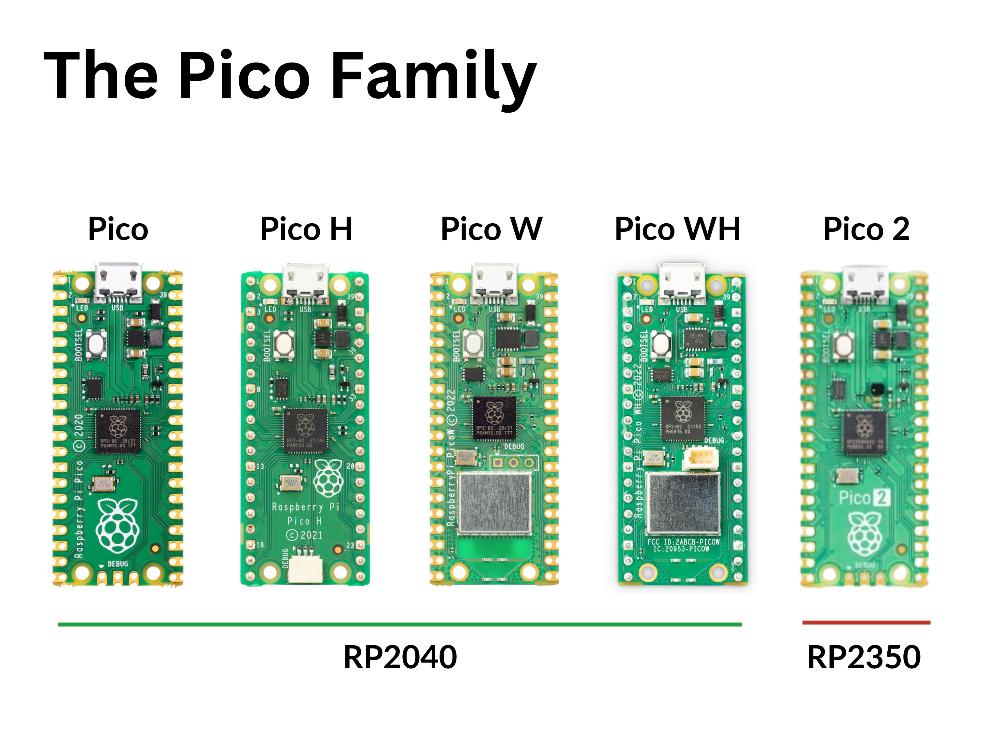

Before we install MicroPython on the Pico, we first need to understand which version of the Pico we have. We need to understand which version we have because there is a specific version of MicroPython that we will need to download and install. There are several different versions of the Raspberry Pi Pico, we'll cover each below.

## Different types of Pico

Since its launch in January 2021, the Raspberry Pi Pico has become one of the most popular microcontrollers on the market. The Pico is available in several different versions, each with its own unique features and capabilities. In this lesson, we will explore the different types of Raspberry Pi Pico and help you choose the right one for your project.

{:class="img-fluid rounded-3 w-100 card-shadow card-hover"}

---

## Raspberry Pi Pico

The original Raspberry Pi Pico is a low-cost, high-performance microcontroller board developed by the Raspberry Pi Foundation. The Pico is built around the RP2040 microcontroller chip, which features a dual-core ARM Cortex-M0+ processor with 264KB of SRAM and 2MB of flash memory. The Pico is designed to be easy to use and is ideal for a wide range of projects, from simple electronics to complex robotics.

The original Pico didn't come with WiFi or Bluetooth cababilities, but it was possible to add these features using external modules.

---

## Raspberry Pi Pico H

The Raspberry Pi Pico H is a variant of the original Pico that comes pre-installed header pins, making it easier to connect to external devices and components. The Pico H is ideal for beginners and hobbyists who want to get started with electronics and programming without the need for soldering.

The Pico H also features a 3-pin [JST](/resources/glossary#JST) debug connector. This is for more advanced users who need to find and fix bugs in their code whilst its running.

---

## Raspberry Pi Pico W

The Raspberry Pi Pico W is a variant of the original Pico that comes with built-in WiFi and Bluetooth capabilities. The Pico W is ideal for projects that require wireless connectivity, such as IoT devices, wearables, and remote sensors.

---

## Raspberry Pi Pico WH

The Raspberry Pi Pico WH is a variant of the Pico W that comes pre-installed with header pins, making it easier to connect to external devices and components. The Pico WH is ideal for beginners and hobbyists who want to get started with electronics and programming without the need for soldering.

---

## Raspberry Pi Pico 2

In August 2024 the Raspberry Pi Pico 2 was launched, powered by the RP2350 microcontroller chip. This chip features a dual-core ARM Cortex-M33 and also dual-core RISC-V Hazard3 all in the same package with 520KB of SRAM and 4MB of flash memory. The Pico 2 is designed to be even more powerful and versatile than the original Pico, with more memory and processing power for more complex projects.

---

## Pico Family

Name    | Processor                     | RAM   | Flash | WiFi | Bluetooth | Header Pins
--------|-------------------------------|-------|-------|------|-----------|------------
Pico    | ARM Cortex-M0+                | 264KB | 2MB   | No   | No        | No
Pico H  | ARM Cortex-M0+                | 264KB | 2MB   | No   | No        | Yes
Pico W  | ARM Cortex-M0+                | 264KB | 2MB   | Yes  | Yes       | No
Pico WH | ARM Cortex-M0+                | 264KB | 2MB   | Yes  | Yes       | Yes
Pico 2  | ARM Cortex-M33/RISC-V Hazard3 | 520KB | 4MB   | No   | No        | No
{:class="table table-striped"}

> ## Where is the Pico 2 W & WH?
>
> The Pico 2 W & WH are expected to be released in the next year.

---
