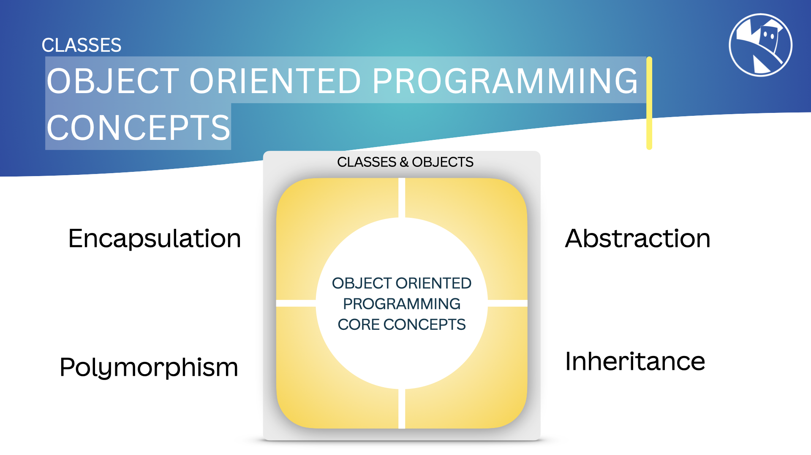

## What is Object-Oriented Programming (OOP)

`Object-Oriented` Programming is a method of programming that is based on the concept of "objects", which can contain data in the form of variables (also known as attributes or properties), and code in the form of functions (methods).

In OOP, `objects` are instances of `classes`, which are templates that define the structure and behavior of objects. Classes can inherit from other classes, which allows for code reuse and the creation of hierarchies of classes.

{:class="img-fluid w-100 card-shadow card-hover rounded-3"}

---

## OOP Concepts

There are 4 core concepts to Object-Oriented Programming in MicroPython:

- [Abstraction](03_abstraction)
- [Inheritance](04_inheritance)
- [Encapsulation](05_encapsulation)
- [Polymorphism](06_polymorphism)

We will learn about each of these concepts in the lessons that follow.

OOP has become the dominant programming paradigm in the software industry, and is widely used in many programming languages, including MicroPython. It focuses on creating reusable code that is easy to maintain and understand, through implementation of the core concepts.

OOP also lends itself to event-driven programming, where code is executed in response to events or user actions. When working with robotics and micropcontrollers this can be very useful.

---

## OOP in MicroPython

Python, and by virtue MicroPython, is an object-oriented programming language. This means that you can create classes and objects in MicroPython, and use them to organize your code and create reusable components.

Not all the concepts are fully supported in MicroPython, some might argue that polymorphism is not fully supported in MicroPython, but the core concepts of OOP are still very much applicable. We'll look into this futher in the following lessons.

---
