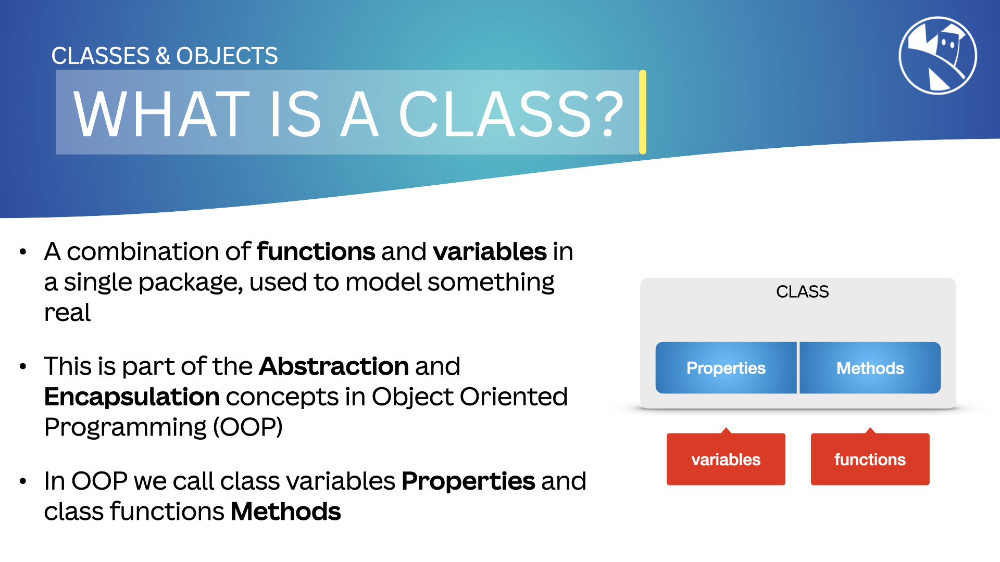
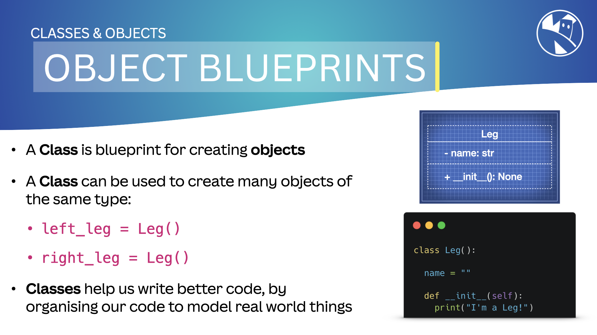
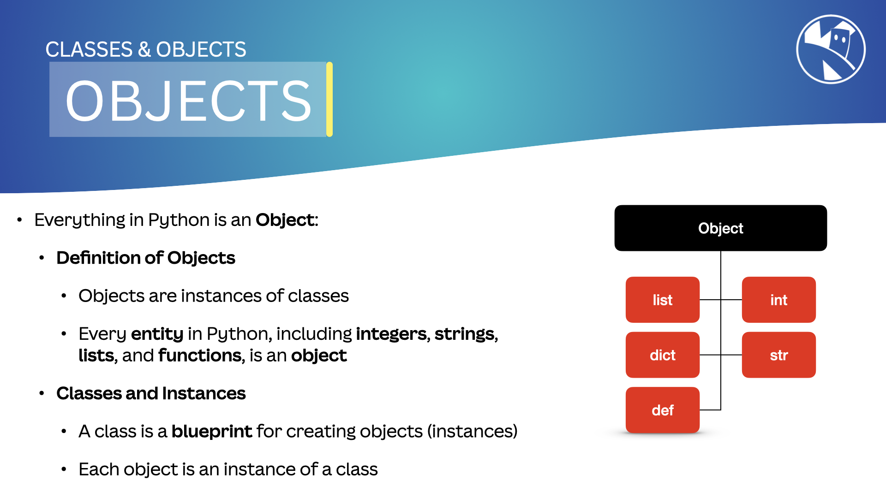

## Introduction

In this lesson, we will explore the concepts of classes and objects in MicroPython. Understanding these concepts is fundamental to mastering object-oriented programming (OOP) and will help you build more organized and reusable code.

---

## What is a Class?

{:class="img-fluid w-100 card-shadow card-hover rounded-3"}

A `class` is a ***blueprint*** for creating `objects`. It defines the `properties` and `methods` that an object will have. In MicroPython, you can define a class using the `class` keyword.

An `instance` of a class is also known as an `object`. By *instance*, we mean a single occurrence of an object:

```python
a = 1         # a is an instance of an integer object
b = "hello"   # b is an instance of a string object
c = [1, 2, 3] # c is an instance of a list object
```

---

## Properties and Methods

A class `property` is the name we give to ***variables*** within a class. A class `method` is the name we give to ***functions*** within a class.

```python
class Robot:
    robot_name = "" # this is a class property
    color = ""      # this is another class property

    def say_hello(self):
        # This is a class method
        print(f"Hello, I am {self.robot_name}")

    def change_color(self, new_color):
        # This is another class method
        self.color = new_color
```

---

## Classes Model the Real World

We use classes to model real-world things, such as a Robot or a Car. For example, we can create a class called `Robot` with properties like `robot_name` and `color`, and methods like `say_hello` and `change_color`—similar to a real-world robot.

```python
class Robot:
    robot_name = ""

    def __init__(self, name, color):
        self.robot_name = name
        self.color = color

    def say_hello(self):
        print(f"Hello, I am {self.robot_name}")

    def change_color(self, new_color):
        self.color = new_color
```

You can create multiple objects from the same class, each with its own set of properties and methods. Note that property values can differ for each object, but the methods remain the same.

```python
r2d2 = Robot("R2D2", "Blue")
c3po = Robot("C3PO", "Gold")
```

> ### Constructors
>
> Notice the `__init__(self, name, color)` method in the `Robot` example above. This is called the `constructor` of the class. It is called when a new object is created from the class.
>
> We use the ***constructor*** to set the initial values of the object's properties.

---

### Naming Conventions & Indentation

The convention is to name classes with an ***uppercase*** letter at the start of each word. In the example above, we have a class called `Robot`.

Notice how the ***methods*** within the class are indented. This means these methods are only accessible *within* the class or via the dot "`.`" operator.

Also, notice that there is a variable called `robot_name` within the class. This is a `class variable` shared by all instances of the class.

{:class="img-fluid w-100 card-shadow card-hover rounded-3"}

---

## What is an Object?

In Python and MicroPython, an `object` is an *instance* of a class. It is created using the *class* as a blueprint.

{:class="img-fluid w-100 card-shadow card-hover rounded-3"}

An **object** is like a variable that also has functions *attached* to it. These functions are the `class methods`.

You can call the **methods** of an object using the dot "`.`" operator.

```python
# Create an object of the Robot class
r1 = Robot("R2D2", "Blue")

# Call the say_hello method
r1.say_hello()

# Change the color of the robot
r1.change_color("Red")

# Access the color of the robot
print(r1.color)
```

---

## Everything in Python is an Object

Almost everything in Python is an object, including `int`, `float`, `list`, `dict`, and `str`. This means they have properties and methods that you can access.

You may have already used objects and their methods without realizing it. For example, the `str` object has a method called `upper()` that converts the string to uppercase.

```python
message = "hello" # create a string called message and store the value "hello"
print(message.upper()) # prints out the message string in uppercase, this uses the str object's upper() method
```

---

## What is Self?

In the `__init__` method and other class methods, you will see a parameter called `self`. This is a reference to the current instance of the class. It is used to access the variables and methods of the class.

`self` is always the first parameter in a class method; it cannot be omitted.

```python
class Robot:
    # Class Properties
    robot_name = "" # this is a class property
    color = ""      # this is another class property

    def __init__(self, name, color):
        self.robot_name = name # changes this object's robot_name to the name provided
        self.color = color     # changes this object's color to the color provided

    def change_color(self, new_color):
        # This is a class method
        self.color = new_color
```

> ## Did You Know?
>
> "`self`" can actually have ***any*** name, but it is a convention to use "`self`" in Python.
>
> You could use "`this`" or "`me`" or any other name, but it is best to stick with "`self`" to avoid confusion. As long as the first parameter of a class method is the reference to the current instance of the class, it will work.

---

### Summary

In this lesson, we've learned about classes and objects in MicroPython. We explored how classes act as blueprints for creating objects, how to define properties and methods, and the importance of the `self` parameter. We also covered naming conventions and the concept that everything in Python is an object.

---
