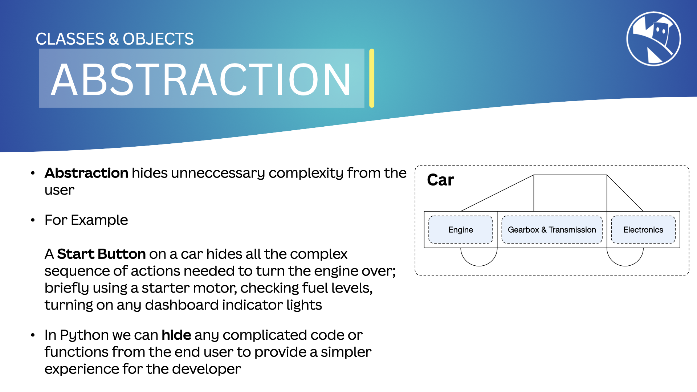

## Abstraction

In [OOP](02_oop), `Abstraction` means hiding the complexity of a system by exposing only the necessary details.

We achieve this by creating simple interfaces that allow interaction with the code without needing to know its inner workings.

This approach allows us to change how the system works without affecting the code that interacts with it, or the user noticing any change.

{:class="img-fluid rounded-3 w-100 card-shadow card-hover"}

---

## How We Use Abstraction in MicroPython

In MicroPython, we use [`classes`](02a_classes) to create abstractions. A class is a blueprint for creating objects that represent real-world entities.

We can hide ***properties*** and ***methods*** using `access modifiers`.

---

## Access Modifiers

An ***access modifier*** in MicroPython controls the visibility of properties and methods in a class; it can be `public`, `private`, or `protected`.

We don't have to specifically declare methods and properties as ***public*** in MicroPython because everything is public by default.

---

## Private and Protected

Both class functions and methods can be marked as `private` (hidden) or `protected` (restricted from changes).

***Private*** methods and properties are not suggested by the Python interpreter or IDEs, making them less accessible to the end user. If you *try* to access a private property or method from outside the class, you will get an `AttributeError`.

***Protected*** properties and methods can, but should not be ***changed*** from outside the class.

---

### Private Properties and Methods

Use a double underscore "`__`" in front of a variable name to make it private:

```python
class Robot:
    __a_private_value = 10
```

Private methods and properties cannot be accessed by the user, either through the Python interpreter or an IDE.

---

### Protected Properties and Methods

Use a single underscore "`_`" in front of a variable name to make it protected:

```python
class Robot:
    _a_protected_value = 20
```

Protected methods and properties can be accessed from outside the class but should not be changed; its just not polite!

---

Below is an example of private and protected properties and methods in a class:

```python
class Robot:
    __battery_max_voltage = 4.2
    __battery_min_voltage = 3.0
    _battery_voltage = 3.7
    __serial_number = "123456"

    def _battery_level(self):
        battery_percentage = ((self._battery_voltage - self.__battery_min_voltage) / (self.__battery_max_voltage - self.__battery_min_voltage)) * 100
        return int(battery_percentage)
    
    def battery(self):
        return f"{self._battery_level()}%"
    
r = Robot()
print(r.battery())
```

In the example above, the complexity of calculating the battery level is hidden. The user doesn’t need to know the voltage levels or the formula used. The `__battery_max_voltage` and `__battery_min_voltage` are hidden from the user; IDE's such as [Thonny](https://thonny.org/) will not suggest them via autocomplete.

Try to access the `r.__battery_max_voltage` property from outside the class, and you will get an `AttributeError`.

Also try changing the `r._battery_voltage` value; it will work, but its not best practice.

---

> ### What is Name Mangling?
>
> MicroPython does not completely hide or protect these methods and properties; it only makes them harder to access. Name mangling is used to obscure the names of private and protected properties and methods.

---

### Example

Think of a car. You don’t need to know how the engine works to drive it. You just use the pedals, steering wheel, and gear stick. The engine is abstracted away from you.

---

### Benefits

- **Simplicity**: Abstraction simplifies complex systems by hiding unnecessary details.
- **Flexibility**: We can change the system's implementation without affecting the code that interacts with it.
- **Reusability**: Abstraction allows us to create interfaces that can be reused in different contexts.

---

[Encapsulation](05_encapsulation) and [Inheritance](04_inheritance) also help create abstractions in MicroPython. We will explore these concepts in the following lessons.

---

### Summary

Abstraction in OOP allows us to hide complexity and create simple interfaces for interacting with systems. It helps simplify, add flexibility, and reuse code in our programs.
