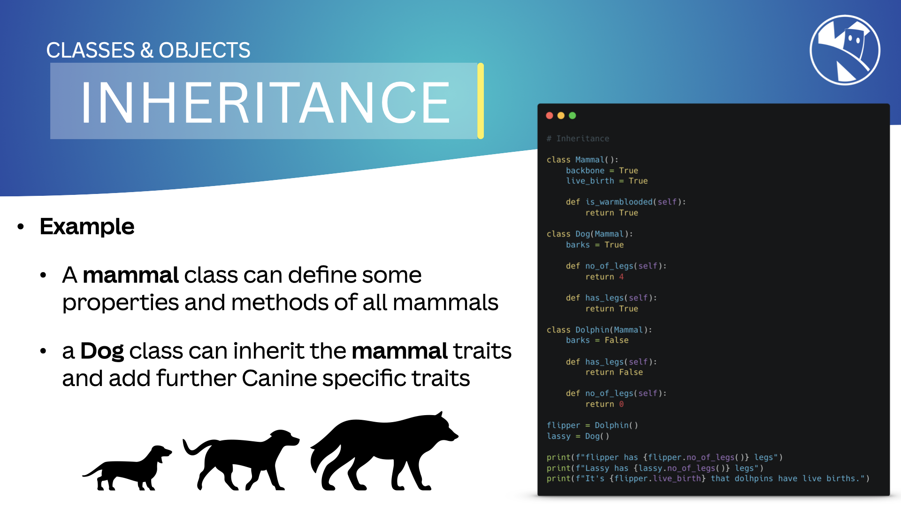
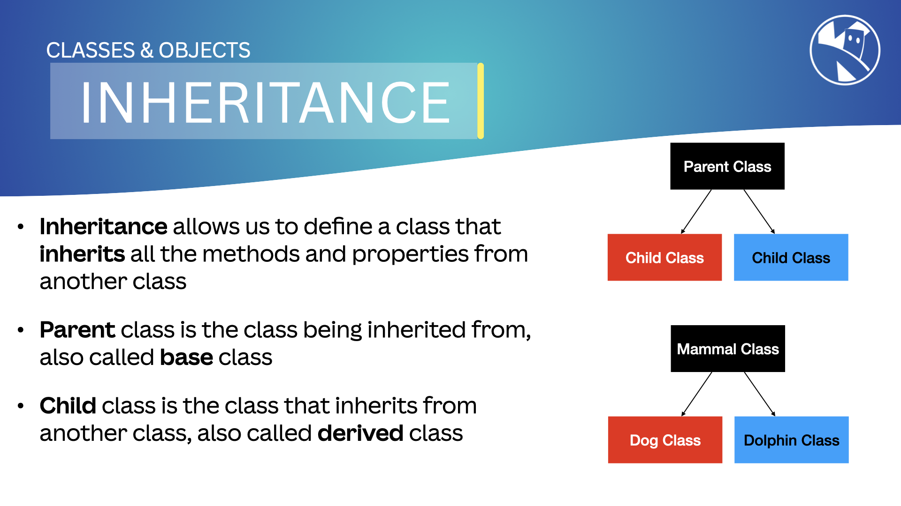

## Inheritance

In object-oriented programming (OOP), `Inheritance` is a way to create new classes based on existing classes. The new classes, known as `derived classes`, inherit attributes and methods from the existing classes, known as `base classes`.

```python
class Animal:
    def __init__(self, name):
        self.name = name

    def speak(self):
        print("Animal speaking")

class Dog(Animal):
    def __init__(self, name, breed):
        super().__init__(name)
        self.breed = breed

    def speak(self):
        print("Dog barking")

animal = Animal("Animal")
dog = Dog("Dog", "Labrador")
dog.speak()
```

First we define the base class, `Animal`, it has a `name` property and a `speak` method.
Next we define a `Dog` class, that inherits from the Animal class.

Notice that the `Dog` class has a parameter - the Base class it inherits from.

Also notice the use of `super()` to call the base class [`constructor`](02a_classes#constructors); we do this to initialize the base class properties in the derived class.

---

## Inheritance and Composition

`Inheritance` is a key feature in object-oriented programming (OOP) that allows ***new*** classes to be created ***from existing ones***. The new classes, known as `derived classes`, inherit attributes and methods from the existing classes, known as `base classes`. This helps in reusing code and creating a hierarchy of classes.

`Composition`, on the other hand, is a way to ***combine*** objects or classes together to represent a ***has-a*** relationship. For example, a car has an engine, and a person has a heart.

---

### Why Use Inheritance and Composition?

- **Code Reusability**: Both inheritance and composition promote code reuse.
- **Better Organization**: They help organize code better by creating a clear structure and relationship between classes.

{:class="img-fluid rounded-3 w-100 card-shadow card-hover"}

{:class="img-fluid rounded-3 w-100 card-shadow card-hover"}

---

### Example of Composition

In composition, we create objects that are made up of other objects. This allows us to create complex objects from simpler ones.

```python
class Robot:
    def __init__(self, name):
        self.name = name
        self.sensors = Sensors()       # create a class property for sensors, which are defined elsewhere
        self.motors = Motors()         # create a class property for motors, which are defined elsewhere
        self.controller = Controller() # create a class property for controller, which are defined elsewhere

    def move_forward(self):
        self.motors.move_forward()

    def move_backward(self):
        self.motors.move_backward()

    def turn_left(self):
        self.motors.turn_left()

    def turn_right(self):
        self.motors.turn_right()

    def read_sensor(self):
        return self.sensors.read_sensor()
```

---

## Multiple Inheritance

In MicroPython, classes can inherit from multiple base classes. This is known as multiple inheritance. When a class inherits from multiple classes, it inherits attributes and methods from all the parent classes.

```python
class A:
    def method_a(self):
        print("Method A")

class B:
    def method_b(self):
        print("Method B")

class C(A, B):
    def method_c(self):
        print("Method C")

c = C()
c.method_a()
c.method_b()
c.method_c()
```

---

### Pros and Cons of Multiple Inheritance

- **Pros**:
  - Provides a way to create complex hierarchies and relationships.
  - Increases code reuse and modularity.

- **Cons**:
  - Can lead to ambiguity and complexity, especially with the diamond problem.
  - Increases the memory usage of your program, which is critical in MicroPython due to limited resources.

---

## How We Use Inheritance in MicroPython

In MicroPython, inheritance helps create new classes with additional functionalities, building on existing ones.

> ## Remember the Memory Constraints of Microcontrollers
>
> When using inheritance in MicroPython, remember that microcontrollers have limited memory. Be cautious when creating new classes that inherit from existing ones, especially with multiple inheritance, as this can increase the memory usage of your program.

---

### Real-World Example

Imagine you are building a library for controlling different types of sensors. You can create a base class for a generic sensor and then create derived classes for specific sensors like temperature and humidity sensors. This way, you can reuse the common functionality in the base class while adding specific features in the derived classes.

---

### Benefits of Inheritance and Composition

- **Simplicity**: Simplifies complex systems by hiding unnecessary details.
- **Flexibility**: Allows changing the system's implementation without affecting the interacting code.
- **Reusability**: Creates interfaces that can be reused in different contexts.

---

[Encapsulation](05_encapsulation) and [Inheritance](04_inheritance) also help create abstractions in MicroPython. We will explore these concepts in the following lessons.

---

### Summary

Abstraction in OOP allows us to hide complexity and create simple interfaces for interacting with systems. It helps simplify, add flexibility, and reuse code in our programs.

---
