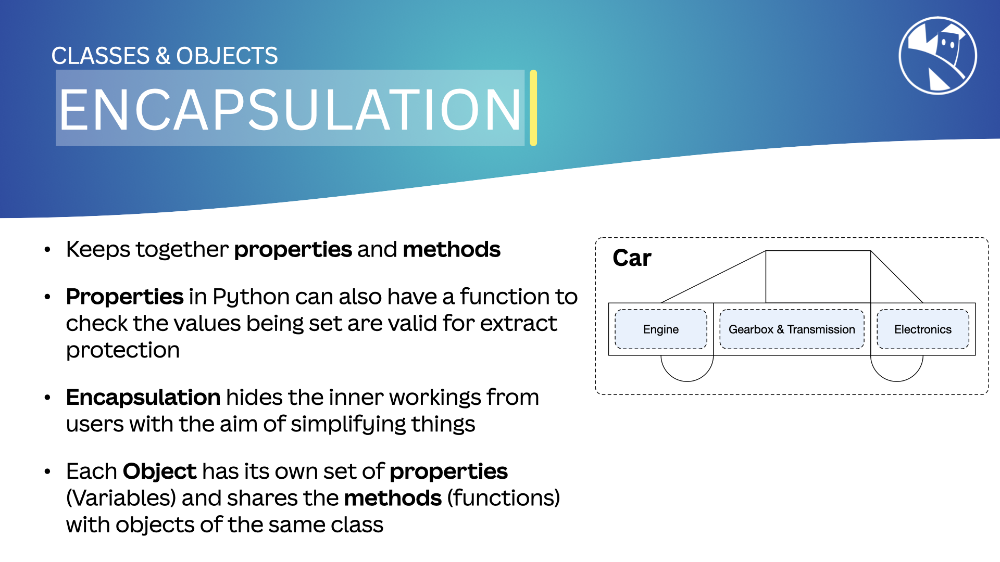
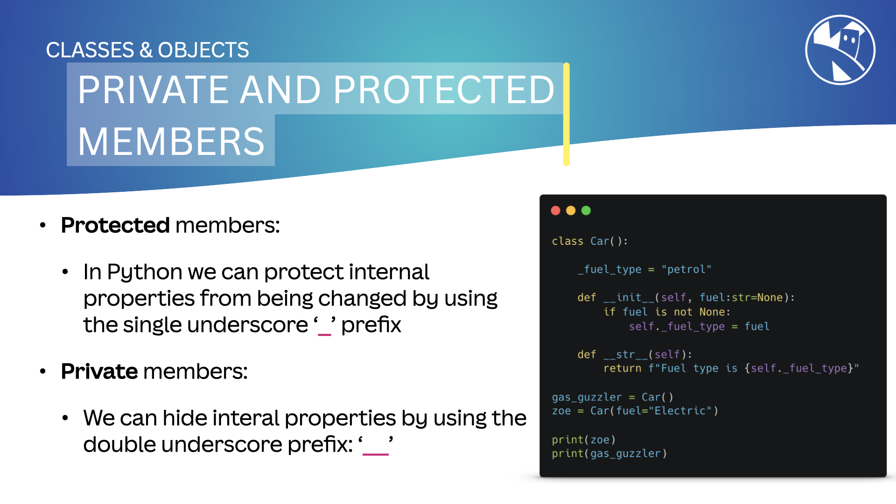

## Encapsulation

In MicroPython, encapsulation is a concept where we hide the complexity of a system by exposing only the necessary details. We achieve this by creating simple interfaces that allow interaction with the code without needing to know its inner workings (see [Abstraction](03_abstraction)).

We can hide ***properties*** and ***methods*** using `access modifiers`.

{:class="img-fluid rounded-3 w-100 card-shadow card-hover"}

---

## Access Modifiers

An ***access modifier*** in MicroPython controls the visibility of properties and methods in a class. These can be `public`, `private`, or `protected`.

In MicroPython, properties and methods are ***public*** by default, meaning they can be accessed from outside the class.

---

## Private and Protected

Both class functions and methods can be marked as `private` (hidden) or `protected` (restricted from changes).

{:class="img-fluid rounded-3 w-100 card-shadow card-hover"}

### Private Properties and Methods

Use a double underscore "`__`" in front of a variable name to make it private:

```python
class Robot:
    __a_private_value = 10
```

Private methods and properties cannot be accessed from outside the class. Attempting to do so will result in an `AttributeError`.

### Protected Properties and Methods

Use a single underscore "`_`" in front of a variable name to make it protected:

```python
class Robot:
    _a_protected_value = 20
```

Protected methods and properties can be accessed from outside the class but should not be changed. This is a convention to indicate that these are intended for internal use only.

---

### Example of Private and Protected Properties and Methods

Below is an example of private and protected properties and methods in a class:

```python
class Robot:
    __battery_max_voltage = 4.2
    __battery_min_voltage = 3.0
    _battery_voltage = 3.7
    __serial_number = "123456"

    def _battery_level(self):
        # Protected method to calculate battery percentage
        battery_percentage = ((self._battery_voltage - self.__battery_min_voltage) / (self.__battery_max_voltage - self.__battery_min_voltage)) * 100
        return int(battery_percentage)
    
    def battery(self):
        # Public method to get the battery percentage
        return f"{self._battery_level()}%"
    
r = Robot()
print(r.battery())
```

In the example above, the complexity of calculating the battery level is hidden. The user doesn’t need to know the voltage levels or the formula used. The `__battery_max_voltage` and `__battery_min_voltage` are hidden from the user; IDEs such as [Thonny](https://thonny.org/) will not suggest them via autocomplete.

If you try to access the `r.__battery_max_voltage` property from outside the class, you will get an `AttributeError`.

Also, try changing the `r._battery_voltage` value; it will work, but it is not best practice.

---

## Name Mangling

> ### What is Name Mangling?
>
> MicroPython does not completely hide or protect these methods and properties; it only makes them harder to access. Name mangling is used to obscure the names of private and protected properties and methods.

---

### Real-World Example

Think of a car. You don’t need to know how the engine works to drive it. You just use the pedals, steering wheel, and gear stick. The engine is abstracted away from you.

---

### Benefits

- **Simplicity**: Encapsulation simplifies complex systems by hiding unnecessary details.
- **Flexibility**: We can change the system's implementation without affecting the code that interacts with it.
- **Reusability**: Encapsulation allows us to create interfaces that can be reused in different contexts.

---

[Encapsulation](05_encapsulation) and [Inheritance](04_inheritance) also help create abstractions in MicroPython. We will explore these concepts in the following lessons.

---

### Summary

Encapsulation in MicroPython allows us to hide complexity and create simple interfaces for interacting with systems. It helps simplify, add flexibility, and reuse code in our programs.

---
