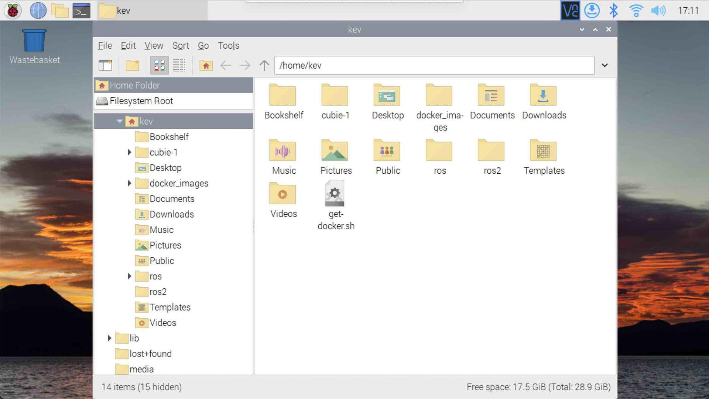

{:class="cover"}

## 64bit Raspberry Pi OS image

You will need to use the 64bit version of the Raspberry Pi OS to use ROS2 within docker. Follow the steps below to install it on your Raspberry Pi.

### Setup the SD card using Raspberry Pi Imager

{:class="img-fluid w-50 shadow-lg"}

* **Get the Raspberry Pi Imager** -  from: <https://www.raspberrypi.com/software/>
* **Insert your Raspberry Pi SD card** - Insert the blank SD card into a card reader on another computer; A 32Gb or higher is recommended
* **Choose the OS** - Click the  `Choose OS` button, and select the Raspberry Pi OS (64Bit) Desktop, under the `Raspberry Pi OS (other)` menu.

{:class="img-fluid w-50 shadow-lg"}

* **Choose Storage** - Click the `Choose Storage` button, and select the SD Card from the list

{:class="img-fluid w-50 shadow-lg"}

* **Advanced Options** - Click the Cog icon (the `Advanced` button) and complete the details; add your Wifi SSID and password, and set a default username and password, and ensure that the `enable SSH` option is selcted; this will enable you to remotely connect to the Raspberry Pi.

{:class="img-fluid w-50 shadow-lg"}

* **Write the Image** - Click the `Write` button, The 64bit version of Raspberry Pi OS will then write to the SD Card; it may take a few minutes.

* **Remove the SD Card** - then insert into the Raspberry Pi 4, and plugin the power to start the bootup process.

---
