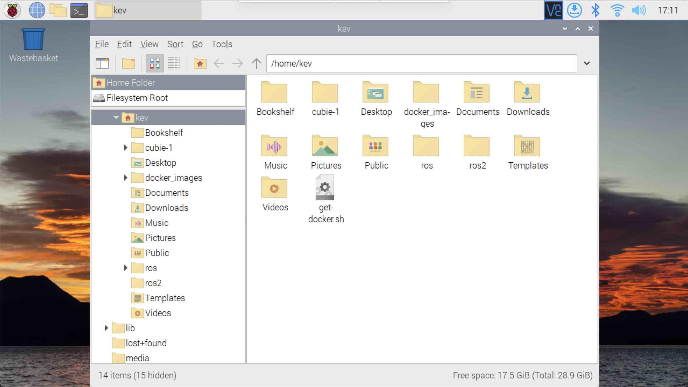

{:class="cover"}

## Get Docker

We will use Docker to manage our ROS environment. Docker enables us to run containers; each container is a separate environment and can contain its own files, and run its own processes. Containers are like lightweight Virtual Machines, without the need to emulate an entire computer.

To get the Docker installation script:

* **Get the install script** - From the terminal, type:

```bash
curl -fsSL https://get.docker.com -o get-docker.sh
chmod +x get-docker.sh 
```

---

## Remove any existing docker installation

If you want to remove any existing docker installations, do this step before installing docker.

* **Purge** - From the terminal, type:

```bash
sudo apt-get purge docker-ce docker-ce-cli containerd.io -y
```

---

## Install Docker

* **Run the script** - From the terminal, type:

```bash
./get-docker.sh
```

---

## Fix permissions

Docker can run commands from a regular user account, but first we need to fix the permissions

* **Make pi user execute docker commands** - From the terminal, type:

```bash
sudo usermod -aG docker pi
```

*Where `Pi` is the user account you created when [setting up the Pi](02_pi_setup#setup-the-sd-card-using-raspberry-pi-imager)*

---

* **Unmask docker**- From the terminal, type:

```bash
sudo systemctl unmask docker
```

---

* **Fix permissions** - From the terminal, type:

```bash
sudo chmod 666 /var/run/docker.sock
```

---

* **install docker-compose** - From the terminal, type:

```bash
 pip3 -v install docker-compose
```

---

* **Start docker** - From the terminal, type:

```bash
sudo systemctl start docker
```

---

* **Reboot** - Restart the Pi to implement the changes. From the terminal, type:

```bash
sudo init 6
```

---
