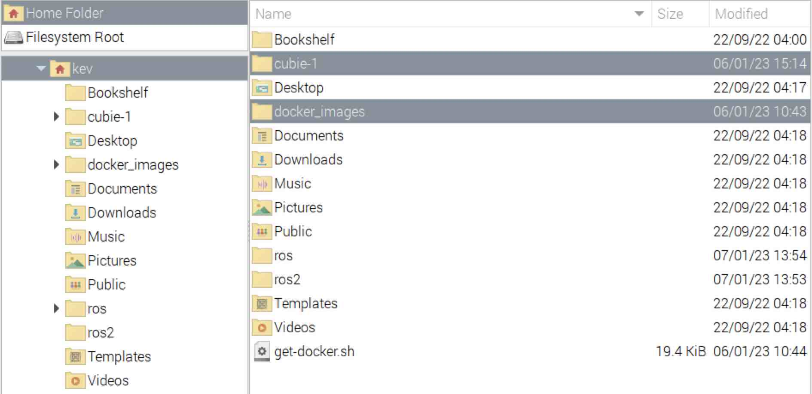

{:class="cover"}

## Open Source Robotics Foundation Official Docker files

The Open Source Robotics Foundation (OSRF) maintain a suite of official Docker container definitions. Lets grab these so that we can build our own container.

---

## Clone the official OSRF Docker Images

This step is optional, as I will provide a tested `dockerfile` and `docker-compose.yml`. However if you want to build a different version or release, these are the files you will need.

Download the official dockers images from the OSRF [github repository](https://www.github.com/osrf/docker_images):

* **Get official ROS docker images** - From the terminal, type:

```bash
git clone https://www.github.com/osrf/docker_images
```

---

## Summary

You should now have a number of extra folders on your Raspberry Pi:

{:class="img-fluid w-50"}

* `docker-images` - contains the Official OSRF docker images
* `cubie-1` - contains the example files

---
