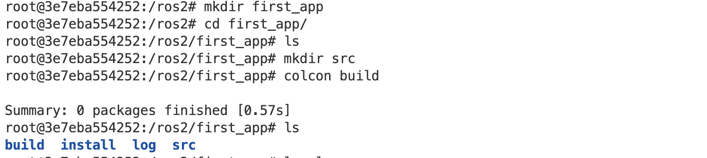
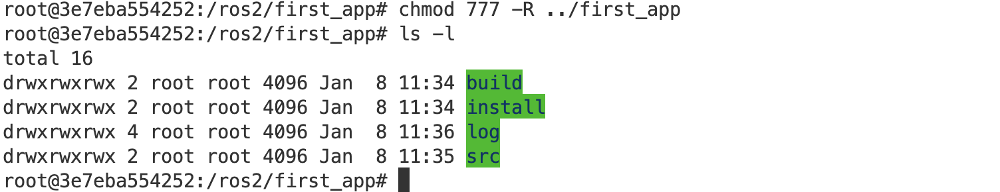
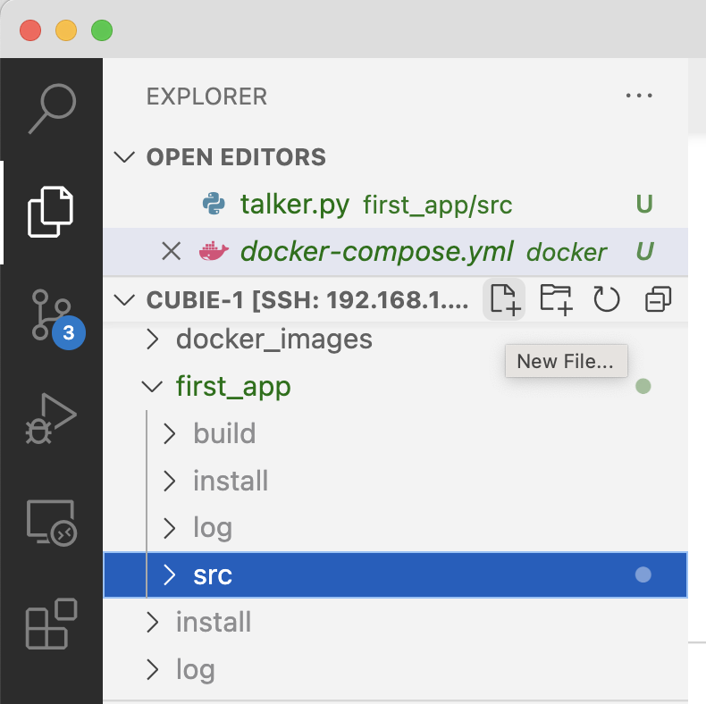
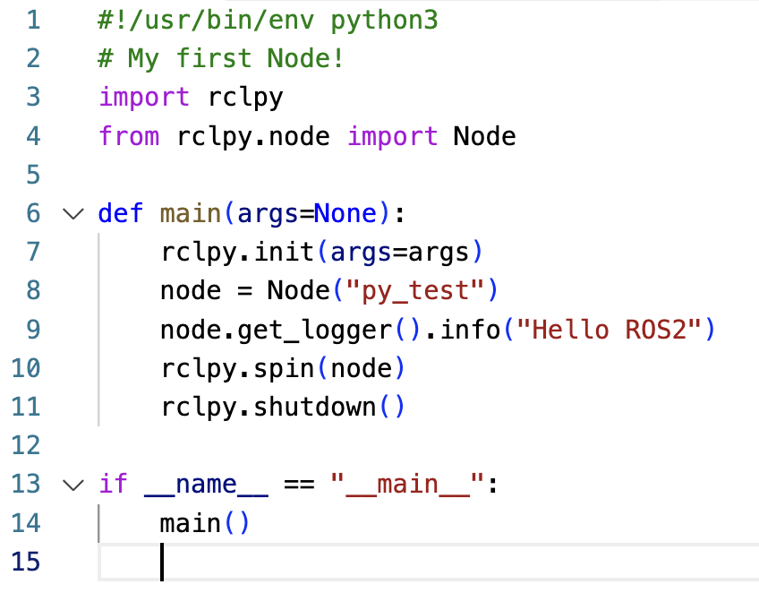
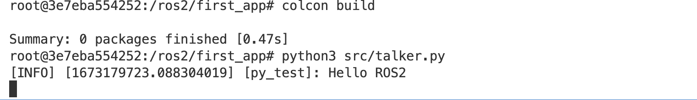

## Source the ROS setup.bash script

To use all the common ROS2 commands we need to `source` the setup script:

* **Source the scripts** - From the remote terminal, type:

```bash
source /opt/ros/humble/setup.bash
```

---

## ROS2 Workspaces

In ROS we use workspaces to manage our robotics projects. They are essentially a folder, with a set of files that ROS expects to see. The great thing is that ROS makes it really easy to set these up with a single `colcon build` command.

* **Create a new workspace** - From the ROS2 container terminal, type:

```bash
cd /ros2
mkdir first_app
cd first_app
mkdir src
colcon build
ls
```

*You will see a few new folders created - `build`, `install` and `log`*

{:class="img-fluid w-100 shadow-lg"}

---

> ### What is `colcon`?
>
> **colcon** - collective construction
>
> Colcon is a command line tool to improve the workflow of building, testing and using multiple software packages. It automates the process, handles the ordering and sets up the environment to use the packages.

---

## Install folder

`colcon` created a new `install` folder; this contains a number of setup scripts that we will use to setup our terminal shell environment with the correct settings for this workspace.

> You can look inside the setup files by using the `cat` command, eg `cat setup.bash` will show you (catalogue) the contents of the script.

---

## Source the setup.bash script

Lets go ahead and setup out terminal shell environment with our freshly created workspace bash setup scripts.

* **Source the scripts** - From the remote terminal, type:

```bash
source install/setup.bash
```

---

## Fix permissions

You may need to fix the permissions within the container so that VSCode can write to these files and folders.

* **change mode** - From the ros2 terminal, type:

```bash
chmod 777 -R ../first_app
```

{:class="img-fluid w-100 shadow-lg"}

---

## Create talker.py in src

Lets create our first ROS2 python program.

* **Select the `src` folder and Click New file** - From the VSCode folder window, select the `src` folder and then click the `New Files` button
* **Name the file** - name the file `talker.py`

{:class="img-fluid w-50 shadow-lg"}

---

## Paste this code

Lets cheat a bit - paste the code below, we'll explain it in the next section

* **Paste this code** - into the new file

```python
#!/usr/bin/env python3
# My first Node!
import rclpy
from rclpy.node import Node

def main(args=None):
    rclpy.init(args=args)
    node = Node("py_test")
    node.get_logger().info("Hello ROS2")
    rclpy.spin(node)
    rclpy.shutdown()

if __name__ == "__main__":
    main()
```

{:class="img-fluid w-50 shadow-lg"}

---

## Run the program

Lets run it! Don't worry we'll explain exactly whats going on.

* **Run the code** - From the ROS2 container terminal, type:

```bash
colcon build
python3 src/talker.py
```

{:class="img-fluid w-100 shadow-lg"}

Congratulations! You've just written a ROS2 program.

But what does the code actually mean? Lets look at that closer in the next section.

---
