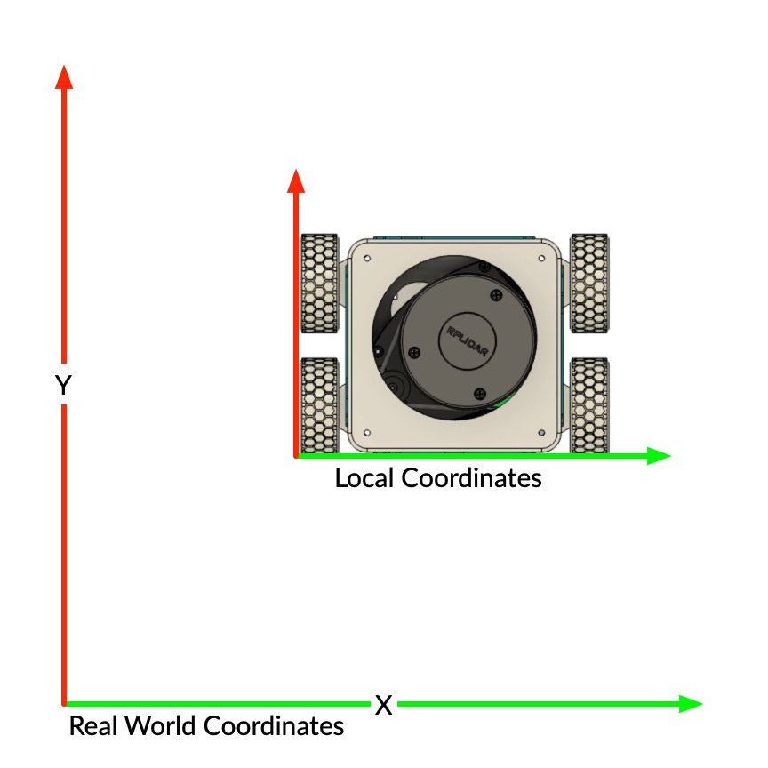

## TF2

`tf2` is the ROS2 transform library, which lets the user keep track of multiple coordinate frames over time. `tf2` maintains the relationship between coordinate frames in a tree structure buffered in time and lets the user transform points, vectors, etc. between any two coordinate frames at any desired point in time.

## Transformations

Transformations allow us to convert (or translate) one set of coordiates to another. Our robot, and the coordinates of the parts of the robot can be considered to be `local` to the robot. 

{:class="img-fluid w-50 shadow-lg"}

{:class="img-fluid w-50 shadow-lg"}

{:class="img-fluid w-50 shadow-lg"}

The robot exists in the real world (or virtual world) in a `world` coordinate space.

We neet to transform the data from the Lidar, know as the `laser_frame` (which is in the robots local coordinates), to the `world` coordinate space.

* `Local` Coordinate start at the objects origin
* Real `World` Coordinates have a different origin

Transformations translate coordinates between the local and real world

---

## Laser_frame to World

We will use TF2 to create the transform from the `laser_frame` to the `world`.

* **Create the Tranform with TF2** - - from the docker-desktop_ros2_1 container, type:

```bash
ros2 run tf2_ros static_transform_publisher 0 0 0 0 0 0 laser_frame world
```

---
