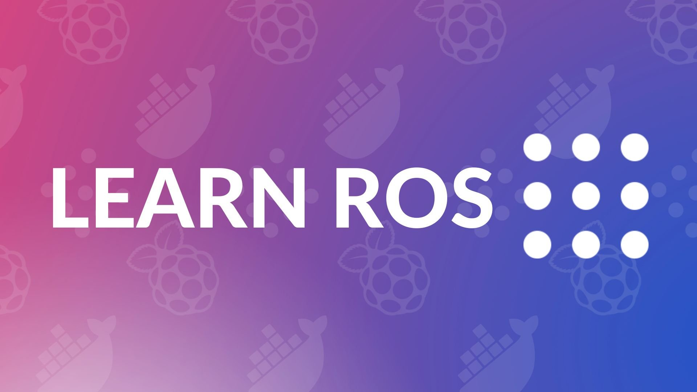

{:class="cover"}

## Overview

This course will teach you all about the Robot Operating System, how to use the ROS2 on a Raspberry Pi 4, and how to write your own ROS programs.

---

## What you'll learn

In this course you will learn:

* How to setup a Raspberry Pi for use with ROS
* How to install docker on a Raspberry Pi
* Setting up the ROS environment within a docker container
* ROS versions
* Creating a ROS workspace with Colcon
* ROS Commandline tools
    * colcon
    * ros2
    * ros nodes list
    * ros pkg list
    * qrt
* Creating a simple ROS program
* Creating a package
* Creating launch files
* Visualising nodes with qrt
* TL
* LIDAR
    * Laser Scan data
    * SLAM

---

### About ROS

ROS (Robot Operating System) is an open-source, meta-operating system for your robot. It provides the tools and libraries that allow you to quickly create and deploy robotics applications. ROS provides a flexible framework for writing and executing code, as well as a wide variety of libraries and tools for navigation, manipulation, and perception. ROS is used by many leading robotics companies and research institutions worldwide.

---

### Don't be scared

 ROS can be very intimidating at first, but don't worry - it's actually quite manageable once you understand the basics. This course is a great starting point for unpacking and learning how ROS works.

---

### What you'll need

Item             | Description
:----------------|-----------------------------
A Raspberry Pi 4 | 4Gb or 8Gb (recommended)
A Lidar sensor   | A1 LiDAR sensor from Slamtec
{:class="table table-striped"}

ROS can be installed on Windows, macOS or Linux; however for robotics we often want to install this on a single board computer such as the **Raspberry Pi 4**. In fact ROS.org supports ROS on Raspberry Pi 4 running the Ubuntu OS, or the standard 64 bit version of the Raspberry Pi OS and running ROS within a Docker container; this is what we will use in this course.

The 8Gb version of the Raspberry Pi 4 is recommended as ROS is quite memory hungry, and the Raspberry Pi cannot use a large swap file as it damages the SD card over time (due to the large number of writes to the flash storage).

---
