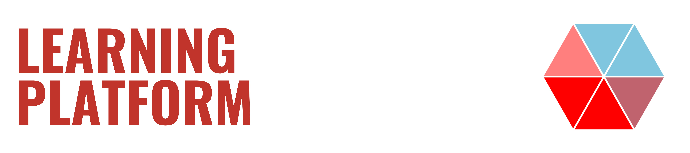

{:class="img-fluid w-100"}

## Welcome

Welcome to the new Learning Platform. This learning platform is a new feature of KevsRobots.com, and will help you level up your skills with tutorials specifically aimed at robotics topics.

---

## Course Content

In this mini-course you'll learn how to:

* Use the `Learning Platform`
* Navigate content
* Download course content
