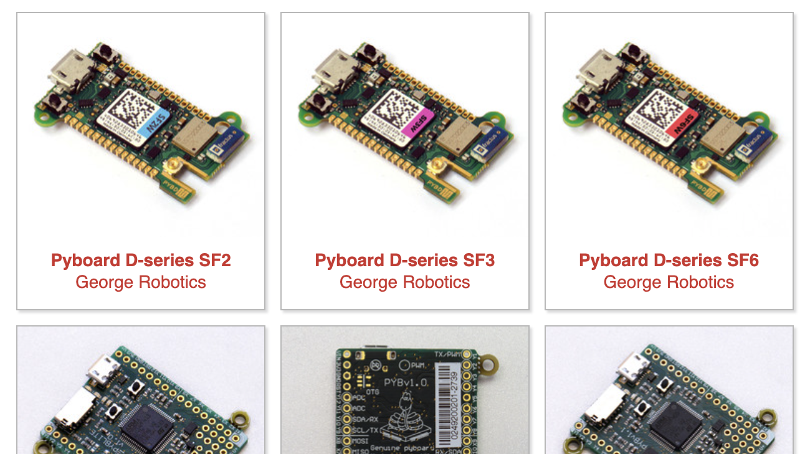

{:class="cover"}

[MicroPython](https://www.micropython.org) is actively developed and maintainted by a small group of developers. Visit <https://www.micropython.org> for the latest version, documentation and tutorials.

On the MicroPython website, there is a link to [Downloads](https://www.micropython.org/download/). There is a build of MicroPython for almost all types of MicroController - as long as the MicroController is capable of running MicroPython, which requires a 32bit processor. You'll see a small thumbnail picture of each board along with the name of the board, click on the image of the board you have and then click on the latest release. As of the writing of this tutorial, `v1.19.1 (2022-06-18).uf2` is the latest version.

This will download the firmware onto your computer in your `downloads` folder.

{:class="img-fluid w-75 shadow-lg"}
