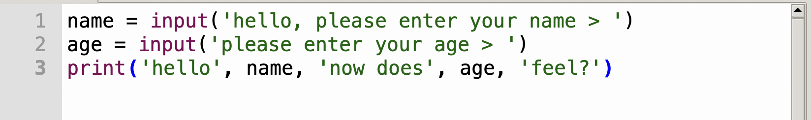
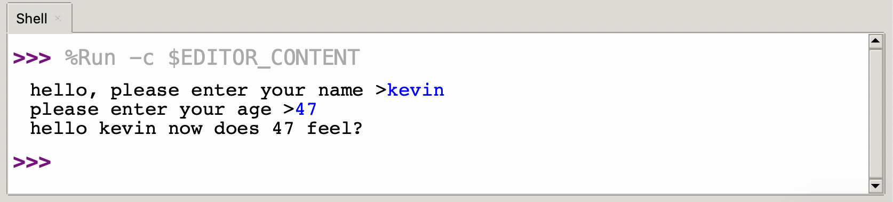

Let’s do something more interesting.

We'll make the Raspberry Pi Pico (or whichever board you are using) ask us a question, then reply back to us.

## name.py

Type of the program below into your Python Editor

```python
# Variables
# name.py

print("Please type your name:")
name = input()
print("Hello", name)
```

Save the file and then run it by pressing the green `run` button.

The `name` variable holds the value that it is assigned, and we assigned it by using the `=` equals sign.

The function `input`, is another built-in function that MicroPython provides to get user input from the keyboard and return it to our program.

The variable is like a box that we can put things in, in this case a persons name.

## Numbers

We can also store `numbers` in variables; let's extend our example and add an extra question

type:

```python
name = input('hello, please enter your name > ')
age = input('please enter your age > ')
print('hello', name, 'how does', age, 'feel?')
```

{:class="img-fluid w-100"}
{:class="img-fluid w-100"}

---

> ## Note
>
> `input()` only returns text (`str`) types of data, this means if you try to do any math with the age
> it will not work in the way you expect. 
>
> If you want `age` to be a number you will too to wrap it in the `int()` type to change it. 
>
> E.g.
>
> ```python
> age = int(input('please enter your age >'))
> print('next year you will be', age + 1, 'years old')
> ```
>
> This is called `casting` and we'll look at this in more depth in later modules.

We can use variables in maths, for example if we want to find the missing angle in a triangle, and we have the other two angles we can use a formula: `180 - a + b = c`

type:

```python
a = 65
b = 42
c = 180 - a + b 
print('the missing angle is: ', c)
```

---
