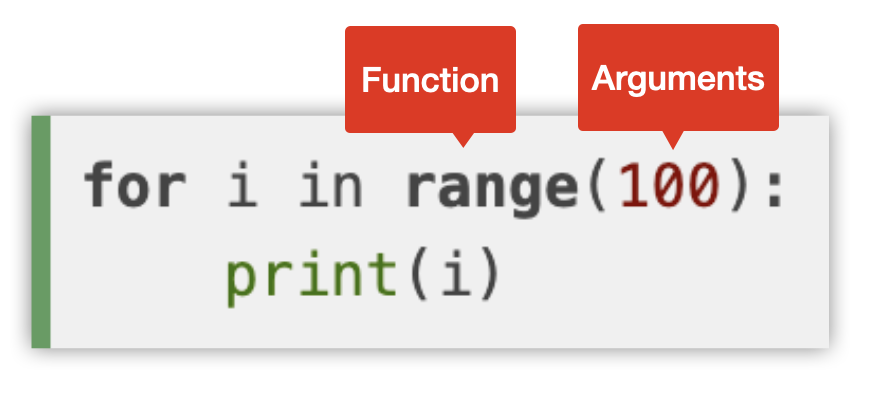

{:class="cover"}

## For Loops

Often we want to run a piece of code a specific number of times.

We can use the `for` statement to run a block of code a number of times:

```python
for i in range(100):
    print('i is:',i)
```

In this example, the loop will start by assign the variable `i` the value `0`, and then run the block of code `print('i is:',i)` which will print out:

```console
i is 0
```

> ## Parameters / Arguments
>
> **`Parameters`**, also known as **`arguments`** are variables that act as inputs into a function. We'll look at functions shortly.
> An example of an argument is the value `100` that we just used in in the `range` function.
> In some programming languages there is a difference between an argument (a literal value like `100`), and a parameter that is a variable (such as `a` that refers to another value). MicroPython doesn't make such a distinction.
>
> * Arguments can be values or variables
> * Arguments are separated by commas
> * Arguments are position - the order the arguments are provided should match the order the function expects
> * Arguments can be named, in which case the order doesn’t matter
> * Arguments can be optional
>
> {:class="img-fluid w-50"}
>

## The range() Function

The range function can take one, two or three parameters:
`range`(`start` <<optional>>, `end`, `steps` <<optional>>)

---

## The range() Function with one parameter

The `range()` function returns a sequence of numbers, starting from `0` by default, and increments by `1` until the `end` number is reached.

---

##### Example

```python
for i in range(100):
    print(i)
```

---

## The range() Function with two parameters

If two parameters are provided, the `range()` function starts from `start` value and increments in steps of `1` until the `end` value is reached (its actually the end value `-1`).

##### Example

```python
for i in range(50,200):
    print(i)
```

---

## The range() Function with three parameters

If three parameters are provided, the `range()` function starts from `start` value and increments in steps of the `steps` value until the `end` value is reached (again, the end value `-1`).

---

##### Example

```python
for i in range(50,200,10):
    print(i)
```

---

## The while loop

if we want to run a block of code many times, based on whether or not a condition is `True` or `False`, we can use the `while` loop.

You'll often see this to run blocks of code indefinetly on MicroControllers as we may want to run the code forever or until the device is reset.

---

##### Example

```python
while True:
    print('hello')
```

The while loop is particularly useful in MicroPython as we may want to check the status of a sensor or externally connected device.

---

##### Example

```python
import machine

button = machine.Pin(0, machine.Pin.IN)

while button.value() == 0:
    print('button is not pressed')
```

In this example we use the `machine` library to access the general purpose input/output pins (also known as `GPIO` pins). We assign `pin 0` to the `button` variable and also define the pin as an input put using the `machine.Pin.IN` parameter.

The progam will keep printing the `button is not pressed` until button is pressed and returns a `1` value.

---

## Control statements
### Break, Continue, Pass

---

| Statement	| Control Statement & Description |
|:--:|---|
|`Break`	|Terminates the loop statement and transfers execution to the statement immediately following the loop.|
|`Continue`|	Causes the loop to skip the remainder of its body and immediately retest its condition prior to reiterating.|
|`Pass`	|The pass statement in Python is used when a statement is required syntactically but you do not want any command or code to execute.|
{:class="table-w100 table table-bordered"}

---
