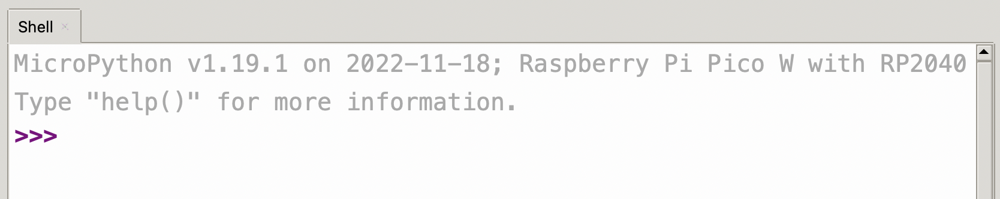

## The REPL

MicroPython has an input and output console thats called the `REPL`, which stands for Read Evaluation Print Loop. This is because the `REPL` `reads` in commands, `evaluates` them, `prints` out the results to the console and then `loops` back to the reading in stage.

You will have noticed the `REPL` at the bottom of the screen, its where we see the output of all the code we've run so far.

You can type MicroPython code directly into the `REPL`, which is useful for quickly testing things or examining the attached MicroPython device.

{:class="img-fluid w-100 shadow-lg"}

A screenshot of the `REPL` showing the currently installed version of MicroPython.
