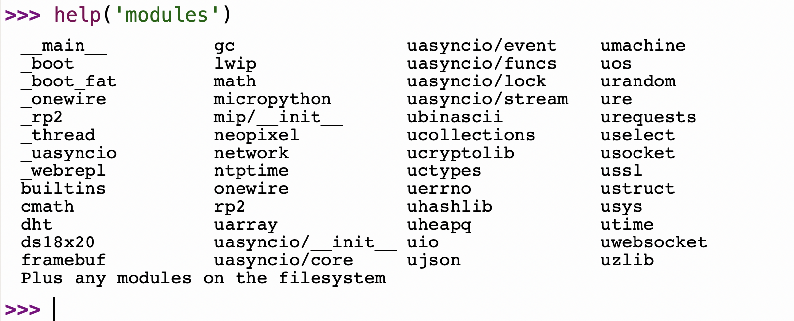

{:.cover}

## Modules

MicroPython has many modules that are built into the firmware. We still need to `import` these if we want to use them in our code.

This is because when we `import` a module MicroPython has to read all the lines of code in that module and store the functions in `RAM` (Random Access Memory). MicroPython devices have limited `RAM` so we need to ensure we only import the modules we need for each specific program.

Lets have alook at all the modules on our MicroPython device. 

##### Example

1. Type the following directly into the `REPL`:

```python
help('modules')
```

{:class="img-fluid w-100 shadow-lg"}

A screenshot of all the installed Modules
{:.caption}

---

You'll notice that most of the modules have `u` as the first letter, this is because they are the simplified MicroPython version of standard Python libraries (in some cases). The `u` is an ascii version of the Mu or `μ` symbol which is the Greek letter for Micro.

A module is just another MicroPython program, one that just contains other functions. Modules tend to by collections of related functions. 

## Table of Built-in Modules
Below is a table of the most commonly used modules:

Module     | Alias     | Description
-----------|-----------|-------------------------------------------------------------------------------------------------------------------------
`math`     | `cmath`   | contains functions such as `radians`, `sin`, `cos`, `sqrt`, `tan`
`dht`      | -         | a class for use with the `dht` range of temperature sensors
`framebuf` | -         | the Frame Buffer class - useful for creating graphics and working with displays
`gc`       | -         | the Garbage Collector - helps keep memory unfragmented
`neopixel` | -         | a class for use with Adafruit Neopixels, or any APA102 and WS1218 RGB LED Strips
`network`  | -         | you'll use this a lot if you're working with Wi-Fi, webservers and APIs
`umachine` | `machine` | contains lots of board specific functions and constants
`utime`    | `time`    | you'll use this to access the `sleep` function which is used in nearly all physcial computing projects, such as robotics
{:class="table"}

This isn't an extensive list, and each variety of board may have a slightly differnt list of modules.

---

## DIR

To investigate each module you can use the `dir()` function:

##### Example

From the `REPL` type:
```python
dir(machine)
```

In the example above you'll discover a list of all the functions, classes and Constants in the module named `machine`.

---
