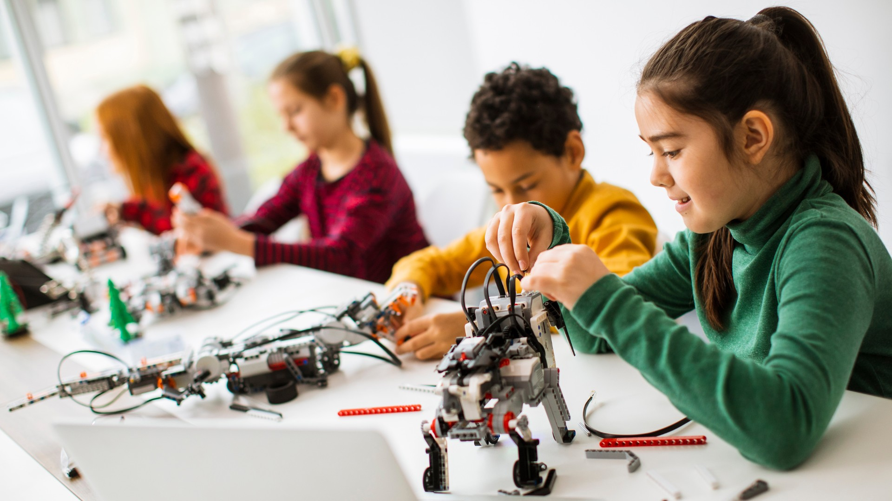

{:class="cover"}
## Overview

Welcome to `Learning MicroPython for beginners`. This course is aimed at people new to MicroPython and programming in general. It will take you through each concept step by step, provide examples of ***real code*** and explain ***how*** and ***why*** it works.

## Course Content

In this course you will learn:

* What MicroPython is, why you should use it, where to download it and which software to use to develop Python code
* Your first program: `Hello World`
* Values and Variable Types
* Reserved words
* Loops, Flow control and Operators
* Functions, the REPL and Modules

---

## Key Results

After you have completed this course you will have a solid idea of the basics of MicroPython, and will be able to confidently write your own programs on your own MicroPython board. 

This course will provide you with the solid foundation of MicroPython so you can go onto write programs to control robots and bring them to life with sensors and motors.

---
## What you'll need

To take this course you will need:

* a computer, tablet or phone to read the course material from
* a computer that is capable of connecting to a MicroPython board such as the [Raspberry Pi Pico](https://www.raspberrypi.com)
* a MicroPython board
* a USB cable to connect the computer to the MicroPython board

---

## How the course works

New Keywords are introduced and explained, and are highlighted to help emphasise them. 

For example keywords are highlighed inline with the course text like `this`.

Longer examples of code are hightlighted like this:

```python
print('this is an example')
```

Important notes will be highlighted in sections like the two below:

> ## This is a note
>
> Important notes are hightlighted like this

---

> ## Another aside
>
> Asides are also highlighed in sections, but in an alternative colour
{:.bg-blue}

---
