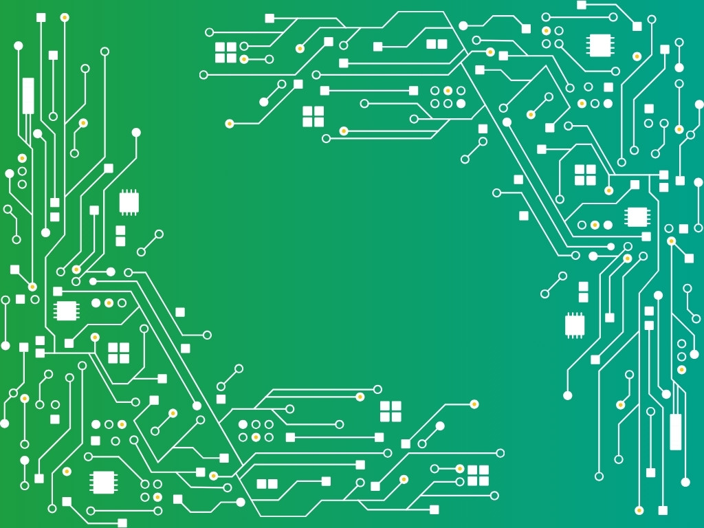

{:class="cover"}

---

You've learned how to control motors, read sensors, respond to your environment, and even command your robot wirelessly. Now it's time to **bring it all together** with a final project of your own.

This is your chance to get creative and build something unique using the techniques and components covered in this course.

---

## 🛠️ Project Guidelines

Your final project should:

- Use **at least two types of sensors**
- Include some form of **movement control**
- Demonstrate **autonomous behavior**, **remote control**, or both
- Be **documented and repeatable**

---

## 🎯 Project Ideas

Need inspiration? Try one of these:

- **Maze Explorer** – Use ultrasonic sensors and timed turning to navigate a simple maze.
- **Line Racer** – Build a faster, more responsive line-following robot.
- **Patrol Bot** – Drive around and stop when an obstacle is detected, or beep an alert.
- **Light-Seeking Robot** – Use light sensors to move toward the brightest spot in a room.
- **Wi-Fi RC Car** – Use Pico W and a web interface to drive from your phone.

---

## 📋 Planning Your Project

Start with a plan:

1. **Define the goal** – What will your robot do?
2. **Choose the components** – Motors, sensors, power, etc.
3. **Sketch the design** – How will everything fit together?
4. **Write the logic** – Pseudocode helps before diving into Python.
5. **Test in parts** – Code and test each feature separately.

---

## 🧩 Sharing Your Work

Take photos and videos of your build, and share your code and wiring diagrams. Include:

- A short description of what your robot does
- Key components used
- Diagrams or photos
- A link to your GitHub repo or code

This is a great way to reflect on what you’ve learned — and show off your skills!

---

## 🏁 Final Tips

- Keep it simple and achievable
- Start with basic behavior, then improve it
- Debug step by step
- Celebrate progress, even small wins!

---

When you're finished, you’ll have a MicroPython-powered robot of your own creation — and the skills to build even more advanced machines in the future.

Next up: [Course Summary and What’s Next](12_summary)

---