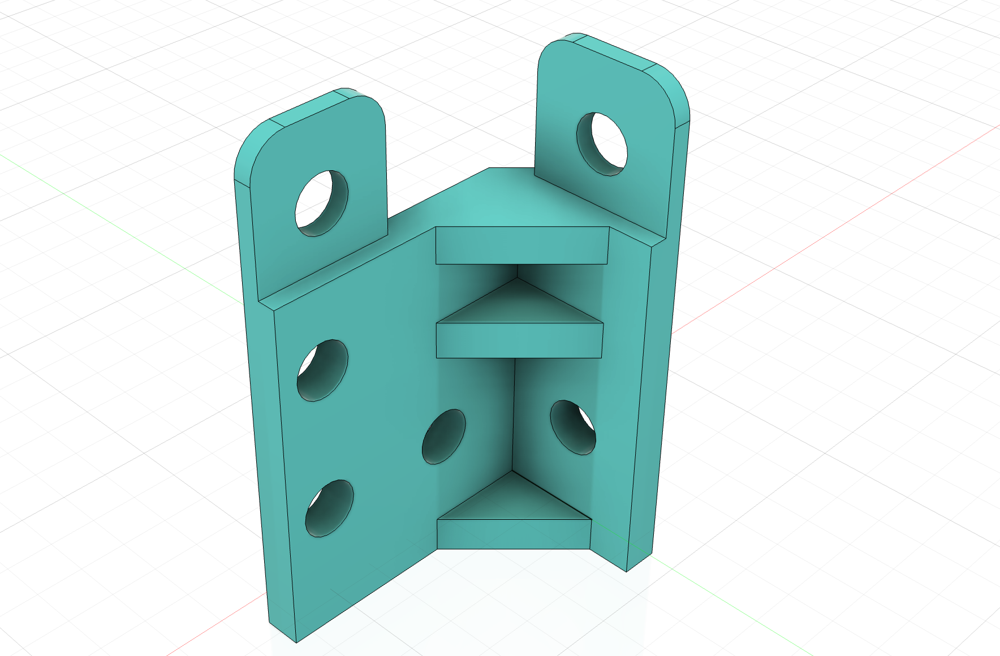

{:class="img-fluid w-100"}

1. Create a new file named `bottom_corner` in Fusion 360

1. Create a new sketch on the XY plane, named `bottom_base`

1. Create the following sketch:

    {:class="img-fluid w-100"}

1. Extrude the body profile by `4mm`:

    {:class="img-fluid w-100"}

1. Extrude the top tab profile by `2mm`:

    {:class="img-fluid w-100"}

1. Create a new sketch on the top of the new part, named `top_profile`

    {:class="img-fluid w-100"}

1. Extrude the top profile to the bottom surface of the main part:

    {:class="img-fluid w-100"}

1. Create a new sketch on the top of the body, named `side holes`

    {:class="img-fluid w-100"}

1. Extrude the top tab:

    {:class="img-fluid w-100"}

1. Create a new sketch, name it `ribs`:

    {:class="img-fluid w-100"}

1. Extrude the sketch::

    {:class="img-fluid w-100"}

1. Create a construction plane on the top of the new rib:

    {:class="img-fluid w-100"}  

1. Extrude the `ribs` sketch `20mm` from the construction plane:

    {:class="img-fluid w-100"}

1. Extrude the sketch from the top of the body down by `4mm`:

    {:class="img-fluid w-100"}

1. Extrude the sketch to create the holes:

    {:class="img-fluid w-100"}

1. Extrude the `ribs` sketch `4mm` from the construction plane:

    {:class="img-fluid w-100"}

---
