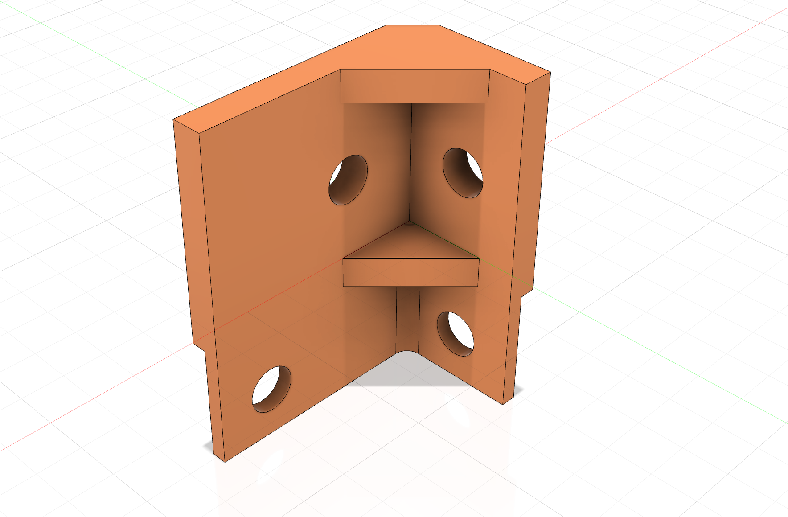

{:class="img-fluid w-100"}

1. Create a new file named `top_corner` in Fusion 360

1. Create a new sketch on the XY plane, named `top_base`

1. Create the following sketch:

    {:class="img-fluid w-100"}

1. Extrude the body profile by `4mm`:

    {:class="img-fluid w-100"}

1. Create a sketch on the top of the new part, named `top_profile`

    {:class="img-fluid w-100"}

1. Extrude the sketch:

    {:class="img-fluid w-100"}

1. Create a new sketch on the top of the body, named `side holes`

    {:class="img-fluid w-100"}

1. Extrude the sketch:

    {:class="img-fluid w-100"}

1. Extrude the sketch:

    {:class="img-fluid w-100"}

1. Extrude the sketch:

    {:class="img-fluid w-100"}

1. Create a new sketch on the top of the body, named `ribs`

    {:class="img-fluid w-100"}

1. Extrude the sketch:

    {:class="img-fluid w-100"}

1. Create a construction plane:

    {:class="img-fluid w-100"}

1. Extrude the `ribs` sketch:

    {:class="img-fluid w-100"}

1. Fillet the inside bottom edge:

    {:class="img-fluid w-100"}

---
